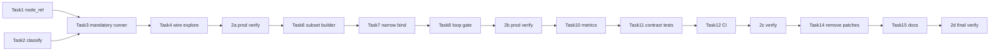

# Explore Tool 可靠性 Phase 2 (2a–2d) Implementation Plan

> **For agentic workers:** REQUIRED SUB-SKILL: Use superpowers:subagent-driven-development (recommended) or superpowers:executing-plans to implement this plan task-by-task. Steps use checkbox (`- [ ]`) syntax for tracking.

**Goal:** 让 explore 28 工具「会调、调对」可度量、可回归——UI/lifecycle/asset 走 mandatory dispatch，node_write 走 narrow bind，删除 Phase 1 nudge/双轨兜底。

**Architecture:** 在 `explore.py` 内引入 `classify_explore_intent` → mandatory 分支（规则解析 + 直接 `tool.ainvoke`）或 LLM 分支（窄/全 bind）。`node_ref.py` 统一 node_id 解析。Wave 2c 加 metrics + CI gate；Wave 2d 删 Phase 1 补丁代码。

**Tech Stack:** LangGraph explore 节点（Python 3.11+）、pytest、`deploy/prod-explore-28-tools-demo.py`、Prometheus `app/metrics.py`、GitHub Actions `ci.yml`。

**Spec:** [2026-08-09-explore-tool-reliability-phase2-design.md](../specs/2026-08-09-explore-tool-reliability-phase2-design.md)

## Global Constraints

- 分支：`feature/explore-tool-reliability-phase2` — **禁止直推 main**。
- 提交前：`cd services/agent-runtime && python3 -m pytest tests/test_explore*.py tests/test_node_ref*.py tests/test_route_decide*.py -q` 全绿；`pnpm build` 通过后再 PR。
- **ETR-P1**：UI command / lifecycle / asset_read **不得**依赖 LLM 选择是否调 tool。
- **L-P7**：explore mandatory 分支禁止无界 ReAct；mandatory max 1 次内部重试。
- **CS-7**：UI 副作用只走 `canvas_command` SSE；Nest 仍只收 node_id。
- explore **禁止** bind `run_*_generation`（现有 EXPLORE 白名单不变）。
- 同 thread **不**做并行 explore（thread lock 不改）。
- 每 Wave 独立 PR（2a → 2b → 2c → 2d），合并后 deploy agent-runtime + 跑 28-tool demo。
- Commit per task；PR Squash merge。

## Baseline（#188 部署后）

| 指标 | Run `9941b1c3` |
|------|----------------|
| pass_tool | 20/28 |
| weak | 9（UI canvas_command 6 + harness 3） |
| fail | 0 |

**Wave 验收阈值：**

| Wave | pass_tool | wrong_route | weak 上限 |
|------|-----------|-------------|-----------|
| 2a | ≥24 | 0 | ≤4 |
| 2b | ≥26 | 0 | ≤2 |
| 2c | ≥26 + CI gate | 0 | ≤2 |
| 2d | ≥27 | 0 | ≤1 |

## File map

| File | Role |
| --- | --- |
| `services/agent-runtime/app/graph/node_ref.py` | **NEW** — `resolve_node_ref`, `resolve_node_refs`, title/@I 解析 |
| `services/agent-runtime/app/graph/explore_dispatch.py` | **NEW** — intent 分类、mandatory runner、窄 bind 常量 |
| `services/agent-runtime/app/graph/nodes/explore.py` | 重构：dispatch 入口；2d 删 nudge/兜底 |
| `services/agent-runtime/app/graph/explore_route.py` | 复用/扩展 lifecycle 信号（可选迁入 dispatch） |
| `services/agent-runtime/app/tools/definitions.py` | `build_explore_tools_subset(names)` |
| `services/agent-runtime/app/metrics.py` | `explore_dispatch_total` 等 |
| `services/agent-runtime/app/runs.py` | step.detail 可选 dispatch 标签 |
| `services/agent-runtime/tests/test_node_ref.py` | **NEW** |
| `services/agent-runtime/tests/test_explore_dispatch.py` | **NEW** |
| `services/agent-runtime/tests/test_explore_mandatory.py` | **NEW** — UI/lifecycle/asset 集成 |
| `services/agent-runtime/tests/test_explore_node.py` | 更新/替换 Phase 1 兜底测试 |
| `deploy/prod-explore-28-tools-demo.py` | 阈值断言、`--min-pass` flag |
| `.github/workflows/ci.yml` | explore contract pytest job |
| `docs/superpowers/specs/2026-08-09-explore-tool-reliability-phase2-design.md` | Wave 完成打勾 |

---

# Wave 2a — `node_ref` + Mandatory UI / Lifecycle / Asset

**PR 标题建议：** `feat(agent-runtime): explore mandatory dispatch for UI/lifecycle/asset (Phase 2a)`

### Task 1: `resolve_node_ref` SSOT

**Files:**
- Create: `services/agent-runtime/app/graph/node_ref.py`
- Create: `services/agent-runtime/tests/test_node_ref.py`

**Interfaces:**
- `resolve_node_ref(text, summary) -> str | None`
- `resolve_node_refs(text, summary) -> list[str]`（多节点：标题前缀「颜色变体」、逗号/到/范围）
- `extract_quoted_title(text) -> str | None`（支持 `「」`/`""`）

- [ ] **Step 1: Write failing tests**

```python
# test_node_ref.py — 覆盖 node_id 正则、标题模糊、多节点前缀、无匹配 None
SUMMARY = {"nodes": [
    {"id": "image-1786157513657-20", "title": "换logo李宁", "type": "image", "status": "completed"},
    {"id": "image-1786156321418-15", "title": "颜色变体1", "type": "image", "status": "completed"},
    {"id": "image-1786156321418-16", "title": "颜色变体2", "type": "image", "status": "completed"},
]}
assert resolve_node_ref("查询 image-16 状态", SUMMARY) == "image-16"
assert resolve_node_ref("查询「换logo李宁」节点", SUMMARY) == "image-1786157513657-20"
assert len(resolve_node_refs("颜色变体1到4", SUMMARY)) >= 2
```

- [ ] **Step 2: Run tests — expect FAIL**

Run: `cd services/agent-runtime && python3 -m pytest tests/test_node_ref.py -v`

- [ ] **Step 3: Implement `node_ref.py`**

优先级：显式 node_id 正则 → summary title 包含匹配 → 标题前缀批量（`颜色变体` + 数字范围解析）。

- [ ] **Step 4: Run tests — expect PASS**

- [ ] **Step 5: Commit** `feat(agent-runtime): add resolve_node_ref SSOT for explore dispatch`

---

### Task 2: Intent 分类器

**Files:**
- Create: `services/agent-runtime/app/graph/explore_dispatch.py`
- Create: `services/agent-runtime/tests/test_explore_dispatch.py`

**Interfaces:**

```python
ExploreIntent = Literal[
    "ui_command", "lifecycle", "asset_read",
    "node_read", "node_write", "open_query",
]

def classify_explore_intent(user_text: str, *, summary: dict | None) -> ExploreIntent:
    ...
```

**规则（与 spec §2.3 对齐）：**
- `ui_command`：撤销/重做/定位/精修/引入/侧栏
- `lifecycle`：取消/确认 + 生成|任务|fallback|回退
- `asset_read`：资产库|素材库|公共素材 + 查询动词
- `node_write`：node ref + 更新|attach|复制|上传|添加|保存|应用
- `node_read`：node ref + 查询|状态|layout|诊断
- 默认 `open_query`

- [ ] **Step 1: Write failing tests**（28-tool demo 话术子集各 1 case）

- [ ] **Step 2–4: Implement + pass**

- [ ] **Step 5: Commit** `feat(agent-runtime): classify explore intent for dispatch`

---

### Task 3: Mandatory dispatch runner

**Files:**
- Modify: `services/agent-runtime/app/graph/explore_dispatch.py`
- Create: `services/agent-runtime/tests/test_explore_mandatory.py`

**Interfaces:**

```python
async def run_mandatory_explore(
    intent: ExploreIntent,
    user_text: str,
    *,
    summary: dict,
    tools_by_name: dict[str, Any],
) -> MandatoryExploreResult:
    """Returns tool_results, canvas_commands, reply_text, tools_called."""
```

**UI command 映射（spec §3.1）：**

| 模式 | tool | args |
|------|------|------|
| 撤销+画布/操作 | undo | `{}` |
| 重做 | redo | `{}` |
| 定位+单节点 | focus_node | `{node_id}` |
| 定位+多节点 | focus_nodes | `{node_ids}` |
| 精修/编辑器 | open_image_editor | `{node_id}` |
| 引入/侧栏 | introduce_nodes_to_agent | `{node_ids}` |

**Lifecycle（spec §3.2）：**
- 无 node_id → 模板回复「请指定节点 id（如 image-16）」
- 有 node_id → 调对应 lifecycle tool；Nest 错误映射为用户可见中文（见 spec 表）

**Asset read（spec §3.3）：**
- `公共` → `list_public_assets`
- 否则 → `list_user_assets`
- 回复 = 模板格式化 JSON（**不调 LLM** 或 optional 单轮 `tool_choice=none` 摘要）

- [ ] **Step 1: Write failing integration tests**

Mock `StructuredTool.ainvoke`；断言 mandatory 路径 **无 LLM 调用** 且 `canvas_commands` 非空（UI cases）。

- [ ] **Step 2–4: Implement `run_mandatory_explore`**

- [ ] **Step 5: Commit** `feat(agent-runtime): mandatory explore dispatch for UI/lifecycle/asset`

---

### Task 4: 接入 `explore.py`

**Files:**
- Modify: `services/agent-runtime/app/graph/nodes/explore.py`

**行为：**
1. `summary = await nest.get_canvas_summary()`
2. `intent = classify_explore_intent(user_text, summary=summary)`
3. 若 `intent in {ui_command, lifecycle, asset_read}` → `run_mandatory_explore` → return（**跳过** LLM bind loop）
4. 否则保留现有 LLM 路径（Phase 1 nudge/兜底 **暂留**，2d 删除）

- [ ] **Step 1: Write test** — mock nest + mock llm，mandatory intent 时 `llm.ainvoke` 不被调用

- [ ] **Step 2: Refactor explore node**

- [ ] **Step 3: Run full explore test suite**

Run: `python3 -m pytest tests/test_explore*.py tests/test_node_ref.py -q`

- [ ] **Step 4: Commit** `feat(agent-runtime): wire mandatory explore dispatch into explore node`

---

### Task 5: Wave 2a 生产验证

- [ ] Deploy agent-runtime（merge 2a PR 后）
- [ ] Run: `SESSION_ID=cmsjq3rpj005op801frieqj42 python3 deploy/prod-explore-28-tools-demo.py`
- [ ] 确认 UI 6 项 + lifecycle 3 项 + asset 2 项中 **≥9 项升为 tool**；`wrong_route == 0`

---

# Wave 2b — Narrow Bind + Loop Gate (node_write)

**PR 标题建议：** `feat(agent-runtime): explore narrow bind and write loop gate (Phase 2b)`

### Task 6: Tool subset builder

**Files:**
- Modify: `services/agent-runtime/app/tools/definitions.py`

**Interfaces:**

```python
EXPLORE_READ_TOOLS = frozenset({...})
EXPLORE_WRITE_TOOLS = frozenset({...})

def build_explore_tools_subset(client, names: frozenset[str]) -> list[StructuredTool]:
    ...
```

**node_write 窄 bind（≤5）：** 按 user_text 关键词选子集，例如：
- 含「prompt」/「prompt-」→ `set_node_prompt`, `upsert_prompt_node`
- 含「复制」→ `duplicate_node`
- 含「上传|URL|picsum」→ `upload_media_to_canvas`
- 含「attach|参考」→ `attach_refs`, `apply_sidebar_attachments`
- 默认：`set_node_prompt`, `set_node_content`, `attach_refs`, `duplicate_node`, `upsert_prompt_node`

- [ ] **Step 1: Unit test** subset 大小 ≤5 且名称 ∈ EXPLORE_TOOL_NAMES

- [ ] **Step 2: Implement**

- [ ] **Step 3: Commit** `feat(agent-runtime): explore tool subset builder for narrow bind`

---

### Task 7: LLM 分支按 intent 窄 bind

**Files:**
- Modify: `services/agent-runtime/app/graph/nodes/explore.py`
- Modify: `services/agent-runtime/app/graph/explore_dispatch.py`

**行为：**
- `node_read` → bind READ subset（~10 tools）
- `node_write` → bind WRITE subset（≤5）+ system prompt「本轮只允许调用下列工具之一」
- `open_query` → bind 全 28

- [ ] **Step 1: Test** — node_write 话术仅 expose write tools（inspect bind list）

- [ ] **Step 2: Implement**

- [ ] **Step 3: Commit** `feat(agent-runtime): narrow tool binding by explore intent`

---

### Task 8: Write loop gate（ETR-L1）

**Files:**
- Modify: `services/agent-runtime/app/graph/nodes/explore.py`

**行为：**
- `node_write` 且 rounds 用尽且无 write tool_call → **一次** narrow re-bind 重试（非 nudge 文案）
- 仍失败 → AIMessage「未能更新节点，请提供节点 id（如 prompt-1）」

- [ ] **Step 1: Test** with mock LLM returning empty tool_calls twice

- [ ] **Step 2: Implement**

- [ ] **Step 3: Commit** `feat(agent-runtime): explore node_write loop gate with single retry`

---

### Task 9: Wave 2b 生产验证

- [ ] 28-tool demo：`set_node_prompt`, `set_node_content`, `apply_asset_to_node` weak 项改善

---

# Wave 2c — CI Gate + Metrics

**PR 标题建议：** `feat(agent-runtime): explore dispatch metrics and CI contract gate (Phase 2c)`

### Task 10: Prometheus metrics（ETR-O1）

**Files:**
- Modify: `services/agent-runtime/app/metrics.py`
- Modify: `services/agent-runtime/app/graph/explore_dispatch.py`（或 explore.py）
- Modify: `services/agent-runtime/tests/test_metrics.py`

**新增：**
- `explore_dispatch_total{intent, strategy}` — strategy=`mandatory`|`llm`
- `explore_tool_skipped_total{intent}` — mandatory 未调 tool（应为 0）
- `explore_route_mismatch_total{expected, actual}` — 预留 intake 对比

- [ ] **Step 1: Test metrics increment**

- [ ] **Step 2: Implement + record in dispatch paths**

- [ ] **Step 3: Commit** `feat(agent-runtime): explore dispatch observability metrics`

---

### Task 11: 离线 contract 测试（CI 可跑）

**Files:**
- Create: `services/agent-runtime/tests/test_explore_28_contract.py`
- Modify: `deploy/prod-explore-28-tools-demo.py`

**策略（回答 spec Open Q1）：** CI **不依赖**生产 CVM；用 **mock nest + mock llm** 跑 28 case 的：
- `classify_explore_intent` 期望 intent
- mandatory 路径 `tools_called` / `canvas_commands`

生产 demo 保留为 **post-deploy smoke**（`deploy-agent-runtime.yml` optional step）。

- [ ] **Step 1: Extract `DEMOS` cases** 到 shared module 或 JSON fixture

- [ ] **Step 2: `test_explore_28_contract.py`** — 28 intent 分类 + 12 mandatory cases 调 tool

- [ ] **Step 3: demo script 加 `--min-pass 24` exit code非0 则 fail**

- [ ] **Step 4: Commit** `test(agent-runtime): explore 28-tool contract tests for CI`

---

### Task 12: CI workflow

**Files:**
- Modify: `.github/workflows/ci.yml`

- [ ] 在 `Verify agent-runtime contract` job 增加：

```bash
cd services/agent-runtime
python3 -m pytest tests/test_explore_28_contract.py tests/test_explore_mandatory.py -q
```

- [ ] **Commit** `ci: add explore 28-tool contract to agent-runtime verify`

---

### Task 13: Wave 2c 验证

- [ ] PR CI 全绿
- [ ] 生产 demo pass_tool ≥26

---

# Wave 2d — 删除 Phase 1 双轨

**PR 标题建议：** `refactor(agent-runtime): remove explore nudge and deterministic fallback (Phase 2d)`

### Task 14: 删除补丁代码

**Files:**
- Modify: `services/agent-runtime/app/graph/nodes/explore.py`

**删除：**
- `_UI_NUDGE`, `_ASSET_NUDGE`, `_CANCEL_NUDGE`, `_pick_nudge`, nudge loop
- `_direct_undo_redo`, `_direct_focus_or_editor`
- Phase 1 冗长 system prompt 中已被 mandatory 覆盖的规则

**保留：**
- open_query / node_read 的 LLM system prompt（精简版）
- node_write loop gate（2b）

- [ ] **Step 1: Update tests** — 删除/改写 `test_explore_node.py` 中兜底测试；mandatory 测试覆盖同等行为

- [ ] **Step 2: Remove dead code**

- [ ] **Step 3: Run full agent-runtime pytest**

- [ ] **Step 4: Commit** `refactor(agent-runtime): single-track explore dispatch remove Phase 1 patches`

---

### Task 15: Spec 与文档收尾

**Files:**
- Modify: `docs/superpowers/specs/2026-08-09-explore-tool-reliability-phase2-design.md`

- [ ] 状态改为 **Accepted**；Open Questions 写入决议：
  - Q1: CI mock + post-deploy prod demo
  - Q2: `resolve_node_refs` 标题前缀规则
  - Q3: mandatory 用模板回复，不强制 LLM 摘要

- [ ] **Commit** `docs: mark explore tool reliability Phase 2 spec accepted`

---

### Task 16: Wave 2d 最终验证

- [ ] 28-tool demo：pass_tool ≥27，weak ≤1，fail 0
- [ ] 更新 spec §1.1 baseline 表

---

## 依赖关系



## PR 合并顺序

| PR | Wave | 合并后动作 |
|----|------|-----------|
| #TBD | 2a | deploy agent-runtime + demo |
| #TBD | 2b | deploy + demo |
| #TBD | 2c | CI 自动；optional prod demo |
| #TBD | 2d | deploy + demo 终验 |

## 风险与缓解

| 风险 | 缓解 |
|------|------|
| mandatory 标题解析失败 | 澄清模板 + 要求 node_id；metrics 计数 |
| focus_nodes 范围解析复杂 | 2a 先支持显式多 id + 标题前缀；不阻塞 |
| CI mock 与生产漂移 | post-deploy demo + 定期 manual smoke |
| 删 nudge 后 open_query 退化 | 2d 前确认 pass_tool ≥26 |

---

## 执行入口

开始 Wave 2a Task 1 前：

```bash
git checkout main && git pull origin main
git checkout -b feature/explore-tool-reliability-phase2
```

每 Wave 可从 main rebase 或 stacked PR（2b based on 2a）。
