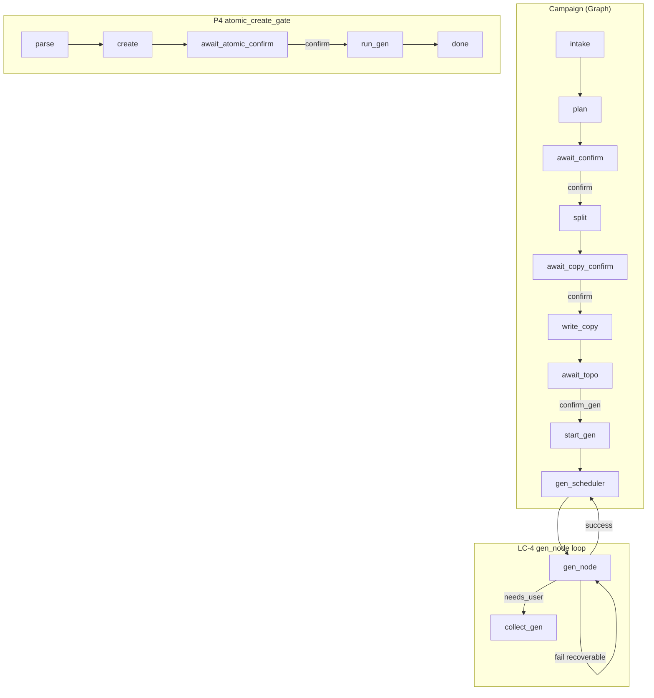

# Loop Engineering 层产品规格（设计）

> 状态：**已确认**（2026-08-04）；**L1-03 atomic_regenerate ✅**（2026-08-04，PR #122）  
> 日期：2026-08-04  
> 前置：[2026-07-26-graph-engineering-design.md](./2026-07-26-graph-engineering-design.md)（G1）、[2026-08-03-atomic-studio-intent-design.md](./2026-08-03-atomic-studio-intent-design.md)（P4）  
> 实施计划：[2026-08-04-atomic-regenerate.md](../plans/2026-08-04-atomic-regenerate.md)

| 字段 | 值 |
|------|-----|
| 文档版本 | v1.0 |
| 创建日期 | 2026-08-04 |
| 文档定位 | Loop Engineering 层的设计规格（动态迭代语义） |
| 关联文档 | [2026-07-26-graph-engineering-design.md](./2026-07-26-graph-engineering-design.md)（G1）、[2026-08-03-atomic-studio-intent-design.md](./2026-08-03-atomic-studio-intent-design.md)（P4 Loop §2.2） |
| 方法论来源 | IBM Loop Engineering、Alphamatch《Loop Engineering: The Quiet Revolution》、Anthropic《Building Effective Agents》、OpenAI Agent Orchestration、LangGraph checkpoint/interrupt |

---

## 一、层定位与边界

### 1.1 在工程栈中的位置

Loop Engineering 是 Graph Engineering 的**动态语义层**：

- **Graph（G）** 定义骨架：State / Node / Edge / HITL 门 / Checkpoint 边界
- **Loop（L）** 定义行为：Goal→Act→Observe→Adjust→Repeat 何时发生、何时终止、失败如何传播

```
用户目标
  → Graph：走哪条路径、在哪个门暂停
  → Loop：同一节点内/跨节点如何迭代、重试、自修正
  → Harness：调哪个 Studio/Nest 工具
```

### 1.2 本层职责

| 负责 | 不负责 |
|------|--------|
| 迭代循环设计（单轮 / 多轮 / HITL revise） | 控制流图结构（属 G 层） |
| 终止条件（success / needs_user / hard_fail / done） | Prompt 措辞（属 P 层） |
| 错误分级与 auto-retry 策略 | Context 组装规则（属 C 层） |
| 断流后对账与 self-healing 语义 | 工具实现与部署（属 H 层） |
| SSE `task_*` 进度与终局关账 | Trace/Metrics 采集细节（属 O 层） |

### 1.3 与其他层的衔接

| 衔接点 | Graph（G1） | Loop（本文档） |
|--------|-------------|----------------|
| 故障传播 | **G-P6** DAG 故障分级 | L-P2 recoverable vs needs_user |
| 出图编排 | W3 gen_scheduler + Send | L-P3 每节点最多 3 次尝试 |
| HITL | **G-P5** interrupt_before | L-P4 revise 回路 = Adjust |
| 原子创作 | P4 atomic_create_gate | L-P5 Single-Shot + 可选 regenerate |
| 断流恢复 | G-P7 checkpoint | L-P6 reconcile 关账 |

---

## 二、设计方法论

### 2.1 业界共识摘要

1. **价值单位是 trajectory，不是单次 response**（Alphamatch）
2. **简单循环优先**：Single-Shot + 明确终止，优于 ReAct 无限工具环（Anthropic）
3. **Evaluator-Optimizer 仅在有客观评估标准时引入**（Graph G1 §2.1 Evaluator-Optimizer 行）
4. **Guardrails 分层**：乐观执行 + tripwire；HITL 用于高风险或 needs_user（OpenAI）

### 2.2 设计原则

| 编号 | 原则 | 含义 |
|------|------|------|
| **L-P1** | Graph 定路径，Loop 定迭代 | 不在 Loop 层发明新路由；revise 必须回到 Graph 已声明的上游节点 |
| **L-P2** | 三级终止 | `success` / `needs_user` / `hard_fail`；禁止无限 Adjust |
| **L-P3** | 有界 auto-retry | recoverable 错误：默认 **最多 2 次重试（共 3 次尝试）** |
| **L-P4** | HITL = Adjust 入口 | `await_*` 门后的用户输入是 Adjust；`none` 不推进 |
| **L-P5** | 单轮优先 | Campaign 子步骤、atomic_create 默认单轮完成；多轮 Critic 属 L2 |
| **L-P6** | 断流可关账 | SSE 丢失时，用 Session 节点态 + Record 合成终局 `task_summary` |
| **L-P7** | 不双栈 ReAct | 禁止在 chat 分支并行跑无界 tool loop 替代 Graph |

---

## 三、本项目 Loop 产品规格

### 3.1 循环类型总览

| 循环 ID | 场景 | 模式 | Graph 附着点 | 终止 |
|---------|------|------|--------------|------|
| **LC-1** | Campaign 方案确认 | HITL revise | `await_confirm` → plan | confirm / replan → 下游 |
| **LC-2** | 主文案草稿 | HITL revise | `await_copy_confirm` → draft_copy | confirm 写入 / revise 重草稿 |
| **LC-3** | 拓扑/出图门 | HITL + query | `await_topo` | confirm_gen / topo_revise / node_revise |
| **LC-4** | 批量出图 | Act–Observe–Adjust | `gen_scheduler` → `gen_node` | 单 key 成功或 needs_user |
| **LC-5** | 原子创作 | Single-Shot | `atomic_create_gate` | done + last_error |
| **LC-6** | 视频/音频确认 | HITL confirm | `await_atomic_confirm` | confirm → gen / cancel → done |
| **LC-7** | SSE 断流 | Reconcile | 前端 + `collect_gen` 语义 | 合成 task_summary |

### 3.2 LC-4 出图编排循环（核心，已实现）

**Goal**：按 split_manifest 拓扑，尽可能多完成 auto_generate 节点。

**Act**：`gen_node` 调 Nest `run_*_generation`（image/video）。

**Observe**：record status、node url、generationRecordId。

**Adjust**（recoverable）：

```text
attempt 1 fail (timeout/5xx/circuit)
  → task_update status=retrying
  → attempt 2 … attempt 3
  → still fail → needs_user（节点 error + hint）
```

**Adjust**（non-recoverable）：`fallback_pending`、积分不足、policy → **不重试**，`force_choice` 或节点 error。

**实现**：`app/graph/nodes/gen_node.py`、`orchestrate_gen.py`；分类 `app/graph/task_events.py`、`app/errors.py`。

**验收**：

- `max_auto_retries() == 2`
- `test_retries_recoverable_then_succeeds`
- `test_fallback_pending_needs_user_no_retry`

### 3.3 LC-1~3 Campaign HITL 循环（已实现）

| 门 | 用户 Adjust | Loop 行为 |
|----|-------------|-----------|
| `await_confirm` | confirm / revise / replan | revise → 回 plan；confirm → split 链 |
| `await_copy_confirm` | 写入 / 修改 | revise → 新 draft；none → 提示保持门 |
| `await_topo` | 确认出图 / 改拓扑 / 查节点 | topo_revise → stage 画布；confirm_gen → LC-4 |

**终止**：每轮 SSE turn END at interrupt；checkpoint 保留 phase + nextNodes。

**验收**：`prod-v4-hitl-refresh-verify.py`、`prod-phase-b-user-verify.py`、`prod-phase-c-user-verify.py`。

### 3.4 LC-5 原子创作循环（P4，已实现）

```text
Goal: 一句指令 → 画布完成态资产
Act:   parse → create_node → [LC-6?] → run_atomic_gen
Observe: Studio record / content / url
Adjust:  recoverable → 同 LC-4 分类（单节点一次 gen_node 调用内不 loop，失败即 done+error）
Terminate: success | hard_fail | cancel → phase=done
```

**V2（L1-03 ✅）**：`atomic_regenerate` — 同 thread「再试一次」+ checkpoint 有 `atomic_node_id` → `prepare_atomic_regenerate` → `run_atomic_gen`

**验收**：`prod-atomic-studio-verify.py`、`prod-atomic-confirm-gate-verify.py`。

### 3.5 LC-6 高成本确认循环（P4 D2，已实现）

video/audio：`create` 后 **必须** interrupt，用户「确认生成」才 Act gen；「取消」→ done，保留 draft 节点。

**验收**：A8 — 未 confirm 不得调 Studio（集成测试 + 生产脚本）。

### 3.6 LC-7 断流关账（部分实现）

**问题**：Vercel/Nginx SSE 超时后，客户端收不到 `task_summary`。

**Loop 策略**：

1. SSE 优先推送 `task_update` / `task_summary`
2. 断流后前端 `loadSession` + Record 轮询 reconcile
3. Runtime `collect_gen` 汇总 gen_fail_details → 终局文案

**验收**：`prod-v5-gen-crash-recovery-verify.py`、confirm-loop-hardening 设计 §1.

---

## 四、错误分级与 retry 契约

### 4.1 三级分类（对齐 G-P6 + P4 §2.2.2）

| 级别 | 典型 status / error | auto-retry | 用户动作 | SSE |
|------|---------------------|------------|----------|-----|
| **recoverable** | tool_timeout, 5xx, circuit_open | ≤2 次 | 可选稍后重试 | task_update retrying |
| **needs_user** | fallback_pending, 积分不足 | 0 | 充值/换模型/确认平台 | force_choice |
| **hard_fail** | param_error, permission_denied | 0 | 改 prompt / 重新登录 | error 文案 |

### 4.2 代码真源

| 模块 | 职责 |
|------|------|
| `app/errors.py` | ErrorType、retry_hint、AgentToolError |
| `app/graph/task_events.py` | is_recoverable、hint_for_error、max_auto_retries |
| `app/graph/nodes/gen_node.py` | 单节点 retry 循环 |
| `app/graph/nodes/orchestrate_gen.py` | 拓扑 batch retry（legacy 路径） |

---

## 五、终止策略矩阵

| flow_mode | 正常终止 | 异常终止 | phase 终态 |
|-----------|----------|----------|------------|
| campaign | collect_gen 完成 + task_summary | 部分 needs_user | await_topo / done |
| single_node | 单节点 gen 完成 | gen error | done |
| atomic_create | run_atomic_gen success | unsupported / nest error | done |
| chat | LLM 回复结束 | — | done |

**禁止**：无用户输入的 while-True；无 max_attempt 的 gen retry。

---

## 六、与实施计划映射（L1  backlog）

| 优先级 | 工作项 | 说明 | 依赖 |
|--------|--------|------|------|
| **L1-01** | 本文档 + 错误分级单测门禁 | 已有 test_task_events / test_errors | — |
| **L1-02** | gen_scheduler 统一 retry | orchestrate_gen 与 gen_node 行为一致文档化 | W3 ✅ |
| **L1-03** | atomic_regenerate | LC-5 V2，同 thread 重试 gen | P4 ✅ |
| **L1-04** | 断流关账前端统一 | LC-7 合成 task_summary 组件化 | confirm-loop |
| **L2-01** | Evaluator-Optimizer | Critic-Refiner for plan/draft | 独立 spec L2 |
| **L2-02** | LLM judge 环 | 仅当有人工标注标准时 | — |

---

## 七、验收标准

| 编号 | 标准 | 验证 |
|------|------|------|
| **L-A1** | recoverable 错误最多 3 次尝试 | unit: max_auto_retries + orchestrate tests |
| **L-A2** | fallback_pending 不 auto-retry | unit: test_fallback_pending_needs_user_no_retry |
| **L-A3** | HITL 门 none 不推进 | unit: await_* tests + prod-v4 |
| **L-A4** | Campaign 出图门 + 批量 gen E2E | prod-phase-b/c |
| **L-A5** | atomic 单轮终止 phase=done | prod-atomic-* |
| **L-A6** | video/audio 未确认不调 Studio | prod-atomic-confirm-gate |
| **L-A7** | 全链路回归 | prod-p4-full-regression.py |

---

## 八、未覆盖的层（链接）

| 文档 ID | 层 | 状态 |
|---------|-----|------|
| G1 | Graph Engineering | ✅ graph-engineering-product-spec.md |
| **L1** | **Loop Engineering（本文档）** | ✅ v1.0 |
| L2 | Evaluator-Optimizer | 待建 evaluator-optimizer-pattern.md |
| C1 | Context Engineering | 部分（P4-05 canvas summary） |
| P1 | Prompt Engineering | 部分（few-shots YAML） |
| H1 | Harness Engineering | 部分（Nest internal API） |
| O1 | Observability | 部分（W23 OTLP） |

---

## 九、下一步

1. ~~**L1-03**：atomic_regenerate~~ ✅ PR #122
2. **L1-04**：断流关账前端统一（LC-7）
3. **L2**：evaluator-optimizer-pattern.md — plan/draft 质量环（非 MVP）
4. 将 L-A1~A7 纳入 CI nightly prod smoke（可选）

---

## 附录：Loop ↔ Graph 对照图


