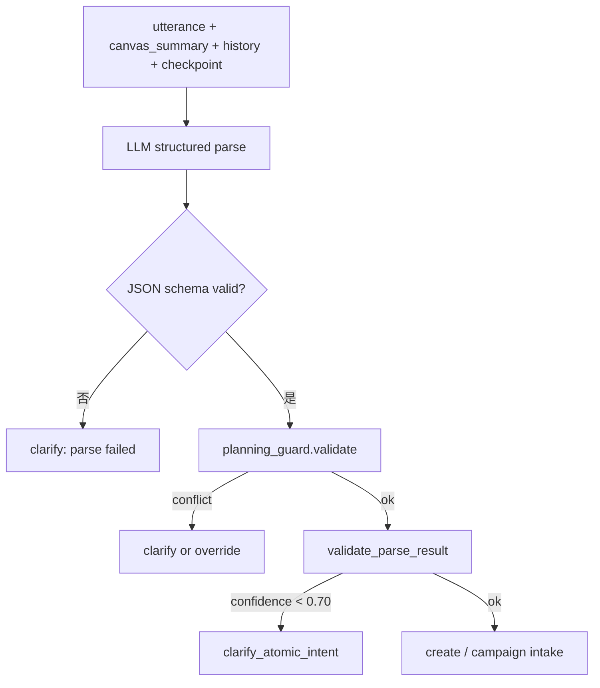

# Intent LLM Structured Parse — 设计规格（Phase C）

> 状态：**Draft**（2026-08-05，B 未交付前为设计态）  
> 前置：**必须先完成** [2026-08-05-intent-planning-guard-design.md](./2026-08-05-intent-planning-guard-design.md)（Phase B）  
> Phase B 计划：[2026-08-05-intent-planning-guard.md](../plans/2026-08-05-intent-planning-guard.md)  
> Phase C 计划：[2026-08-05-intent-llm-structured-parse.md](../plans/2026-08-05-intent-llm-structured-parse.md)

| 字段 | 值 |
|------|-----|
| 文档版本 | v1.0 |
| 定位 | 从「关键词 + hybrid 规则」升级为 **LLM 结构化意图理解** |
| 原则 | LLM 主判、规则 guardrail；B 的 Planning Guard **永不删除** |

---

## 一、动机与 B→C 边界

### 1.1 B 方案遗留上限

| 局限 | 表现 |
|------|------|
| 词表维护 | 新说法「视觉脚本」「页面结构稿」需人工加词 |
| 子串冲突 | 「设计一张」vs「设计方案」靠 regex 边界 |
| 多意图句 | 「写文案并生成主图」只能单模态或 clarify |
| promptMode 脱节 | `classifyPromptMode` 只在 Nest 生产层，路由层不知 commercial/turnaround |
| 跨语言/口语 | 「帮我整一个详情页的感觉」规则难以覆盖 |

### 1.2 C 方案目标

用户任意自然语言 utterance → **单次 LLM 结构化 parse** → 输出可执行的 `route + items[]`，置信不足或 guard 冲突 → **Clarify**。

### 1.3 非目标（C 阶段）

- 不实现 ReAct 多轮工具循环
- 不替代 Campaign 14 节点编排引擎
- 不做前端 Clarify 卡片 UI（仍 SSE 文本）
- 不在 C 第一阶段改 Vercel 前端 classify

---

## 二、目标架构

### 2.1 解析流水线（C 主路径）



### 2.2 与 B 的关系

| 组件 | B 角色 | C 角色 |
|------|--------|--------|
| `planning_guard.py` | 决策者（cap confidence、campaign override） | **校验器**（否决 LLM 明显违规 parse） |
| `rule_parse_atomic` | 主路径 fast path | **降级 fallback**（LLM 超时/失败） |
| `atomic_parse_llm.py` | 低置信时才调用 | **默认首调** |
| `classifyPromptMode` (TS) | 生产层 | **L3 路由层同步调用**（通过 runtime bridge） |

### 2.3 四层意图模型（C 完整实现）

```
用户输入 + checkpoint + 画布摘要 + 近期 history
        │
        ▼
┌───────────────────────────────────────────────────┐
│ L0 Action    plan | write | generate | expand      │
│              | regenerate | confirm | cancel       │
└───────────────────────────────────────────────────┘
        ▼
┌───────────────────────────────────────────────────┐
│ L1 Route     campaign | atomic_create |            │
│              atomic_regenerate | single_node | chat│
└───────────────────────────────────────────────────┘
        ▼
┌───────────────────────────────────────────────────┐
│ L2 Structure single | multi                       │
└───────────────────────────────────────────────────┘
        ▼
┌───────────────────────────────────────────────────┐
│ L3 Modality  image | text | video | audio | prompt│
│              + prompt_mode (optional)              │
└───────────────────────────────────────────────────┘
        ▼
┌───────────────────────────────────────────────────┐
│ L4 Extract   per-item title, prompt, pipeline      │
└───────────────────────────────────────────────────┘
```

---

## 三、LLM Parse JSON Schema

### 3.1 顶层结构

```typescript
interface IntentParseResult {
  action: 'plan' | 'write' | 'generate' | 'expand' | 'regenerate' | 'unknown'
  scope: 'atomic' | 'campaign' | 'unknown'
  route: 'campaign' | 'atomic_create' | 'atomic_regenerate' | 'single_node' | 'chat'
  structure: 'single' | 'multi'
  items: IntentParseItem[]
  confidence: number          // 0.0–1.0
  needs_clarify: boolean
  clarify_question: string | null
  reason: string              // 简短中文理由，便于日志
}

interface IntentParseItem {
  target_type: 'image' | 'text' | 'video' | 'audio' | 'prompt'
  title: string               // ≤24 字节点标题
  prompt: string              // 生图/扩写/文案正文
  confirm_gate?: boolean
  prompt_mode?: string        // e.g. character_turnaround, commercial_storyboard
  pipeline?: string           // e.g. turnaround_image
  imageAspect?: string
}
```

### 3.2 映射规则（LLM system prompt 硬约束）

| action | scope | 典型 route | items |
|--------|-------|------------|-------|
| plan | campaign | campaign | [] 或 placeholder（由 Campaign 填充） |
| plan | atomic | atomic_create | text（构图策划 Markdown） |
| write | atomic | atomic_create | text |
| expand | atomic | atomic_create | prompt + prompt_mode |
| generate | atomic | atomic_create | image/text/video/audio |
| generate | atomic | atomic_create | multi image items |
| regenerate | — | atomic_regenerate | 沿用 checkpoint |
| unknown | — | chat 或 clarify | needs_clarify=true |

**硬约束（与 planning_guard 一致）**：
- `action=plan` 且 utterance 含「详情页/主图+方案」→ **禁止** `target_type=image` 单 item 直出
- `action=generate` 且含「生成一张/来一张」→ 允许 image，`confidence≥0.85`
- video/audio → `confirm_gate=true`
- multi items > 5 → `needs_clarify=true`，建议 campaign

### 3.3 prompt_mode 与 packages/agent 对齐

| prompt_mode | 触发 utterance 示例 | target_type |
|-------------|-------------------|-------------|
| `character_turnaround` | 三视图/模特定妆/turnaround | image + pipeline |
| `commercial_storyboard` | 商业分镜/问界/AITO/15秒30秒 | prompt 或 text |
| `storyboard` | 分镜提示词（非商业） | prompt |
| `vision_text` | 视觉方案/构图策划 | text |
| `generic` | 默认 | prompt |

C 阶段在 runtime 增加 `resolve_prompt_mode(utterance) -> str | None`，与 TS `classifyPromptMode` **同规则**（可 codegen 或共享 yaml taxonomy）。

---

## 四、Rule Fast Path 收缩策略

### 4.1 C 上线后保留 fast path 的条件（全部满足）

1. `INTENT_LLM_PARSE=0`（flag 关闭，纯 B）或 LLM 超时 fallback
2. LLM 失败降级：调用现有 `rule_parse_atomic`
3. **可选**保留的「白名单 fast path」（eval 对照组 100% PASS）：
   - 「生成一张*」「来一张*」+ image
   - 「写*文案/脚本/广告词」+ text
   - 「重新生成一张」+ checkpoint regenerate

### 4.2 取消 fast path 的场景

- 含 planning 动词
- 含 ≥2 种模态关键词
- 含 marketing + image 双命中
- confidence 由 LLM 给出且 guard 无冲突 → **不再调用** `rule_parse_confidence`

### 4.3 Feature Flag

```python
# app/config.py
intent_llm_parse: bool = Field(default=False, alias="INTENT_LLM_PARSE")
intent_llm_parse_shadow: bool = Field(default=False, alias="INTENT_LLM_PARSE_SHADOW")
```

| 模式 | 行为 |
|------|------|
| `0/0` | 纯 B |
| `1/0` | LLM 主路径，规则 fallback |
| `1/1` | Shadow：LLM 与 rule 并行，日志 diff，用户仍走 rule（灰度验证） |

---

## 五、Clarify 续聊（C 新增）

### 5.1 场景

B 阶段 clarify 后用户回复「1」「2」「3」或自然语言续答，C 需解析续路由。

### 5.2 `classify_clarify_reply`

```python
def classify_clarify_reply(
    original_utterance: str,
    clarify_question: str,
    user_reply: str,
    *,
    checkpoint: dict | None,
) -> IntentParseResult | Literal["none"]:
    ...
```

| 用户回复 | 映射 |
|----------|------|
| `1` / 「单张主图」 | action=generate, items=[{image}] |
| `2` / 「完整方案」 | route=campaign |
| `3` / 「文字策划」 | action=write, items=[{text, prompt_mode=vision_text}] |
| 新 utterance | 重新 full parse |

### 5.3 Graph 状态

```python
clarify_context: {
  "original_utterance": str,
  "clarify_question": str,
  "clarify_kind": "planning_image_conflict" | "campaign_vs_atomic" | ...
}
```

`atomic_parse` 节点检测 `phase=clarify` + 新 user message → 优先 `classify_clarify_reply`。

---

## 六、LLM 调用规格

### 6.1 模型与参数

| 参数 | 值 | 理由 |
|------|-----|------|
| model | 与现有 atomic parse 一致（如 gpt-4o-mini / deepseek） | 成本 |
| temperature | 0.1 | 结构化输出稳定性 |
| response_format | JSON object | schema 约束 |
| timeout | 8s | 超时 fallback rule |
| max_retries | 1 | 格式错误重试 |

### 6.2 Context 注入

```json
{
  "utterance": "...",
  "canvas_summary": "画布 3 节点（image×2, text×1）；已有：主图、白底图",
  "recent_dialogue": "用户:...→助手:...",
  "checkpoint": { "atomic_node_id": "...", "target_type": "image" },
  "focus_node_id": null
}
```

### 6.3 Few-shot

扩展 `skills/atomic-create/few-shots.yaml` → `parse_intent_structured` 段，≥15 对，覆盖：
- planning → campaign
- planning → text
- generate → image
- expand → prompt + prompt_mode
- multi image
- clarify 触发

---

## 七、Guardrail 层（B 遗产，C 必留）

LLM parse 后 **必须**过：

```python
def validate_llm_parse(result: IntentParseResult, utterance: str) -> ParseOutcome:
    # 1. planning_guard: action=generate 但 has_planning_image_conflict → clarify
    # 2. schema: items 非空或 route=campaign
    # 3. validate_parse_result: confidence threshold
    # 4. cross-check: LLM route=campaign 但 orchestration=atomic → 以 LLM 为准并 log
```

**永不信任 LLM 单点**：guard 冲突 → clarify，不 silent override 为用户不可见行为。

---

## 八、评测（Eval）

### 8.1 数据集扩展

| 文件 | cases | 说明 |
|------|-------|------|
| `eval-planning-guard-set.yaml` | 25 | B 交付，C 回归 |
| `eval-intent-llm-set.yaml` | **80+** | C 主集：口语/adversarial/多意图 |
| `eval-intent-regression.yaml` | 持续追加 | 生产 badcase |

### 8.2 Adversarial 类别（C 必测）

- 子串陷阱：「重新生成一张」「确认出图」
- 资产名无动词：「蓝牙耳机主图」
- 多意图：「写文案并生成主图」
- 口语：「整一个详情页的感觉」
- 英文混排：「hero image + detail page layout」

### 8.3 Shadow 模式指标

- **Agreement rate**：LLM vs rule 一致率 ≥ 90% 方可切主路径
- **Latency p95**：parse ≤ 3s（含 LLM）
- **Clarify rate**：5–15%（过低=冒进，过高=体验差）

### 8.4 启动 C 的前置条件（Gate）

- [ ] B：`eval-planning-guard-set` 25/25 PASS
- [ ] B：prod planning smoke 2 周无 FAIL
- [ ] B：planning 误路由人工抽检 < 5%
- [ ] C shadow：`eval-intent-llm-set` agreement ≥ 90%
- [ ] C shadow：latency p95 ≤ 3s

---

## 九、文件改动清单（C）

| 文件 | 改动 |
|------|------|
| `app/graph/intent_parse_schema.py` | **Create** — IntentParseResult TypedDict + validator |
| `app/graph/intent_parse_llm.py` | **Create** — 主 LLM parse（或扩展现有 atomic_parse_llm） |
| `app/graph/nodes/atomic_parse.py` | LLM-first 分支 + shadow + fallback |
| `app/graph/clarify_reply.py` | **Create** — 1/2/3 续聊解析 |
| `app/graph/planning_guard.py` | 增加 `validate_llm_parse()` |
| `app/config.py` | INTENT_LLM_PARSE flags |
| `packages/agent/src/prompt-modes/taxonomy.yaml` | **Create** — prompt_mode 与 route 共享词表 |
| `skills/atomic-create/eval-intent-llm-set.yaml` | **Create** |
| `tests/test_intent_llm_parse_eval.py` | **Create** |
| `deploy/prod-atomic-intent-shadow-verify.py` | **Create** — shadow diff 报表 |

---

## 十、风险与缓解

| 风险 | 缓解 |
|------|------|
| LLM 延迟增加 | fallback rule；cache 同 utterance（session 内） |
| LLM 成本 | mini model；fast path 白名单保留 |
| JSON 格式错误 | response_format + 1 retry + fallback |
| LLM 幻觉 route | planning_guard + eval adversarial |
| 回退困难 | feature flag 一键切 B |

---

## 十一、验收标准（C）

1. `INTENT_LLM_PARSE=1` 时，「请你帮我设计一个蓝牙耳机主图，详情页的构图方案」→ campaign 或 clarify，**零** image 直出
2. 「生成一张蓝牙耳机主图」→ atomic image，p95 延迟 ≤ B + 2s
3. `eval-intent-llm-set` ≥ 95% PASS（80 cases）
4. B eval sets **零回归**
5. clarify 回复「2」→ campaign 链路可继续
6. shadow 报告 agreement ≥ 90% 才允许默认开启 flag

---

## 十二、里程碑

| 里程碑 | 内容 | 依赖 |
|--------|------|------|
| **C0** | Schema + LLM prompt + unit tests | B merged |
| **C1** | Shadow mode + eval-intent-llm-set 80 cases | C0 |
| **C2** | Guardrail validate + clarify 续聊 | C1 |
| **C3** | prompt_mode L3 统一 | C1 |
| **C4** | Flag 默认 ON + 收缩 fast path | C1–C3 PASS |
| **C5** | prod shadow verify + 2 周观察 | C4 |
