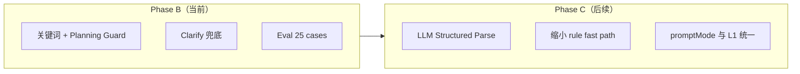
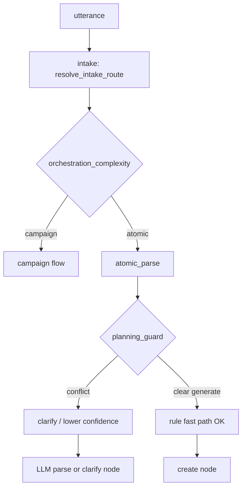

# Intent Understanding Evolution — 设计规格（B → C 路线图）

> 状态：**Draft**（2026-08-05）  
> 前置：[2026-08-04-atomic-intent-hybrid-design.md](./2026-08-04-atomic-intent-hybrid-design.md)、[2026-08-03-atomic-studio-intent-design.md](./2026-08-03-atomic-studio-intent-design.md)  
> **Phase B 计划**：[2026-08-05-intent-planning-guard.md](../plans/2026-08-05-intent-planning-guard.md)  
> **Phase C 规格**：[2026-08-05-intent-llm-structured-parse-design.md](./2026-08-05-intent-llm-structured-parse-design.md)  
> **Phase C 计划**：[2026-08-05-intent-llm-structured-parse.md](../plans/2026-08-05-intent-llm-structured-parse.md)

| 字段 | 值 |
|------|-----|
| 文档版本 | v1.1 |
| 动机 | 「蓝牙耳机主图，详情页的构图方案」因「主图」子串误走 image 直出 |
| 路线 | **先 B 再 C**：B = Planning Guard + Clarify + Eval；C = LLM 结构化意图理解 |

---

## 一、问题陈述

### 1.1 根因

| 现象 | 机制 |
|------|------|
| 「主图」触发 image | `IMAGE_KEYWORDS` + `parse_atomic_target_type` 默认 image |
| Campaign 未生效 | `resolve_intake_route` 中 `atomic_create_intent` **优先于** `marketing_intent` |
| 「构图方案」无规则 | 不在 `TEXT_DEFAULT_KEYWORDS` / `CAMPAIGN_COMPLEXITY_PHRASES` |
| LLM 被 bypass | 「主图」∈ `_STRONG_SIGNAL_KEYWORDS` → `rule_parse_confidence=0.96` |

### 1.2 核心矛盾

系统将 **资产名词**（主图、Banner、详情页）等同于 **动作意图**（生成一张 / 设计方案 / 写策划）。

### 1.3 非目标（Phase B）

- 不在 B 阶段做全 LLM 路由（去掉 rule fast path）→ **见 Phase C spec**
- 不新增前端 Clarify UI 组件（复用现有 `clarify_atomic_intent` SSE 文案）
- 不改造 Campaign 14 节点拓扑逻辑

---

## 〇、四阶段改造总览（B → C）

从「关键词路由」到「意图理解」分 **四层**，B/C 分工如下：

| 层 | 名称 | Phase B | Phase C |
|----|------|---------|---------|
| **L0** | Action 理解 | 规则：`planning_guard.detect_action` | LLM 结构化 `action` 字段 |
| **L1** | 路由 (flow_mode) | orchestration override + 现有 keyword intake | LLM `route` + planning_guard 兜底 |
| **L2** | 结构 (single/multi) | 规则 multi parse + LLM 辅助 | LLM `structure` + `items[]` |
| **L3** | 模态 (target_type) | keyword + planning cap | LLM `target_type` per item |
| **L4** | 抽取 (title/prompt) | prefix strip + enrich | LLM per-item 抽取 |
| **横切** | Clarify + Eval | ✅ 25 case gold set | 100+ case + 续聊解析 |



**B 交付门槛 → 启动 C 的前置条件**（详见 C spec §8）：
1. `eval-planning-guard-set` 25/25 PASS 且零回归
2. prod planning smoke 稳定 2 周
3. clarify 模板 A/B 可量化（误路由率 < 5%）

---

## 二、设计原则

> **先识别 Action（plan / write / generate / expand），再识别 Modality（image / text / …）；资产名词不能单独决定路由。**

### 2.1 三维意图模型（Planning Guard 扩展）

在现有 L1–L4 模型上增加 **Action** 与 **Scope** 判定（规则 + LLM 共用词汇表）：

| 维度 | 取值 | 说明 |
|------|------|------|
| **Action** | `plan` \| `write` \| `generate` \| `expand` \| `unknown` | 用户要做什么 |
| **Scope** | `atomic` \| `campaign` \| `unknown` | 单点 vs 多节点链路 |
| **Modality** | image / text / prompt / video / audio | 现有 `target_type` |

### 2.2 动词词表

**Planning 动词**（命中则禁止 image rule fast path）：

```
设计, 方案, 构图, 策划, 规划, 结构, 框架, 思路, 布局, 模块, 视觉方案, 视觉策划
```

**Generation 动词**（明确允许 image atomic 快路径）：

```
生成一张, 生成一个, 来一张, 做一张, 出图, 直接生成, 帮我生成一张, 帮我做一张
```

**Write 动词**（倾向 text）：

```
写, 撰写, 起草, 输出文案
```

> 注意：「帮我生成」单独出现仍为 vague → clarify（已有逻辑保留）。

### 2.3 组合规则（Planning Guard）

| 条件 | 路由 / 模态 | 置信度 |
|------|-------------|--------|
| Planning + `详情页` + (`构图`\|`方案`\|`结构`) | **campaign**（intake override） | orchestration=campaign |
| Planning + `marketing_intent` + 无 Generation | **clarify** 或 campaign | confidence ≤ 0.65 |
| Planning + 仅「构图方案/视觉方案」无出图动词 | **text** 或 clarify | target=text 或 clarify |
| Generation + `主图` | **image** atomic | 保持 0.96 fast path |
| `主图` + `详情页` + 无 Generation | **campaign** 或 clarify | 禁止 image fast path |

### 2.4 示例 utterance 期望

| Utterance | 期望 route | 期望 outcome |
|-----------|------------|--------------|
| 请你帮我设计一个蓝牙耳机主图，详情页的构图方案 | campaign 或 clarify | **非** image 直出 |
| 生成一张蓝牙耳机主图 | atomic_create | image |
| 帮我做一套天猫蓝牙耳机详情页营销方案 | campaign | plan gate |
| 写一份详情页主图与模块的构图策划（文字版） | atomic_create | text |
| 用提示词模式扩写：赛博朋克耳机主图 | atomic_create | prompt |

---

## 三、架构与 Hook 点



### 3.1 新增模块

**`services/agent-runtime/app/graph/planning_guard.py`**

| 函数 | 职责 |
|------|------|
| `detect_action(text) -> Literal[plan, write, generate, expand, unknown]` | 动词分类 |
| `is_planning_intent(text) -> bool` | Planning 动词或组合 pattern |
| `is_explicit_generation_intent(text) -> bool` | 明确出图/生成 |
| `has_planning_image_conflict(text) -> bool` | 主图/详情页 + planning 无 generation |
| `planning_guard_confidence_cap(text, base_conf) -> float` | 冲突时 cap ≤ 0.65 |
| `planning_clarify_question(text) -> str` | 专用追问文案 |

### 3.2 修改现有文件

| 文件 | 改动 |
|------|------|
| `atomic_intent.py` | 扩展 `CAMPAIGN_COMPLEXITY_PHRASES`；`orchestration_complexity_intent` 识别 planning 组合 |
| `atomic_parse_util.py` | `rule_parse_confidence` 调用 planning_guard cap |
| `atomic_parse_schema.py` | `validate_parse_result` 新增 planning conflict → clarify |
| `atomic_parse_llm.py` | system prompt 增加 Action/Scope 说明 |
| `clarify_atomic_intent.py` | 透传 `clarify_question`（已有，仅确保 planning 文案） |
| `intent-taxonomy.yaml` | 同步 planning/generation 词表（可选，便于运营调整） |

### 3.3 intake 行为（不变优先级文档，增强 orchestration）

`intake.py` 已有逻辑：

```python
if orch == "campaign" and (is_atomic or is_variant_create):
    is_atomic = False
    route = "campaign"
```

**扩展 `orchestration_complexity_intent`** 使 planning 组合返回 `campaign`，即可在不改 `resolve_intake_route` 优先级的前提下，把「详情页构图方案」从 atomic 拉回 Campaign。

对 **atomic-only planning**（无 marketing 词、只要文字策划）走 parse 层 clarify 或 text。

---

## 四、Clarify 文案模板

### 4.1 Planning + 电商资产冲突（默认）

```
您提到「主图」和「详情页构图方案」。请确认：
1）单张主图直接出图；
2）完整详情页 Campaign 方案（多节点：主图/白底/场景等）；
3）只要文字版构图策划（不出图）。
回复 1 / 2 / 3，或补充具体需求。
```

### 4.2 Campaign vs atomic（已有，扩展触发）

当 `详情页` + `方案|构图|设计` 且非明确「生成一张」时，优先走 campaign；若仍进 parse 则 clarify。

---

## 五、评测（Eval）

### 5.1 新增 gold set

**`eval-planning-guard-set.yaml`**（25 cases，独立文件便于回归）

分类：
- `plan-campaign`（10）：详情页/营销/构图方案 → campaign
- `plan-clarify`（5）：主图+详情页双命中 → clarify
- `plan-text`（5）：文字版构图策划 → text
- `control-generate`（5）：明确生成一张主图 → image atomic（不得回归）

### 5.2 扩展现有 set

- `eval-orchestration-set.yaml`：+5 planning cases
- `eval-intent-set.yaml`：+3（含用户原始 case）

### 5.3 测试入口

```bash
pytest services/agent-runtime/tests/test_planning_guard.py
pytest services/agent-runtime/tests/test_atomic_create_intent_eval.py
pytest services/agent-runtime/tests/test_orchestration_intent_eval.py
```

### 5.4 生产 smoke（可选 P1）

`deploy/prod-atomic-studio-verify.py` 增加 1 条 planning utterance，断言 **非** image 直出或 SSE 含 clarify/Campaign。

---

## 六、Global Constraints

- `CLARIFY_THRESHOLD = 0.70`（不变）
- `RULE_FAST_PATH_THRESHOLD = 0.95`（不变；planning conflict 须 cap 至 < 0.70）
- 不降低明确「生成一张主图」类 case 的 fast path 性能
- 中文 clarify 文案，与现有 SSE 风格一致
- Python 与 TS promptMode **本阶段不解耦**（planning 走 text/campaign，不新增 promptMode）

---

## 七、验收标准

1. 「请你帮我设计一个蓝牙耳机主图，详情页的构图方案」→ **route=campaign** 或 **phase=clarify**，**禁止** `target_type=image` 且 confidence≥0.95
2. 「生成一张蓝牙耳机主图」→ 仍为 atomic image，confidence≥0.95
3. eval-planning-guard-set 25/25 PASS
4. 现有 eval-intent-set + eval-orchestration-set **零回归**
5. prod smoke planning case PASS（若纳入 P1）

---

## 八、风险与缓解

| 风险 | 缓解 |
|------|------|
| 「设计一张海报」被误判 planning | Generation 子串「一张」+ 设计 → 仍视为 generate（规则：`设计`+量词+资产 → generate） |
| Campaign 过重 | clarify 提供「文字版策划」选项 |
| 词表维护成本 | `planning_guard.py` + yaml 词表；eval 驱动迭代 |

---

## 九、Phase C 概要（完整规格见独立文档）

> **完整设计**：[2026-08-05-intent-llm-structured-parse-design.md](./2026-08-05-intent-llm-structured-parse-design.md)  
> **实施计划**：[2026-08-05-intent-llm-structured-parse.md](../plans/2026-08-05-intent-llm-structured-parse.md)

Phase C 目标：将 L0–L4 **主路径**从规则 keyword 切换为 **LLM 结构化 parse**，B 的 `planning_guard` + Clarify **保留为 guardrail**（永不删除）。

| 能力 | C 阶段交付 |
|------|-----------|
| 统一 parse schema | `{ action, scope, route, structure, items[], confidence, needs_clarify }` |
| 取消 blanket rule fast path | 仅「高置信 + 无 planning 冲突 + eval 对照组」保留 fast path |
| promptMode 前置 | L3 路由层感知 `commercial_storyboard` / `character_turnaround` 等 |
| Clarify 续聊 | 用户回复「1/2/3」→ `classify_clarify_reply` 解析续路由 |
| Eval 扩展 | 100+ utterances，含 adversarial 子串陷阱 |
| Feature flag | `INTENT_LLM_PARSE=1` 灰度，可回退 B |

**B 与 C 共存策略**：C 上线后 parse 流程为 `LLM parse → planning_guard validate → validate_parse_result → clarify|create`；规则层从「决策者」降为「校验器」。

---
