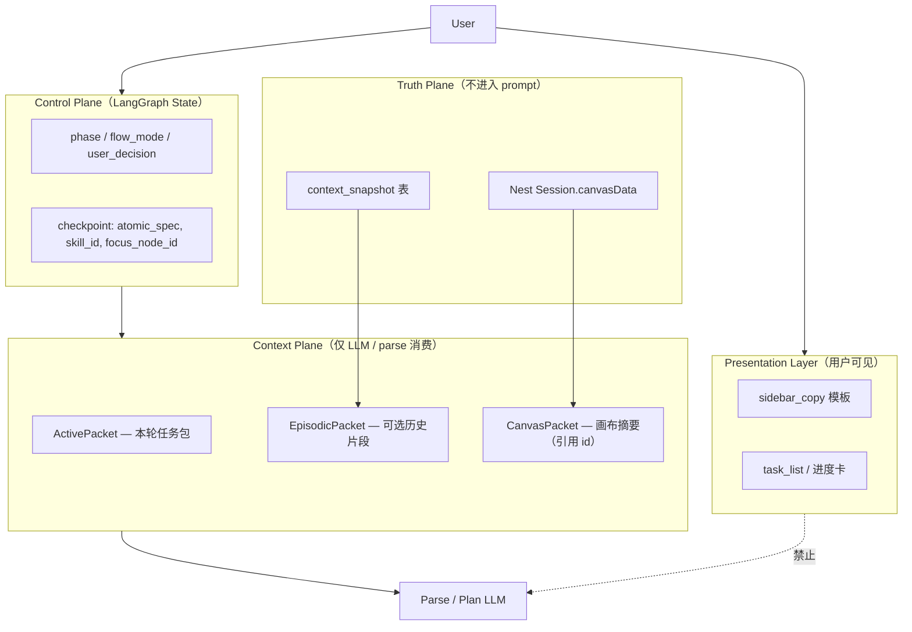

# Agent Context Engineering 设计（侧栏文案规范延伸）

> 状态：**已确认**（2026-08-06）  
> 前置：[2026-08-06-agent-sidebar-copy-design.md](./2026-08-06-agent-sidebar-copy-design.md)（Presentation 层）  
> 关联：[2026-08-05-intent-llm-structured-parse-design.md](./2026-08-05-intent-llm-structured-parse-design.md)（L0–L4 意图模型）  
> 原则：**用户看到的 ≠ 模型看到的**；上下文是稀缺资源，按任务按需装配

---

## 0. 为什么要单独设计 Context

侧栏文案规范解决了 **Presentation 泄露**（把 parse 调试串给用户）。  
但山海经案例的根因还有一半在 **Model Context 设计**：

| 现象 | Context 层问题 |
| --- | --- |
| 蓝牙耳机 / 智慧园区污染 parse | 无差别注入「近期对话 2 轮 + 画布全摘要」 |
| 用户换话题 Agent 仍像粘旧任务 | 缺少 **topic boundary** 与 relevance gate |
| parse / plan / gen 混用同一 history | **未按阶段**切分 working memory |
| 500 字硬截断 | 扁平字符串 ` \| ` 拼接，无优先级丢弃策略 |

Context Engineering 目标：**让模型「刚好看见」完成当前步所需的信息**，且与用户侧栏文案彻底解耦。

---

## 1. 两层记忆模型（Pi / harness 通用模式）



| 层 | 存什么 | 不存什么 |
| --- | --- | --- |
| **Truth** | 全量 nodes/edges/url | 不进 LangGraph messages |
| **Control** | phase、interrupt、atomic_spec 指针 | 长文 plan 正文（用 snapshot） |
| **Context** | 结构化、有预算、可丢弃的摘要 | 用户侧栏文案、debug 字段 |
| **Presentation** | 人话 + 进度 | canvas_context、confidence、route 名 |

---

## 2. ContextPacket 结构（替代扁平 `canvas_context` 字符串）

**现状**（`atomic_context.py`）：

```
上轮原子:prompt:蓝牙耳机… | 画布 3 节点（image×2, prompt×1）| 近期对话:用户:…→助手:…
```

**目标**：typed blocks + 独立预算 + 显式 relevance。

```typescript
interface ContextPacket {
  /** 当前 utterance 的语义锚点 — 永远保留 */
  active: {
    utterance: string
    focus_node_id?: string
    thread_phase?: string
    flow_mode?: string
  }

  /** 仅在与当前任务相关时注入 */
  task?: {
    kind: 'atomic' | 'campaign' | 'regenerate' | 'single_node'
    prior_title?: string      // 上轮 atomic title（短）
    prior_target_type?: string
    style_inherit?: boolean   // 「按刚才风格」时为 true
  }

  /** 画布 — 只给 id/type/title/status，不给 content/url */
  canvas?: {
    node_count: number
    type_counts: Record<string, number>
    relevant_nodes?: Array<{ id: string; type: string; title: string; status?: string }>
    selected_node?: { id: string; type: string; title: string; prompt_hint?: string }
  }

  /** 历史 — 默认不注入；仅 style_inherit / regenerate / 指代消解时 */
  episodic?: {
    turns: Array<{ user: string; assistant_summary: string }>
    max_turns: number
  }

  /** 元数据 — 永不进 prompt，仅日志/shadow eval */
  meta?: {
    topic_switch: boolean
    dropped_sections: string[]
    char_budget_used: number
  }
}
```

**LLM 侧序列化**（示例）：

```markdown
## 当前请求
帮我生成一个山海经的神兽的三视图

## 画布（摘要）
共 3 节点：image×2, prompt×1
选中节点：无

## 任务上下文
类型：atomic_create（新任务，与上轮「蓝牙耳机三视图 prompt」无关 — 已忽略上轮）

## 规则
仅解析当前请求；勿继承无关历史主题。
```

---

## 3. 按阶段注入（Stage-Aware Context）

不同图节点 **不应共用同一 context 配方**。

| 阶段 | 消费者 | 应注入 | 应排除 |
| --- | --- | --- | --- |
| **intake / parse** | Intent LLM | `active.utterance`、精简 `canvas`、**条件** `task.prior_*` | Campaign 方案全文、assistant 侧栏旧文案、2 轮以上对话 |
| **plan** | Plan LLM | `user_brief` anchor、`plan_draft` 摘要、skill body | 无关 atomic 历史、其他 session 节点 content |
| **split / gen** | 工具编排 | manifest keys、node ids、depends_on | 对话 history |
| **chat** | Chat LLM | 最近 1–2 轮 + 简短 canvas 一行 | 营销 manifest、atomic_spec |
| **clarify** | 无 LLM 或极小 | 仅 `clarify_question` 模板 | 一切其它 |

**硬规则：**

1. **Parse 默认零 episodic** — 只有检测到指代/风格继承才打开 `episodic`。
2. **Plan 默认零 canvas 全量** — 用 `context_snapshot` + `get_canvas_summary` 的 title 列表即可。
3. **Gen 零 messages** — 只传 `node_id`，结果回 Nest。

---

## 4. Relevance Gate（解决话题污染）

在 `build_context_packet()` 内增加 **相关性门控**（规则优先，LLM 可选）：

### 4.1 Topic Switch 检测（已有 `topic_switch_prefix` 的用户侧版本）

模型侧更严格：

```python
def should_include_prior_task(utterance: str, prior_spec: dict | None) -> bool:
    if not prior_spec:
        return False
    if is_regenerate_phrase(utterance):      # 「再生成」「按刚才风格」
        return True
    if has_deictic_reference(utterance):    # 「这个」「那张」「同上」
        return True
    if titles_semantically_overlap(utterance, prior_spec["title"]):
        return False  # 同主题续作 — 可带 prior
    return False      # 默认：新 utterance = 新任务，丢弃 prior
```

**山海经 vs 蓝牙耳机**：`should_include_prior_task` → `False` → `task` block 省略或显式写「与上轮无关」。

### 4.2 Canvas 节点筛选

不要注入「已有：帮我拟定蓝牙耳机…」这种 title 全文列表。

| 策略 | 做法 |
| --- | --- |
| **focus 优先** | 有 `focus_node_id` → 只注入该节点 + 直接上游 ref |
| **类型过滤** | parse image 请求 → 最多列 3 个同类最近节点 title |
| **状态过滤** | 优先 `generating` / 刚 `completed` 的节点（用户可能 regenerate） |
| **Campaign 隔离** | `flow_mode=campaign` 的 plan 节点 title 不进入 atomic parse |

### 4.3 Episodic 条件打开

| 触发 | 注入量 |
| --- | --- |
| 「按刚才 / 同风格 / 再来一张」 | 1 轮 user+assistant **摘要**（非侧栏原文） |
| 「改成 / 调整」且 prior_spec 存在 | prior title + 用户 modify 句 |
| 全新主题 | **0 轮** |

Assistant 摘要应用 **semantic summary**，不是侧栏 `sidebar_copy` 字符串：

```python
def summarize_assistant_for_context(content: str) -> str:
    # 例：「已完成蓝牙耳机主图生成」而非「已在画布创建节点，正在生成…四格…」
```

---

## 5. Context Budget（优先级丢弃）

总预算建议（parse 路径）：

| 块 | 上限 | 优先级 |
| --- | --- | --- |
| `active.utterance` | 200 字 | P0 — 永不丢 |
| `task` | 80 字 | P1 |
| `canvas.relevant_nodes` | 150 字 | P2 |
| `canvas` 一行统计 | 60 字 | P3 |
| `episodic` | 120 字 | P4 — 最先丢 |

丢弃顺序：**episodic → canvas 详单 → canvas 统计 → task.prior**（除非 regenerate）。

`meta.dropped_sections` 写日志，便于 shadow eval 对比。

---

## 6. Progressive Disclosure（Skills / 规则）

对齐 Pi / Agent Skills 的 **按需加载**：

| 层级 | 内容 | 何时加载 |
| --- | --- | --- |
| **L0** | Intent schema + 10 条硬约束 | 每次 parse |
| **L1** | `intent-taxonomy.yaml` 摘要（route 定义） | parse |
| **L2** | few-shots（按 detected action 过滤） | 低置信或 shadow |
| **L3** | 完整 skill body | plan 节点 only |
| **L4** | `canvas-manifest.yaml` | split / orchestrate_gen only |

**不要**在 parse system prompt 里塞 turnaround 四格全文 — 只保留一条：`三视图无「提示词」→ pipeline=turnaround_image`。

---

## 7. 与现有组件的映射

| 现有 | 演进 |
| --- | --- |
| `atomic_context.build_atomic_parse_context` | → `context_packet.build_parse_packet()` |
| `atomic_parse_llm` 的 `[画布上下文] {string}` | → `render_packet_for_llm(packet, stage='parse')` |
| `history_trim.trim_history` | 保留；Campaign plan 用 anchor |
| `context_snapshot` | episodic 替代源；存 plan/manifest 摘要 |
| `sidebar_copy` | 只读 `packet.active` + 执行结果，**不读** packet 全量 |
| LangGraph `messages` | 只存 **用户可见** 往返；不把 context packet 写入 messages |

---

## 8. 实施路线（在侧栏规范之上）

### Phase 1 — 结构化 + 门控（1–2 天，高收益）

- [ ] 新增 `app/graph/context_packet.py`（`ContextPacket` + `build_parse_packet`）
- [ ] `should_include_prior_task` / `should_include_episodic`
- [ ] `atomic_parse_llm` / `intent_parse_llm` 改用 markdown block 渲染
- [ ] 删除 pipe 拼接字符串；`atomic_spec.canvas_context` 改为存 JSON packet（或仅 debug log）

### Phase 2 — Assistant 摘要与 Canvas 筛选（2–3 天）

- [ ] `summarize_assistant_for_context()` — 从执行结果生成，非侧栏 copy
- [ ] focus 节点 + 类型过滤的 `relevant_nodes`
- [ ] shadow eval：`eval-intent-llm-set.yaml` 增加 **topic switch** 用例

### Phase 3 — 分阶段配方（3–5 天）

- [ ] `STAGE_CONTEXT_RECIPES`  registry（parse / plan / chat）
- [ ] plan 节点读 snapshot，不读 messages 里的旧 atomic 文案
- [ ] 统一 observability：`context_packet.meta` 进 LangSmith / 结构化 log

---

## 9. 验收（Context 层）

1. **Topic switch**：蓝牙耳机 prompt → 山海经三视图；parse prompt **不含**蓝牙耳机/episodic。  
2. **Style inherit**：「按刚才风格再来一张」；parse prompt **含** 1 轮 episodic + prior title。  
3. **Focus**：选中 image 节点 + 「快速生成」；canvas 块 **仅**该节点。  
4. **Budget**：超长 session；`active.utterance` 完整，episodic 被丢弃且 parse 仍正确。  
5. **隔离**：侧栏文案变更 **不**改变 parse prompt（presentation ↔ context 零耦合）。

---

## 10. 反模式 checklist

| 反模式 | 正确做法 |
| --- | --- |
| 把 debug context 拼进 AIMessage | packet 仅进 LLM user block |
| 每轮注入最近 2 轮完整对话 | 默认 0；指代/风格才开 episodic |
| 画布 title 全量列表 | relevant_nodes ≤3 或 focus only |
| 同一字符串服务 UI + LLM | `sidebar_copy` vs `context_packet` 分离 |
| 截断 500 字从右截 | 按优先级丢块，保留 utterance |
| 在 messages 里累积机器 phase 文案 | messages = 用户可见历史；phase 在 state |

---

## 11. 与 Pi harness 的对照

| Pi 实践 | lnkpi 映射 |
| --- | --- |
| Minimal system prompt | parse/plan 分阶段短 system + taxonomy |
| Skills on demand | L0–L4 progressive disclosure |
| Dynamic context injection | `ContextPacket` per stage |
| Append-only session tree | LangGraph checkpoint + snapshot；messages 仅 visible |
| Tool results → context | Nest tool 结果进 state pointer，不进 messages 全文 |

lnkpi **额外**需要：Campaign HITL 门、canvas SoT 分离 — 这些不适合 Pi 默认 4-tool loop，但 **context 分层思想完全适用**。

---

## 12. 相关文件（规划）

| 文件 | 职责 |
| --- | --- |
| `app/graph/context_packet.py` | **新建** — packet 构建、relevance gate、budget |
| `app/graph/context_render.py` | **新建** — stage → markdown/json for LLM |
| `app/graph/atomic_context.py` | 薄封装 / deprecated 转发 |
| `app/graph/atomic_parse_llm.py` | 消费 rendered packet |
| `app/graph/intent_parse_llm.py` | 同上 |
| `docs/.../agent-sidebar-copy-design.md` | Presentation 层（已完成） |
