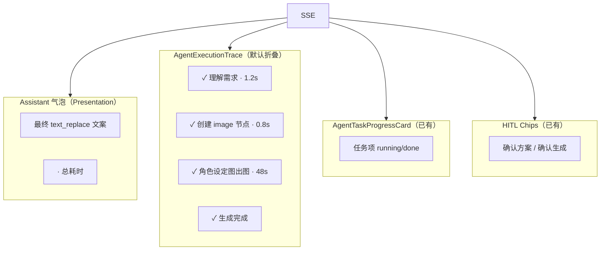

# Agent 执行过程可见性设计（Execution Trace）

> 状态：**P0 实现中**（2026-08-06）  
> 前置：  
> - [2026-08-06-agent-sidebar-copy-design.md](./2026-08-06-agent-sidebar-copy-design.md)（侧栏人话文案 + `text_replace`）  
> - [2026-08-06-agent-context-engineering-design.md](./2026-08-06-agent-context-engineering-design.md)（Context 与 Presentation 分离）  
> - [2026-07-25-agent-task-progress-card-design.md](./2026-07-25-agent-task-progress-card-design.md)（任务进度卡）  
> 对标：Cursor Agent / Codex 等产品的 `>` 可折叠步骤、Thinking / Explore / Working、工具调用明细、任务状态与耗时  
> 范围：**P0–P2 共 10 项**（本文 §4–§6）— 侧栏执行轨迹 UI、SSE 协议扩展、Runtime 步骤 emit、Thinking/Explore 可选层、Replay 时间线  
> 非范围：侧栏文案模板改写（已交付）、三视图事前 confirm 弹窗、Campaign plan 全文重构、Pi 全量替换

---

## 0. 决策摘要

| 项 | 结论 |
| --- | --- |
| UI 形态 | 每轮 assistant 消息下挂 **`AgentExecutionTrace`**：默认折叠 `▸ 执行过程（N 步）`，点击展开逐步明细 |
| 与 `text_replace` 关系 | **气泡仍只显示最终阶段文案**（sidebar_copy 规范不变）；轨迹区**保留**本轮全部 `text_replace` 序列与步骤事件 |
| 步骤来源（P0） | 现有 SSE：`text_replace` 历史、`task_*`、`canvas_action`、`tool_call/result`、`node_status` |
| 步骤来源（P1） | 新增 `step` / `phase_hint` 事件，由 LangGraph `stream_mode="updates"` 标准化 emit |
| 耗时 | P0 前端回合计时；P1 单步 `ms`；重连/历史可读 `thread-timeline` 补全 |
| Thinking | P2、**默认折叠**、仅 parse/plan 摘要，非 raw CoT |
| Explore | P2、展示「参考了哪些画布上下文」摘要，与 ContextPacket 一致 |
| 术语 | 轨迹 label 用人话；**禁止** `atomic_create_gate`、`image 节点（直达）`、`[canvas_context]` |

---

## 1. 问题与目标

### 1.1 现状（2026-08-06）

| 已有 | 缺口 |
| --- | --- |
| 任务进度卡（Campaign / 批量 gen） | 无 Cursor 式 `>` 折叠步骤面板 |
| `text_replace` 阶段替换（人话气泡） | 中间阶段对用户「闪没」 |
| `tool_call` 仅显示 `⚙ name` | 无参数/结果摘要；Runtime 路径几乎不 emit |
| `node_status` 已在 SSE | 前端 **零 handler** |
| `canvas_action` 静默写画布 | 聊天不可见「创建了哪个节点」 |
| `GET /api/agent/thread-timeline` | 前端未消费 |
| Studio 文本 `thinking` | Agent SSE **无** thinking 流 |

### 1.2 成功标准

1. 用户可在侧栏看到「Agent 正在做什么」：默认简洁，可展开看步骤。  
2. 单轮 atomic / Campaign gen 结束显示 **总耗时**（如 `· 52s`）。  
3. 展开后可看到：理解需求 → 创建节点 → 出图中 → 完成（及失败/重试/等待确认）。  
4. 不破坏 sidebar_copy 规范：主气泡无内部路由词、无 context 泄露。  
5. 生产 smoke 可断言轨迹步骤存在（见 §9）。

---

## 2. 信息架构



| 层 | 用户看到什么 | 数据来源 |
| --- | --- | --- |
| **主气泡** | 人话结论 + 总耗时 | 最后一条 `text_replace` + 前端 `turnStartedAt` |
| **执行轨迹** | 可折叠步骤列表 | `executionSteps[]` reducer（§3.2） |
| **任务卡** | 批量 gen 逐项状态 | `task_list` / `task_update` / `task_summary` |
| **HITL** | 待确认操作 | `interrupt` + chip 启发式 |

---

## 3. 数据模型

### 3.1 前端 `ExecutionStep`

```typescript
type ExecutionStepStatus = 'pending' | 'running' | 'done' | 'failed' | 'waiting_user' | 'skipped'

interface ExecutionStep {
  id: string                    // 稳定 id，便于更新
  kind:                         // 步骤类型（决定 icon / 默认 label）
    | 'phase'                   // LangGraph / 逻辑阶段
    | 'text_stage'              // sidebar_copy 阶段（parse/create/done）
    | 'canvas'                  // canvas_action 摘要
    | 'tool'                    // tool_call + result
    | 'node_gen'                // node_status / 单节点出图
    | 'task'                    // 与 task_progress 行关联
    | 'thinking'                // P2：推理摘要（折叠）
    | 'explore'                 // P2：上下文探索摘要
  label: string                 // 用户语言，必填
  detail?: string               // 展开二级：参数摘要、errorHint、URL 短链等
  status: ExecutionStepStatus
  startedAt?: number            // epoch ms
  endedAt?: number
  ms?: number                   // 完成后写入
  meta?: {
    nodeId?: string
    taskId?: string
    toolName?: string
    phase?: string              // 内部 phase，仅 debug 模式展示
    errorCode?: string
  }
}
```

### 3.2 `AgentMessage` 扩展

```typescript
interface AgentMessage {
  // ...现有字段
  executionTrace?: {
    steps: ExecutionStep[]
    collapsed: boolean          // 默认 true
    turnStartedAt: number
    turnEndedAt?: number
    totalMs?: number
  }
  textReplaceHistory?: string[] // P0：本轮每条 text_replace，供轨迹与验收
}
```

**规则：**

- 每个 **user turn** 创建新的 assistant 占位消息，挂载独立 `executionTrace`。  
- `text_replace`：**更新** `content`（最终气泡），**追加** `textReplaceHistory`。  
- `done` / SSE 关闭：写入 `turnEndedAt`、`totalMs`。

### 3.3 步骤 label 映射（人话，禁止内部名）

| 内部信号 | 轨迹 label（示例） |
| --- | --- |
| `text_replace` 含「我来生成」 | 理解需求 |
| `text_replace` 含「已在画布创建」 | 创建画布节点 |
| `text_replace` 含「角色设定图」+ turnaround note | 角色设定图扩写与出图 |
| `text_replace` 含「生成完成」 | 生成完成 |
| `canvas_action` add_node image | 添加图片节点「{title}」 |
| `node_status` generating | 节点出图中 |
| `node_status` completed | 节点出图完成 |
| `task_update` retrying | 重试出图（{n}/2） |
| `interrupt` phase=await_confirm | 等待你确认方案 |
| `step` kind=atomic_parse | 解析创作意图 |
| `explore` | 参考画布上下文（{n} 个节点） |
| `thinking` | 思考中…（摘要） |

映射实现：`apps/web/src/components/agent/executionStepLabels.ts`（纯函数，可单测）。

---

## 4. P0 — 现有事件产品化（优先交付）

> 目标：**不改 Runtime 协议**即可显著接近 Cursor「过程可见」；预计 1–2 周。

### P0-1 · `AgentExecutionTrace` 可折叠步骤面板

**描述：** 仿 Cursor `>`，在 assistant 消息下方渲染折叠块。

**UI：**

```text
「山海经…」生成完成，请在画布查看节点。  · 52s
▸ 执行过程（4 步）                 ← 默认 collapsed
```

展开：

```text
▾ 执行过程（4 步）
  ✓ 理解需求 · 1.2s
  ✓ 创建画布节点 · 0.8s
  ✓ 角色设定图扩写与出图 · 48s
  ✓ 生成完成 · 0.1s
```

**交互：**

- 点击标题行 toggle；状态持久到**当前 session**（`sessionStorage`，key `agent-trace-expanded`）。  
- 步骤行可点击：有 `nodeId` → `focusNode`；有 `taskId` → 滚动任务卡对应行。  
- Streaming 中：标题显示 `▸ 执行过程（进行中…）`，最后一步 `running` 带 pulse。

**组件：**

| 文件 | 职责 |
| --- | --- |
| `AgentExecutionTrace.vue` | 折叠 UI + 步骤列表 |
| `executionTraceReducer.ts` | SSE → `ExecutionStep[]` |
| `executionStepLabels.ts` | 人话 label 映射 |

**接入：** `AgentSideRail.vue`（主）、`AgentPanel.vue` / `AgentFloatingWindow.vue`（只读精简版，可选 P0 末）。

---

### P0-2 · 保留 `text_replace` 历史（修复「过程闪没」）

**描述：** sidebar_copy 规范要求气泡**替换**为最终文案；轨迹层必须**追加**每阶段全文。

**Store（`agent.ts`）：**

```typescript
function replaceAssistantText(text: string) {
  const last = messages[messages.length - 1]
  if (!last?.executionTrace) initExecutionTrace(last)
  last.textReplaceHistory = [...(last.textReplaceHistory ?? []), text]
  last.content = text
  executionTraceReducer.applyTextStage(last.executionTrace, text)
}
```

**Reducer 规则：**

- 每条 history 生成或更新一个 `kind: 'text_stage'` 步骤。  
- 相邻同 label 合并（避免 create 阶段两次 replace 重复行）。  
- **禁止**把 history 拼回主气泡。

**验收：** 生产 `prod-sidebar-copy-verify.py` 逻辑并入正式 smoke：断言 `textReplaceHistory.length >= 2` 且首条含「我来生成」、末条含「生成完成」。

---

### P0-3 · 接入 `node_status`

**描述：** Runtime / Nest 已 emit `{ nodeId, status, url?, generationRecordId? }`，SideRail 未处理。

**Handler：**

```typescript
case 'node_status': {
  const { nodeId, status, url } = event.data
  executionTraceReducer.applyNodeStatus(trace, { nodeId, status, url })
  // 可选：同步 taskProgressReconcile（与画布 polling 对齐）
  break
}
```

**步骤：**

| status | 步骤 status | label |
| --- | --- | --- |
| `generating` | `running` | 节点出图中 |
| `completed` | `done` | 节点出图完成 |
| `failed` | `failed` | 节点出图失败 |

**与任务卡：** 若同一 `nodeId` 已在 `task_list`，更新对应 `task` 步骤而非重复 `node_gen` 行（dedupe by `nodeId`）。

---

### P0-4 · 展示 `canvas_action` 摘要

**描述：** 用户应看到 Agent **改动了画布**，而非静默 mutation。

**Handler：**

```typescript
case 'canvas_action':
  agent.addCanvasAction(data)          // 保留现有 flush
  executionTraceReducer.applyCanvasAction(trace, data)
```

**摘要规则（`CanvasAction` → label）：**

| action | label |
| --- | --- |
| `add_node` | 添加 {typeLabel} 节点「{title}」 |
| `update_node` | 更新节点「{title}」 |
| `add_edge` | 连接画布节点 |
| `remove_node` | 移除节点 |

`typeLabel` 来自 sidebar_copy 的 `TARGET_TYPE_LABELS` 映射（图片/文本/…）。

**detail（展开二级）：** 仅 nodeId 短码 + 可选 title，**不**展示完整 JSON。

---

### P0-5 · 回合总耗时

**描述：** 对标 Cursor 底部 `Done · 12.4s`。

**实现：**

- `sendMessage()` 时：`turnStartedAt = Date.now()` 写入 assistant 占位。  
- 收到 `done` 或 SSE 关闭：`totalMs = Date.now() - turnStartedAt`。  
- 气泡 footer：`formatDuration(totalMs)` → `· 52s` / `· 1m 12s`。  
- Streaming 中：可选弱提示 `· 进行中…`（不显示虚假秒数）。

**重连：** 若 SSE 中断后恢复，用最后 activity timestamp 估算；精确值 P1 由 `step.ms` 累加。

---

## 5. P1 — 协议与 Runtime 标准化（2–4 周）

### P1-6 · 新增 `step` / `phase_hint` SSE 事件

**动机：** P0 靠启发式解析 `text_replace`，Campaign 多节点路径 label 不稳定；需 LangGraph 主动 emit。

**事件：**

```typescript
// 步骤生命周期（可多次 update 同一 id）
{ type: 'step', data: {
  id: string
  kind: 'phase' | 'tool' | 'gen' | 'hitl'
  label: string              // 人话，Runtime 侧 step_copy.py 生成
  status: 'running' | 'done' | 'failed' | 'waiting_user'
  detail?: string
  ms?: number                // status=done 时可选
  nodeId?: string
  taskId?: string
}}

// 轻量阶段提示（不打断气泡，只更新轨迹首行）
{ type: 'phase_hint', data: {
  phase: string              // 内部 phase 枚举
  label: string              // 用户语言，如「等待你确认方案」
}}
```

**Runtime（`runs.py`）emit 点：**

| 时机 | step label（示例） |
| --- | --- |
| `graph.astream` 进入 node | 根据 `NODE_STEP_LABELS[node_name]` emit `running` |
| node 完成 | 同 id `done` + `ms` |
| `interrupt` 前 | `waiting_user` + `phase_hint` |

**`NODE_STEP_LABELS`（Runtime，`step_copy.py`）：**

| node_name | label |
| --- | --- |
| `intake` | 理解你的需求 |
| `atomic_parse` / `parse_atomic_intent` | 解析创作意图 |
| `atomic_create` / `create_atomic_node` | 创建画布节点 |
| `run_atomic_gen` | 生成内容 |
| `plan` | 拟定营销方案 |
| `split` | 拆解画布任务 |
| `orchestrate_gen` | 批量生成 |
| `await_confirm` | 等待确认 |

**禁止**把 node_name 直接作为 label 展示。

**类型：** 扩展 `packages/agent/src/types.ts` `AgentStreamEvent`；Nest `agent.service.ts` 透传。

---

### P1-7 · 结构化错误展示

**描述：** `error` 事件已有 `error_type`、`tool_name`、`retry_hint`；UI 仅 `⚠️ message`。

**轨迹步骤：**

- 失败步骤 `kind: 'tool' | 'gen'`，`status: failed`。  
- `detail` 展示：`retry_hint` > `errorCode`（task_update）> `message` 短句。  
- 主气泡：保留一句人话；轨迹展开看技术细节。

**任务卡：** `AgentTaskProgressCard` 渲染 `errorHint` / `errorCode`（已有字段未展示）。

**映射表（`executionStepErrors.ts`）：**

| error_type | 用户 detail |
| --- | --- |
| `tool_timeout` | 服务响应超时，可稍后重试 |
| `downstream_unavailable` | 生成服务暂不可用 |
| `circuit_open` | 服务繁忙，请稍后再试 |
| `internal_error` | 内部错误，请重试或联系支持 |

---

### P1-8 · `interrupt` 阶段文案

**描述：** `interrupt` payload 含 `phase`、`node`、`interrupted`；目前只驱动 chip。

**行为：**

1. emit `phase_hint`（P1-6）或轨迹步骤 `waiting_user`。  
2. 标题行 label 来自 `PHASE_HINT_LABELS`：

| phase | label |
| --- | --- |
| `await_confirm` | 等待你确认方案 |
| `await_copy_confirm` | 等待你确认主文案 |
| `await_topology_confirm` | 等待你确认节点结构 |
| `atomic_confirm_gate` | 等待你确认生成参数 |

3. 主气泡**不**追加机器 phase 字符串；chip + 轨迹即可。

**重连：** 现有 `GET /api/agent/thread-state` + `recoveredPhaseHint` 同步写入轨迹首条 `waiting_user` 步骤。

---

## 6. P2 — 增强层（可选，按需排期）

### P2-9 · Thinking 流（谨慎）

**原则：** 画布 Agent 是「创作执行」非「代码推理」；Thinking 为**信任增强**，非 debug _dump。

**范围：**

- 仅 **parse / plan** LLM 调用可选开启（env：`AGENT_THINKING_UI=true`）。  
- SSE 新事件：

```typescript
{ type: 'thinking', data: {
  status: 'running' | 'done'
  summary?: string    // 完成后 1–2 句摘要，非 raw tokens
}}
```

- UI：`kind: 'thinking'` 步骤，**默认折叠**在轨迹最上；展开才看 summary。  
- **禁止**默认向所有用户流式 raw CoT。  
- 与 Studio `textThinking` 共用 provider 能力，但**独立**于 Agent 主气泡。

**非范围：** gen 节点出图过程 thinking、全量 token 流。

---

### P2-10 · Explore 语义（上下文探索可见）

**描述：** 对标 Cursor 「Explored 3 files」；对我们 = ContextPacket 装配过程。

**SSE：**

```typescript
{ type: 'explore', data: {
  label: '参考画布上下文'
  nodeCount: number
  nodeTitles?: string[]   // 最多 3 个 title + 「等」
  episodicUsed: boolean
  topicSwitch: boolean
}}
```

**emit 点：** `atomic_parse` / `intent_parse` 完成 ContextPacket 后（`context_packet.py`），**仅摘要**。

**UI：** 单条 `kind: 'explore'` 步骤；detail 示例：`已参考 2 个节点：蓝牙耳机主图、模拍参考；未引用历史对话`。

**与 Context Engineering 一致：** 展示「用了什么」而非 `[canvas_context]` 原文。

---

### P2-11 · Replay / 运维时间线（`thread-timeline`）

**描述：** W27 已有 `GET /api/agent/thread-timeline?threadId=`，返回 checkpoint phase 序列；前端未用。

**消费场景：**

1. **ReplayPage**：历史会话展示折叠轨迹（离线，无 SSE）。  
2. **Debug 模式**（设置开关 / `?agentDebug=1`）：SideRail 轨迹底部「查看 Graph 时间线」，映射 `entries[].phase` → 内部 phase（**仅 debug 可见**）。  
3. **Ops**：deploy smoke 可选拉 timeline 断言 phase 顺序。

**API 扩展（可选）：** timeline entry 增加 `startedAt` / `durationMs`（Runtime `replay.py` 由 checkpoint metadata 推算）。

**注意：** 生产用户默认只见 P0/P1 人话轨迹；timeline 为补充，不替代 `step` 事件。

---

## 7. SSE 协议汇总（增量）

| 类型 | 阶段 | payload 要点 | 前端 |
| --- | --- | --- | --- |
| `text_replace` | 已有 | `{ text }` | 气泡替换 + **history 追加** + text_stage 步骤 |
| `node_status` | P0 | `{ nodeId, status, url? }` | 轨迹 node_gen 步骤 |
| `canvas_action` | P0 | `CanvasAction` | 轨迹 canvas 步骤 + 现有 flush |
| `tool_call` / `tool_result` | P0 增强 | `{ name, arguments?, result? }` | 轨迹 tool 步骤 + detail 摘要 |
| `step` | P1 | 见 §5 P1-6 | 轨迹主数据源（优先于启发式） |
| `phase_hint` | P1 | `{ phase, label }` | 轨迹 waiting / 进行中提示 |
| `thinking` | P2 | `{ status, summary? }` | 折叠 thinking 步骤 |
| `explore` | P2 | ContextPacket 摘要 | explore 步骤 |
| `interrupt` | P1 增强 | 现有 + phase_hint 联动 | waiting_user 步骤 + chips |
| `error` | P1 增强 | 结构化字段全展示 | failed 步骤 detail |
| `done` | P0 | `{}` | 写 totalMs |

**类型文件：** `packages/agent/src/types.ts` 补齐 `ping`、`interrupt`、`force_choice`、`text_replace`、`step`、`phase_hint`、`thinking`、`explore`。

---

## 8. 与现有规范的关系

| 规范 | 关系 |
| --- | --- |
| sidebar_copy | 主气泡文案**不变**；轨迹展示阶段历史，不泄露内部词 |
| context_engineering | Explore 步骤展示 ContextPacket **摘要**，非 raw packet |
| task_progress_card | 批量 gen 仍用任务卡；轨迹与卡** dedupe** 同 nodeId |
| text_replace 一轮一气泡 | **维持**；history 仅存在于 `executionTrace` |

---

## 9. 验收标准

### 9.1 P0

1. atomic 单图：折叠块默认存在；展开含 ≥3 步（理解 / 创建 / 完成）。  
2. 主气泡无 `原子创作`、`image 节点`；轨迹亦无。  
3. `node_status` 出图时轨迹有「节点出图中 → 完成」。  
4. `canvas_action` add_node 后轨迹有「添加图片节点…」。  
5. 回合结束显示 `· Ns`。  
6. `textReplaceHistory` 长度 ≥ 2，首末条符合 sidebar_copy。

### 9.2 P1

7. Campaign 确认后轨迹含「拟定方案 → 拆解 → 等待确认」等等价步骤（来自 `step` 事件）。  
8. 工具/生成失败：轨迹步骤 `failed` + retry_hint 可见。  
9. interrupt 重连后轨迹显示「等待你确认方案」。

### 9.3 P2

10. `AGENT_THINKING_UI=true` 时 parse 出现可折叠 thinking 摘要，默认收起。  
11. Explore 步骤显示参考节点数，无 `[canvas_context]`。  
12. ReplayPage 可渲染历史轨迹；debug 可看 thread-timeline。

### 9.4 自动化

| 脚本 | 断言 |
| --- | --- |
| `deploy/prod-sidebar-copy-verify.py` | 扩展：SSE 多步 `text_replace` |
| `deploy/prod-execution-trace-verify.py`（新建） | 轨迹步骤数、耗时、无禁止词 |
| `executionTraceReducer.test.ts` | reducer + label 映射单测 |
| `services/agent-runtime/tests/test_step_events.py` | P1 step emit |

---

## 10. 实现顺序与文件

```text
Phase P0（可独立 PR）
  apps/web/src/stores/agent.ts
  apps/web/src/components/agent/AgentExecutionTrace.vue
  apps/web/src/components/agent/executionTraceReducer.ts
  apps/web/src/components/agent/executionStepLabels.ts
  apps/web/src/components/agent/AgentSideRail.vue
  deploy/prod-execution-trace-verify.py

Phase P1（依赖 P0 reducer）
  services/agent-runtime/app/graph/step_copy.py
  services/agent-runtime/app/runs.py
  packages/agent/src/types.ts
  apps/server/src/agent/agent.service.ts
  apps/web/src/components/agent/executionStepErrors.ts
  apps/web/src/components/agent/AgentTaskProgressCard.vue

Phase P2
  services/agent-runtime/app/graph/context_packet.py  → explore emit
  services/agent-runtime/app/graph/intent_parse_llm.py → thinking
  apps/web/src/pages/ReplayPage.vue
  services/agent-runtime/app/replay.py               → timeline timestamps
```

---

## 11. 附录：Cursor 对标映射

| Cursor / Codex | 本设计 |
| --- | --- |
| `>` 折叠步骤 | `AgentExecutionTrace` |
| Thinking | P2 `thinking`（摘要、默认折叠） |
| Exploring files | P2 `explore`（画布 ContextPacket 摘要） |
| Working / Ran command | P0 tool 步骤 + P1 `step` |
| Todo 清单 | 已有 `AgentTaskProgressCard` |
| Done · 12.4s | P0 回合 `totalMs` + P1 单步 `ms` |

---

## 12. 待确认项

- [x] P2 Thinking：**默认关闭**；仅 `AGENT_THINKING_UI=true` 或实验室开关开启（不对全量用户默认展示 raw CoT）  
- [x] `AgentPanel` / 浮窗：**P0 仅 SideRail** 展示轨迹；Panel/浮窗后续按需同步  
- [x] 轨迹持久化：**P0 仅 session 内存**（Pinia + 当前 turn）；DB 持久化列入 P2+ 可选  

确认后可进入实现计划（`writing-plans`）并拆 PR：建议 **P0 单 PR**、**P1 单 PR**、**P2 按 9/10/11 再拆**。
