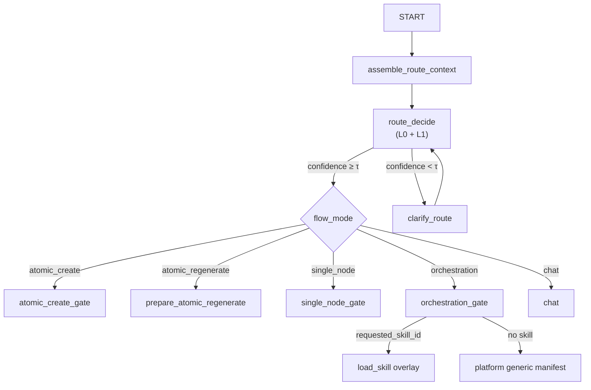

# 平台路由与 Skill 边界 — 设计规格

> 状态：**Implemented R0/R1**（2026-08-07）  
> 动机：生产复测暴露 img2img 原子请求被误判为 Campaign 营销方案流；根因是 **平台 L1 路由** 与 **Skill 隐式绑定** 耦合，且样例 skill 被当作电商默认路径  
> 前置：[2026-08-04-atomic-intent-hybrid-design.md](./2026-08-04-atomic-intent-hybrid-design.md)、[2026-08-05-intent-llm-structured-parse-design.md](./2026-08-05-intent-llm-structured-parse-design.md)、[2026-08-07-agent-sidebar-material-entry-design.md](./2026-08-07-agent-sidebar-material-entry-design.md)、[2026-08-03-agent-phase-c2-dock-model-skillid-design.md](./2026-08-03-agent-phase-c2-dock-model-skillid-design.md)  
> 将 supersede：`docs/adr/p5-atomic-orchestration-boundary-adr.md` 规则 3（LLM 不改 L1）；Phase C2 §4.1 关键词启发式绑 skill  
> 非范围：Skill 市场 UI、用户安装/卸载 API、斜杠唤起（R3+）；电商领域 skill 产品化内容（R4）

| 字段 | 值 |
|------|-----|
| 文档版本 | v1.0 |
| 创建日期 | 2026-08-07 |
| 文档定位 | 将 **平台 Graph 路由** 与 **agentskills.io Skill 生态** 解耦；定义 `route_decide`、RouteContext、显式 Skill 调用契约 |

---

## 0. 决策摘要

| # | 决策 | 说明 |
|---|------|------|
| **R-S1** | **平台路由与 Skill 选择正交** | `flow_mode` 由平台 `route_decide` 决定；`skill_id` **仅**在用户显式传入 `requested_skill_id` 时绑定 |
| **R-S2** | **废止 intake 关键词隐式绑 skill** | 删除 `marketing_intent(text) → enterprise-marketing-campaign`；`MARKETING_HINTS` 不再驱动 skill 加载 |
| **R-S3** | **`enterprise-marketing-campaign` 定位为验收样例** | 仅用于 LangGraph/manifest 格式参考；**不得**作为 production 默认 orchestration；电商最佳实践以可安装 Skill 交付 |
| **R-S4** | **新增 `route_decide` 节点** | L0 Action + L1 `flow_mode` 在 **全量 RouteContext** 上决策；位于 Graph 分叉点之前 |
| **R-S5** | **歧义默认 `clarify_route`，非 Campaign** | 低置信路由 → 侧栏追问；禁止 silent 进 14 节点 `await_confirm` |
| **R-S6** | **侧栏 ref 参与 L1** | `mentionedKeys` + `sidebarAttachments` 为 P1 信号；双图 ref + 变换动词 → 优先 `atomic_create`（img2img） |
| **R-S7** | **L0 `preserve` 修饰 `generate`** | 「保持构图/主图风格/背景不变」→ 禁止 `planning_guard` 触发 campaign override |
| **R-S8** | **`flow_mode=campaign` 更名为 `orchestration`**（可选 R2） | 语义为平台多节点编排能力，不隐含任何 skill；过渡期允许 alias |
| **R-S9** | **Route Unification 完成（P1c）** | L0 路由仅经 `extract_route_features` + `apply_route_precedence`；废止 `decide_route_legacy` 与 shadow diff；`orchestration_phrases` / IR 替代 L1 substring hint 表 |

---

## 1. 背景与生产事件

### 1.1 触发 case（2026-08-07 生产）

用户输入：

```text
@I1 这个是模特图，@I2 这个是产品图，让模特穿上这件衣服。保持主图风格，背景，构图不变。
```

**期望：** `atomic_create` → img2img（@I1 + @I2）  
**实际：** `flowMode=campaign` → `await_confirm` → 「拟定拆解约 14 个画布节点」

### 1.2 双重误路由

| 层 | 误判机制 | 性质 |
|----|----------|------|
| **平台 L1** | `has_planning_image_conflict`：`主图` + `构图` → planning；`resolve_intake_route` → campaign | **规则误判**（非 LLM） |
| **Skill 绑定** | `marketing_intent("主图")` → 自动 `skill_id=enterprise-marketing-campaign` | **架构耦合**（用户未显式选 skill） |

补充：`atomic_create_intent` 对该句为 **True**（含模特图/产品图），但被 L1 campaign override 覆盖；LLM structured parse **未参与**（仅在 `flow_mode=atomic_create` 后才进入 `parse_atomic_intent`）。

### 1.3 设计债归纳

当前 `intake.py` 将三件正交职责耦在一起：

1. **L1 平台路由**（atomic / orchestration / single_node / chat）
2. **Skill 选择**（应为用户显式安装/调用）
3. **样例电商编排**（`enterprise-marketing-campaign` 14 节点 manifest）

这与产品方向冲突：**Skill 是 agentskills.io 生态下用户可安装、显式调用的扩展**；平台 Graph 应提供与 Skill 无关的基础能力。

---

## 2. 目标与非目标

### 2.1 目标

1. **解耦**：平台 `flow_mode` 决策与 `skill_id` 绑定分离；唯一显式接口为 `requested_skill_id`。
2. **Context-aware 路由**：`route_decide` 消费 utterance + 侧栏 ref + focus + canvas + checkpoint。
3. **L0 Action 层**：区分 `plan` / `generate` / `preserve` / `regenerate` 等，消除 preservation 短语误触 planning guard。
4. **Clarify 优先**：歧义 → `clarify_route`，不默认最重链路。
5. **评测闭环**：新增 `eval-route-set.yaml` + skill 边界 case；CI 阻断回归。
6. **渐进迁移**：R0 止血 → R1 平台路由 → R2 orchestration 泛化 → R3 Skill 生态 → R4 电商 Skill 产品化。

### 2.2 非目标

| 能力 | 说明 |
|------|------|
| Skill 市场 / 安装器 | R3+ 独立 spec |
| 斜杠 `/skill-name` 唤起 | R3+ |
| ReAct 无界 tool loop | 与 Loop Engineering L-P7 一致 |
| 一次性修完所有 planning_guard 词表 | 系统性靠 L0 + RouteContext，非词表战争 |
| 在本 spec 内重写 Campaign 14 节点产品 | 属 Skill 包内容 |

---

## 3. 目标架构

### 3.1 两层模型

```text
┌─────────────────────────────────────────────────────────────┐
│ 平台 Graph（内置，与 Skill 无关）                              │
│  route_decide → flow_mode ∈ { atomic_create, atomic_regen,   │
│    single_node, orchestration, chat, clarify_route }         │
└─────────────────────────────────────────────────────────────┘
                              │
          requested_skill_id  │（显式，可选）
                              ▼
┌─────────────────────────────────────────────────────────────┐
│ Skill 生态（agentskills.io，用户安装 + 显式调用）               │
│  SKILL.md + manifest + references + allowed-tools           │
│  仅影响：manifest 模板 / few-shots / 领域 clarify 文案          │
└─────────────────────────────────────────────────────────────┘
```

### 3.2 Graph 拓扑（目标态）



**变更要点：**

- `intake` 瘦身为 dispatcher：读 `route_decision`，不再内嵌 200 行规则 + 默认 campaign。
- `orchestration_gate` 替代「Campaign = enterprise-marketing-campaign」硬编码。
- `skill_id` 只在 `requested_skill_id` 校验通过时写入 state。

### 3.3 四层意图模型（修订）

在 [Hybrid Spec §2](./2026-08-04-atomic-intent-hybrid-design.md) 基础上增加 **L0**，并将 L1 决策点前移：

| 层 | 职责 | 决策点 |
|----|------|--------|
| **L0 Action** | plan \| write \| generate \| preserve \| regenerate \| confirm \| cancel | `route_decide` |
| **L1 Route** | flow_mode（平台） | `route_decide` |
| **L2 Structure** | single \| multi | `parse_atomic_intent` / orchestration plan |
| **L3 Modality** | image \| text \| video \| audio \| prompt | parse |
| **L4 Extract** | title, prompt per item | parse |

**修订 I-1（supersede Hybrid §2.1）：**

- L1 **可以**在 `route_decide` 使用 LLM（shadow → prod），但 **仅允许降 complexity**（orchestration → atomic）或 **clarify**；**禁止** silent 升档至 orchestration。
- L2–L4 仍在 subgraph 内；与现 `atomic_parse` 对齐。
- `planning_guard` 角色：**veto / clarify**，不再是 silent campaign override。

---

## 4. RouteContext 契约

### 4.1 数据结构

```typescript
/** 平台路由唯一输入；与 atomic_parse context packet 字段对齐，避免双栈 */
interface RouteContext {
  utterance: string
  mentionedKeys?: string[]           // @I1 @I2，来自侧栏 M3
  sidebarAttachments?: SidebarAttachment[]
  focusNodeId?: string
  canvasSummary?: string
  checkpoint?: {
    atomicNodeId?: string
    atomicSpec?: Record<string, unknown>
    flowModePrev?: string
    userBrief?: string
    planDraft?: string
  }
  requestedSkillId?: string          // UI Dock / API 显式传入；P0 最高优先级
  requestedFlowMode?: never          // 预留：不在 MVP 开放
}
```

Runtime state 注入：`assemble_route_context` 在 `intake` 之前或作为 `intake` 第一步，从 `RunRequest` + checkpoint 组装。

### 4.2 信号优先级表

| 优先级 | 信号 | L1 倾向 | 备注 |
|--------|------|---------|------|
| **P0** | `requestedSkillId` 有效 | 不单独决定 flow_mode；与 utterance 联合 | Skill **不**强制 orchestration；见 §4.3 |
| **P1** | `mentionedKeys.length ≥ 2` + image refs + 变换动词（穿上/替换/融合/换装） | `atomic_create` | img2img 强信号 |
| **P2** | `focusNodeId` + `single_node_gen_intent` | `single_node` | 现有逻辑保留 |
| **P3** | L0=`plan` + 详情页/多模块/分镜≥4 | `orchestration` 或 `clarify_route` | 无 skill 时 clarify 优先 |
| **P4** | L0=`generate` + 单资产 | `atomic_create` | |
| **P5** | L0=`preserve` + L0=`generate` | `atomic_create`；**禁止** planning_guard campaign | |
| **P6** | 其余 / 低置信 | `clarify_route` | **禁止** 默认 orchestration |

变换动词词表（MVP，可扩展）：`穿上`、`换装`、`替换`、`融合`、`上身`、`try-on`、`virtual try-on`（英文可选）。

### 4.3 Skill 与 flow_mode 关系

| 场景 | flow_mode | skill_id |
|------|-----------|----------|
| 用户只发 utterance，无 skill | 由 P1–P6 决定 | `null` |
| 用户 Dock 选 skill + utterance | 由 route_decide 决定；skill 提供 manifest overlay | `requestedSkillId` |
| utterance 像 orchestration 但未选 skill | `clarify_route`：「单张出图 vs 多节点编排？是否选用已安装 Skill？」 | `null` |
| 用户选 skill +  utterance 与 skill 能力明显冲突 | `clarify_route`（skill 内 clarify 模板） | 保留 requested |

**禁止：**

- 根据 utterance 关键词自动 `discover_skills()[0]` 或绑定 `enterprise-marketing-campaign`。
- Skill 的 SKILL.md `description` 被 runtime 解析用于 L1 路由（仅用于市场检索 / 用户选择 UI）。

---

## 5. L0 Action 与 Planning Guard 修订

### 5.1 L0 分类

```python
ActionKind = Literal[
    "plan", "write", "generate", "preserve",
    "regenerate", "confirm", "cancel", "unknown"
]
```

**preserve 检测（MVP 规则）：**

- 短语：`不变`、`保持`、`维持`、`沿用`、`same composition`、`keep style`
- 与 planning verb 共现时的语义：**preserve 修饰 generate**，不是 plan

示例：

| utterance 片段 | L0 | planning_guard |
|----------------|-----|----------------|
| 「详情页的构图**方案**」 | plan | 可触发 orchestration/clarify |
| 「保持**构图不变**」 | preserve + generate | **不触发** |
| 「保持**主图**风格」 | preserve + generate | **不触发**；**不**触发 marketing_intent 绑 skill |

### 5.2 planning_guard 角色变更

| 现状（B 阶段） | 目标态 |
|----------------|--------|
| intake 内 `has_planning_image_conflict` → 直接 campaign | 输出 `guard_veto: planning_image_conflict` → `clarify_route` 或 cap confidence |
| 覆盖 `atomic_create_intent=True` | **禁止 silent override**；至多 clarify |

`validate_llm_parse` 保留：LLM 判 generate 但 guard 冲突 → clarify（现有 Phase C 设计）。

### 5.3 marketing_intent 废止范围

- **删除**：`marketing_intent` → 设置 `skill_id`、作为 orchestration 主触发器。
- **保留（可选）**：作为 `route_decide` 弱特征之一，权重低于 P1 侧栏信号；不得单独触发 orchestration。
- **删除**：`MARKETING_HINTS` 中「主图」作为独立 campaign 触发词（电商语义留给 Skill description）。

---

## 6. Loop Engineering：clarify_route

### 6.1 触发条件

- `route_decide.confidence < CLARIFY_THRESHOLD`（默认 0.70，与 atomic parse 对齐）
- P3 命中但无 `requestedSkillId`
- planning_guard veto 且 utterance 非显式 generate

### 6.2 用户可见文案（MVP）

**img2img 歧义（无 skill）：**

```text
你是要：
1）单张图生图（使用 @I1 @I2 做换装/融合）；
2）完整多节点编排（需选用已安装的编排 Skill）；
3）其他（请补充）。
回复 1 / 2 / 3。
```

**preservation + 电商词：**

```text
听起来像在原图基础上直接出图。请确认是要「单张图生图」，还是「完整详情页编排方案」？
回复「出图」或「方案」。
```

### 6.3 终止与回路

- 用户回复 → 重新 `assemble_route_context` + `route_decide`（L-P4 HITL = Adjust）
- `clarify_route` **不得**写入 `user_brief` 或进入 `await_confirm` 14 节点门

---

## 7. Skill 生态契约（agentskills.io）

### 7.1 样例 skill 定位

`enterprise-marketing-campaign`：

| 属性 | 值 |
|------|-----|
| 用途 | LangGraph 验收、manifest 格式参考、CI fixture |
| 生产默认 | **否** |
| 隐式加载 | **禁止**（R0 起） |
| SKILL.md description | 仅供文档；runtime 不 parse 路由 |

### 7.2 显式调用路径

| 入口 | 字段 | 校验 |
|------|------|------|
| Agent Dock skill 选择 | `ConversationDto.skillId` → `mapUiSkillId` → `requested_skill_id` | `discover_skills()` 存在 |
| 未来：斜杠 / 市场安装 | 同 `requested_skill_id` | 同上 |
| 无效 skill id | `skill_id=null`；不 fallback 到样例 skill | 现有 test 保留并扩展 |

### 7.3 orchestration_gate 与 skill overlay

```text
orchestration_gate:
  if requested_skill_id:
    manifest = load_skill(skill_id).canvas_manifest
    prompts  = skill body + references
  else:
    manifest = platform_generic_manifest   # R2：最小 3–5 节点或纯 plan-only
  → confirm_gate → split → topo → gen
```

电商「14 节点天猫详情页」等最佳实践 = **用户安装的领域 Skill**，不是平台内置。

---

## 8. 与现有组件的映射

| 现有 | 目标 | 阶段 |
|------|------|------|
| `intake.py` 规则 + 默认 campaign | `assemble_route_context` + `route_decide` + thin `intake` | R1 |
| `marketing_intent` → skill | 删除；仅 `requested_skill_id` | R0 |
| `flow_mode=campaign` | `orchestration`（alias 兼容） | R2 |
| `atomic_parse` LLM shadow | 扩展到 `route_decide` shadow | R2–R3 |
| `eval-planning-guard-set.yaml` | 增加 preserve 负例 + sidebar fixture | R0–R1 |
| `agent-skill-map.ts` `canvas→enterprise-marketing-campaign` | Dock 选「画布编排」→ 显式 skill；未选则不绑 | R0 |
| P5 ADR 规则 1 | 修订：orchestration override 需高置信 + 无 P1 img2img | R1 |
| P5 ADR 规则 3 | 修订：LLM 可参与 L1，仅降档/clarify | R2 |

---

## 9. 数据契约增量

### 9.1 State 字段

```python
# AgentRuntimeState 增量
route_context: RouteContext | None          # 组装后快照，供日志
route_decision: RouteDecision | None        # route_decide 输出

class RouteDecision(TypedDict):
    flow_mode: Literal[
        "atomic_create", "atomic_regenerate",
        "single_node", "orchestration", "chat", "clarify_route"
    ]
    l0_action: ActionKind
    confidence: float
    reason: str                               # 机器可读，如 sidebar_img2img_p1
    clarify_question: str | None
    guard_veto: str | None                    # planning_image_conflict 等
```

### 9.2 与 skill_id 的关系

```python
# intake 输出（修订）
skill_id: str | None   # 仅当 requested_skill_id 校验通过
flow_mode: str         # 来自 route_decision，不再默认 campaign
```

---

## 10. Harness Engineering

### 10.1 新增评测集

**`eval-route-set.yaml`**（建议 ≥40 cases）：

| 类别 | 示例 | gold |
|------|------|------|
| sidebar-img2img | `@I1 模特 @I2 产品，穿上，保持构图不变` + attachments fixture | atomic_create, skill_id=null |
| preserve | `保持主图风格、背景、构图不变，生成换装图` | atomic_create, guard 不触发 |
| plan-orchestration | `详情页构图方案` | orchestration 或 clarify；skill_id=null |
| explicit-skill | 同上 + requestedSkillId | orchestration + skill_id |
| no-skill-no-implicit | `天猫蓝牙耳机详情页` | clarify 或 chat；**禁止** skill_id=enterprise-marketing-campaign |
| hello | `你好` | chat, skill_id=null |

**扩展 `eval-planning-guard-set.yaml`：**

- pg-sidebar-01：`@I1 模特 @I2 产品，穿上，保持主图风格构图不变` → route=atomic_create, planning_conflict=false

### 10.2 CI 与生产 smoke

| 门禁 | 命令 / 文件 |
|------|-------------|
| 单元 | `pytest tests/test_route_decide.py tests/test_planning_guard_eval.py` |
| 路由 gold | `tests/test_eval_route_set.py` |
| Skill 边界 | `tests/test_intake_gate.py` 修订：marketing 不再绑 skill |
| 生产 | `deploy/prod-route-context-verify.py`（新）；含 utterance + mock attachments |

### 10.3 Shadow 路径

1. R1：`route_decide` 并行 rule vs LLM，log `route_shadow_diff`
2. 达标：agreement ≥95% + eval-route 全绿
3. R3：`INTENT_LLM_PARSE=true` 管 L0+L1；planning_guard 仅 veto

---

## 11. 分阶段交付

### R0 — 止血（1–2 天）

- [x] 删除 `marketing_intent → skill_id` 隐式绑定
- [x] `has_planning_image_conflict`：preserve 短语豁免
- [x] gold case pg-sidebar-01 + CI
- [x] 文档：样例 skill 非 production 默认（本 spec §7.1）

**验收：** 生产复测 utterance（§1.1）在无 skill 时 **不得** 出现 14 节点 await_confirm；应 atomic 或 clarify。

### R1 — 平台路由（约 1 周）

- [x] `RouteContext` 组装；Nest → Runtime 已有 attachments/mentionedKeys 贯通
- [x] `route_decide` 节点 + P1 侧栏信号表
- [x] thin `intake`；默认 flow 非 campaign
- [x] `eval-route-set.yaml` v1

### R2 — Orchestration 泛化（约 2 周）

- [ ] `orchestration_gate` + platform generic manifest
- [ ] `flow_mode` campaign → orchestration alias
- [ ] `route_decide` LLM shadow
- [ ] 修订 P5 ADR

### R3 — Skill 生态（独立 spec）

- [ ] 安装/发现/版本；Dock 展示已安装 skills
- [ ] 斜杠唤起；Skill 市场检索

### R4 — 电商 Skill 产品化

- [ ] 独立「天猫详情页」「服装换装」等 skill 包
- [ ] 样例 skill 移入 `_samples/` 或文档-only

---

## 12. 风险与迁移

| 风险 | 缓解 |
|------|------|
| 去掉隐式 skill 后，老用户习惯「说主图就进方案」 | clarify_route 引导；Dock 明示选 skill |
| 规则 → LLM 切换回归 | shadow + eval-route 门禁 |
| `campaign` 改名破坏 checkpoint | state alias：`campaign` ↔ `orchestration` 读兼容 |
| 侧栏 P1 误杀纯文案 multi-ref | P1 要求 image ref + 变换动词 |

---

## 13. 验收标准（R0+R1 合并）

1. §1.1 生产 case 在无 `requestedSkillId` 时：`flow_mode ∈ {atomic_create, clarify_route}`，**never** orchestration + 14 节点。
2. 同 case 带 `mentionedKeys: ['I1','I2']` + 两图 attachments：`flow_mode=atomic_create`，`skill_id=null`。
3. 「帮我做天猫详情页营销方案」无 skill：`skill_id=null`；orchestration 或 clarify，**不**自动 enterprise-marketing-campaign。
4. Dock 显式选 skill：`skill_id=requested`，flow 由 route_decide 与 utterance 联合决定。
5. `eval-route-set` + `eval-planning-guard-set` CI 全绿。

---

## 14. 参考

- 生产复现 thread：`rdbg_202df83a`（`flowMode=campaign`，2026-08-07）
- 代码：`services/agent-runtime/app/graph/nodes/intake.py`、`planning_guard.py`、`atomic_intent.py`
- agentskills.io：Runtime `discover_skills` / `SKILL.md` frontmatter
- 侧栏 M3：[2026-08-07-agent-sidebar-m3-explicit-refs-design.md](./2026-08-07-agent-sidebar-m3-explicit-refs-design.md)

---

## 15. 变更记录

| 版本 | 日期 | 说明 |
|------|------|------|
| v1.0 | 2026-08-07 | 初稿：平台路由 vs Skill 边界、route_decide、RouteContext、分阶段 R0–R4 |
| v1.1 | 2026-08-09 | R-S9：P1 Route Unification — precedence 表为唯一 L0 冲突消解；legacy hint 路由删除 |
