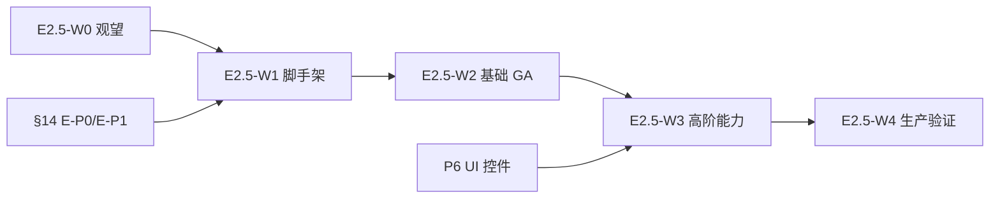

# Seedance 2.0 / agnes-video-v2.0 视频生成对接规格

> 状态：**C3-video P0–P5 已落地（PR #174）/ P6 UI 待做 / §14–§15 扩展规格草稿**  
> 日期：2026-08-08（§14–§15 增补：2026-08-08）  
> 实施计划：`docs/superpowers/plans/2026-08-08-seedance-agnes-video-adapter.md`（§14 扩展待独立 plan）  
> 范围：补齐 `agnes-video-v2.0`、`seedance-2.0-min` 在 Agnes / APIMart 网关下的 **native 参考图/视频/音频、多模态 @ 占位符、异步任务、引用一致性** 全链路；并规划 **Seedance 2.0 全变体 catalog/profile 扩展（§14）** 与 **Seedance 2.5 演进路线（§15）**  
> 前置：`2026-07-19-dock-studio-model-adapter-design.md`（C1 适配层）、`2026-08-06-seedream-gpt-image2-apimart-design.md`（ImageModelProfile 先例）  
> 后续：`2026-07-19-dock-studio-model-adapter-design.md` **C3**（V* 抽帧/理解增强，本规格先消费 V*/A* URL 引用）  
> 参考文档：  
> - [Agnes Video V2.0](https://wiki.agnes-ai.com/en/docs/agnes-video-v20)  
> - [APIMart doubao-seedance-2.0](https://docs.apimart.ai/en/api-reference/videos/doubao-seedance-2.0)  
> - [fal Seedance 2.0 reference-to-video](https://fal.ai/models/bytedance/seedance-2.0/reference-to-video)

---

## 0. 决策摘要

| 项 | 结论 |
|---|---|
| 本轮代号 | **C3-video**（C1 视频最小路径的补全；与 C3 V* 抽帧理解可并行但本规格不依赖抽帧） |
| Agnes 网关 | 继续 `AgnesVideoProvider`；扩展 keyframes / seed / negative_prompt |
| Seedance 网关 | 新增 **APIMart Video Provider**：`POST /v1/videos/generations` → task 轮询 |
| catalog 映射 | `seedance-2.0-min` → gateway `doubao-seedance-2.0-mini` |
| 参考图 wire（Agnes） | 单图 `image`；多图（≥2）→ `extra_body.image[]` + `extra_body.mode: keyframes` |
| 参考图 wire（Seedance） | `image_urls[]` + prompt 中 `@Image1`…`@ImageN`（1-based，与数组顺序一致） |
| 参考视频 wire（Seedance） | `video_urls[]` + prompt 中 `@Video1`…（**本轮新增 V* 消费**） |
| 参考音频 wire（Seedance） | `audio_urls[]` + prompt 中 `@Audio1`…（须配合 I* 或 V*；**本轮新增 A* 消费**） |
| 首尾帧模式 | Seedance `image_with_roles`（`first_frame` / `last_frame`）；detect 或 UI 扩展 `first_last_frame` |
| 一致性 prompt | 有 I* 时追加 **【参考图一致性】** 块；Seedance 多模态时由 adapter 注入 `@ImageN` / `@VideoN` / `@AudioN` |
| 内网 upload URL | 生成前须公网 HTTPS 或 Data URI（与图像链路相同 `inlineUpstreamReferenceImages`） |
| 明确不做（C3-video 首轮） | fal 直连 SDK；web_search tools；shot/scene composer 旁路统一（C2） |
| 明确不做（§14 扩展前） | Seedance 1.x / 1.5 Pro 混用 2.0 Provider；Seedance 2.5（见 §15，上游 GA 前） |
| 延后至 §14 | `asset://`（仅 standard/fast）；1080p/4K（standard）；`seedance-2.0-face` |
| 延后至 §15 | 30s 单 pass、50 路多模态、原生 4K/10-bit、区域编辑 |

---

## 1. 问题与缺口（现状调研结论）

### 1.1 能力利用率评估

| 模型 | 估算利用率 | 说明 |
|---|---|---|
| `agnes-video-v2.0`（Agnes 网关） | ~40% | 文生视频 + 单图 i2v + 基础分辨率/时长可用；关键帧、seed、negative_prompt 未用 |
| `seedance-2.0-min`（Apimart/通用网关） | ~85%（PR #174 后） | mini 全链路已通；**2.0 其他变体 / BYOK 非 catalog 仍有问题（§14）** |
| `seedance-2.0` / `-fast` / `-face` | 0% | Catalog 无条目；gateway 被 rewrite 为 mini（§14.3） |
| Seedance 2.5 | 0% | 上游 Coming Soon（§15） |
| 引用一致性 | 偏低 | 多 I* 降级为 `[ref-image:url]` prompt tag；V*/A* 完全未消费 |

### 1.2 代码级缺口

| 缺口 | 位置 | 影响 |
|---|---|---|
| 无 Seedance / APIMart Video Provider | `video-provider.ts` | BYOK Apimart 选 Seedance 返回假视频 |
| Provider 路由仅识别 Agnes baseUrl | `createVideoProvider()` | 平台若走 Apimart 则 Seedance 不可用 |
| 视频无 per-model profile | 缺 `videoModelProfiles.ts` | 无法像图像一样分流 refWire / responseMode |
| 多 I* 仅首张 → `options.image` | `buildVideoProviderOptions()` | Agnes keyframes / Seedance `image_urls` 均未用 |
| 额外 I* → `[ref-image:url]` 拼 prompt | 同上 | 上游不识别该格式；Seedance 需 `@ImageN` |
| `extractReferenceImages` 只取 `mediaType === 'image'` | `studio.service.ts`, `material.service.ts` | **V* / A* 引用被丢弃** |
| video merge 不传 `imageRefs` | `resolveMergedPrompt()` | 多 I* 一致性仅靠 T* 文本合并 |
| 未传 seed / negative_prompt / generate_audio | `AgnesVideoProvider`, adapter | 上游支持的可复现/有声视频未释放 |
| catalog `gatewayModelId` 与 APIMart 不一致 | `studioModelCatalog.ts` | ✅ PR #174 已修正 mini |
| metadata 缺 refWire / responseMode | video 生成 metadata | ✅ PR #174 已补 |
| **BYOK 非 catalog Seedance → profile 回退 Agnes** | `resolveModelKey` + `buildVideoProviderOptions` | metadata `refWire=agnes_*` 但出站 model 为 Seedance；**§14 P0** |
| **所有 `doubao-seedance-*` rewrite 为 mini** | `resolveVideoGatewayModelId` | standard/fast/face 无法拿到正确档位；**§14 P1** |
| 2.0 standard/fast/face 无 catalog | `studioModelCatalog.ts` | UI/BYOK 无法显式选型；**§14 P1** |

### 1.3 平台默认路径

`.env.production.example` 配置 `OPENAI_VIDEO_MODEL=agnes-video-v2.0` + Agnes 网关 → **主路径 Agnes 可用**。目录中 Seedance 可选但后端未真正打通。

---

## 2. 上游模型关键参数分析

> 本节按「参数 → 约束 → 对一致性的作用 → 本项目是否已传」组织，作为 adapter/profile 设计的依据。

### 2.1 agnes-video-v2.0

#### 2.1.1 参数全景

| 参数 | 必填 | 取值 / 约束 | 对生成质量的作用 | 一致性相关 | 项目现状 |
|---|---|---|---|---|---|
| `model` | ✓ | `agnes-video-v2.0` | — | — | ✅ 已传 |
| `prompt` | ✓ | 自然语言 | 主体/动作/镜头/风格的主控 | 多图时须写清过渡关系 | ✅ 已传（含 T* merge） |
| `image` | — | 公网 HTTPS URL | 单图 i2v 首帧锚定 | **强**：锁定主体外观 | ✅ 仅首张 I* |
| `width`, `height` | — | 8 对齐；API normalize 到 480p/720p/1080p | 输出档位与构图 | 与参考图比例不一致时会 remap | ✅ 由 duration/ratio/resolution 换算 |
| `num_frames` | — | ≤441，**8n+1** | 控制时长与运动幅度 | 越长越易漂移 | ✅ 由 duration 推算 |
| `frame_rate` | — | 1–60，推荐 24/30 | 流畅度；影响实际秒数 | 同 frames 下 fps↑ → 时长↓ | ✅ 固定 24 |
| `seed` | — | 整数 | 弱复现 | 同 seed 结果相近非完全相同 | ❌ 未传 |
| `negative_prompt` | — | 字符串 | 排除水印/畸变/多余肢体等 | 减少主体崩坏 | ❌ 未传 |
| `mode` | — | `ti2vid` / `keyframes` | 区分单图动画 vs 多帧过渡 | keyframes 模式是多图一致性的**原生路径** | ❌ 未传 |
| `extra_body.image[]` | — | URL 数组 | 多关键帧输入 | **强**：帧间身份/构图约束 | ❌ 未传 |
| `extra_body.mode` | — | `keyframes` | 启用关键帧工作流 | 与 `extra_body.image` 配套 | ❌ 未传 |

#### 2.1.2 时长映射（本项目 UI → 上游）

UI `VideoSettings.duration` 为 **5 / 10 / 15 秒**（`clampVideoDuration` 5–15）。Adapter 换算规则（保持现有 `resolveVideoParams` 逻辑）：

| UI duration | frame_rate | num_frames | 实际秒数 |
|---|---|---|---|
| 5 | 24 | 121 | ≈5.04s |
| 10 | 24 | 241 | ≈10.04s |
| 15 | 24 | 361 | ≈15.04s |

> 注意：响应中的 `seconds` / `size` / `metadata.size_mapping` 为**权威值**；请求 width/height 可能被 normalize。

#### 2.1.3 分辨率 / 比例映射

| UI resolution | UI aspectRatio | 长边策略（现有实现） | Agnes 档位 |
|---|---|---|---|
| 480p | 16:9 | longEdge=854 | ~480p |
| 720p | 16:9 | longEdge=1280 | ~720p |
| 1080p | 16:9 | longEdge=1920 | ~1080p |
| * | 9:16 / 1:1 | 长边赋给竖边或正方形边 | 按官方 normalize |

Agnes 额外支持 **4:3 / 3:4**；本项目 UI 暂未暴露，adapter 可预留、P6 再开。

#### 2.1.4 引用模式决策树（Agnes）

```text
I* 数量 = 0  →  纯文生视频（不传 image / extra_body）
I* 数量 = 1  →  image: I1.url + prompt 描述动作/镜头稳定
I* 数量 ≥ 2  →  extra_body: { image: [I1..In], mode: 'keyframes' }
               prompt 强调 smooth transition + identity consistency
               不传顶层 image
V* / A*      →  本轮不支持（Agnes 无 video_urls/audio_urls）
```

---

### 2.2 Seedance 2.0（APIMart：`doubao-seedance-2.0-mini`）

#### 2.2.1 参数全景

| 参数 | 必填 | 取值 / 约束 | 对生成质量的作用 | 一致性相关 | 项目现状 |
|---|---|---|---|---|---|
| `model` | ✓ | `doubao-seedance-2.0-mini` 等 | — | — | ❌ gateway id 错误 + 无 provider |
| `prompt` | △ | 文生必填；i2v 可简短 | 主控叙事、镜头、时间线 | 多模态时**必须**用 `@ImageN` 指代引用 | ⚠️ 无 @ 注入 |
| `duration` | — | **4–15** 整数秒 | 镜头节奏 | 长 prompt + 长 duration 易丢细节 | ⚠️ UI 最小 5s |
| `size` | — | `16:9`…`21:9`, `adaptive` | 画幅 | i2v 可用 `adaptive` 跟随参考图 | ⚠️ wire 字段名应为 `size` 非 aspectRatio |
| `resolution` | — | 480p/720p/1080p | 清晰度；1080p 仅 standard 版 | mini 建议 720p | ⚠️ 已标记 native 但未发出 |
| `generate_audio` | — | bool，默认 true | 环境音/对白/口型 | 与 `@AudioN` 可叠加 | ❌ 未传 |
| `seed` | — | int | 弱复现 | 分镜重试时可固定 | ❌ 未传 |
| `return_last_frame` | — | bool | 返回末帧 PNG URL | **连续分镜**衔接 | ❌ 未传 |
| `image_urls` | — | ≤9 URL | 角色/产品/风格参考 | `@Image1` = `[0]` | ❌ 未传 |
| `image_with_roles` | — | `{url, role}`[] | 首尾帧 / 人像参考 | `first_frame`+`last_frame` 锁定起止 | ❌ 未传 |
| `video_urls` | — | ≤3，总 1.8–15.2s，480–720p | 运镜/动作/风格迁移 | `@Video1` = `[0]` | ❌ V* 未消费 |
| `audio_urls` | — | ≤3，总 ≤15s | BGM/对白参考 | `@Audio1`；**须**有 I* 或 V* | ❌ A* 未消费 |

#### 2.2.2 互斥与组合矩阵

| 组合 | 是否允许 | 说明 |
|---|---|---|
| `image_urls` + `image_with_roles` | ✗ | 二选一 |
| `image_with_roles` + `video_urls` / `audio_urls` | ✗ | 首尾帧模式隔离 |
| 仅 `audio_urls`（无 I*/V*） | ✗ | 上游拒绝；本项目须预检阻断 |
| `image_urls` + `video_urls` + `audio_urls` | ✓ | 全模态；prompt 须分角色描述 |
| 文生视频（无 refs） | ✓ | 仅 prompt + duration/size/resolution |

#### 2.2.3 @ 占位符与数组下标（核心一致性机制）

| 占位符 | 对应字段 | 下标规则 | prompt 写法示例 |
|---|---|---|---|
| `@Image1` | `image_urls[0]` | **1-based** | `@Image1 中的模特缓慢转身，保持面部特征不变` |
| `@Image2` | `image_urls[1]` | 1-based | `产品特写参考 @Image2 的包装细节` |
| `@Video1` | `video_urls[0]` | 1-based | `运镜方式参考 @Video1 的推拉节奏` |
| `@Audio1` | `audio_urls[0]` | 1-based | `背景音乐使用 @Audio1，口型与对白同步` |
| `@图片1` | 同 `@Image1` | 中文别名 | 可选支持，低优先级 |

**反模式（当前项目）：** 把 URL 写入 `[ref-image:https://...]` — Seedance **不解析**，等于丢引用。

#### 2.2.4 模型变体选型

| gateway id | 适用场景 | 本项目 catalog |
|---|---|---|
| `doubao-seedance-2.0-mini` | 默认、成本友好 | `seedance-2.0-min` ✅（PR #174） |
| `doubao-seedance-2.0-fast` | 预览/迭代 | §14 P1 catalog + profile |
| `doubao-seedance-2.0` | 1080p / 4K / asset:// | §14 P1 catalog + profile |
| `doubao-seedance-2.0-face` | 真人参考上传 | §14 P1 可选 catalog |
| `doubao-seedance-1.x-*` | 旧版 Volcano/Apimart | **明确不支持**；BYOK 须阻断或报错 |
| Seedance 2.5 | 30s / 4K / 50 refs | §15 演进路线 |

---

### 2.3 双模型关键差异对照

| 维度 | agnes-video-v2.0 | Seedance 2.0 mini |
|---|---|---|
| 时长表达 | `num_frames` + `frame_rate` | `duration` 秒 |
| 比例表达 | `width` + `height`（像素） | `size` 比例字符串 |
| 单图 i2v | `image` | `image_urls[0]` + `@Image1` |
| 多图 | `extra_body.image[]` keyframes | `image_urls[]` + `@ImageN` |
| 视频引用 | ✗ | `video_urls[]` + `@VideoN` |
| 音频引用 | ✗ | `audio_urls[]` + `@AudioN` |
| 首尾帧 | keyframes 模式（多图过渡） | `image_with_roles` |
| 有声视频 | 无独立开关 | `generate_audio: true` |
| 异步形态 | Agnes poll | APIMart task poll |
| 一致性抓手 | prompt + keyframes + seed | @ 占位符 + 多模态数组 + seed |

---

## 3. 调用最佳实践

### 3.1 Prompt 结构（通用）

上游推荐结构（Agnes 官方 / Seedance 社区共识）：

```text
[主体 Subject] + [动作 Action] + [场景 Scene] + [镜头 Camera] + [光照 Lighting] + [风格 Style]
```

**图生视频额外约束：**

```text
以参考图主体为准，保持面部/服装/产品外形一致；描述应动元素（头发、背景、镜头），避免重塑主体。
```

**多图 / 关键帧额外约束：**

```text
Agnes:  Create a smooth transition from the first keyframe to the second, maintaining character identity and camera continuity.
Seedance:  @Image1 作为起幅，@Image2 作为落幅，中间过渡自然，身份特征保持一致。
```

### 3.2 agnes-video-v2.0 推荐调用

#### 文生视频（S1）

```json
{
  "model": "agnes-video-v2.0",
  "prompt": "一位年轻女性站在霓虹街头，慢速跟拍，电影感侧光，写实风格",
  "width": 1280, "height": 720,
  "num_frames": 121, "frame_rate": 24,
  "seed": 42,
  "negative_prompt": "blurry, distorted face, watermark, extra limbs"
}
```

#### 单图 i2v（S2）

```json
{
  "model": "agnes-video-v2.0",
  "prompt": "参考图中的人物微微转头看向镜头，自然表情，头发随微风轻轻摆动，背景虚化光斑闪烁",
  "image": "https://cdn.example.com/portrait.png",
  "num_frames": 121, "frame_rate": 24
}
```

#### 多图关键帧（S4）

```json
{
  "model": "agnes-video-v2.0",
  "prompt": "在两帧之间生成平滑电影感过渡，保持角色身份、服装与机位连贯",
  "extra_body": {
    "image": ["https://cdn.example.com/kf-a.png", "https://cdn.example.com/kf-b.png"],
    "mode": "keyframes"
  },
  "num_frames": 121, "frame_rate": 24
}
```

**实践要点：**

- 轮询用 `video_id`，Completed 后读 `metadata.url`（兼容顶层 `url`）  
- 调试时长/分辨率以响应 `seconds`、`size`、`metadata.size_mapping` 为准  
- 分镜重试：固定 `seed` + 固定 `num_frames`  

### 3.3 Seedance 2.0 推荐调用

#### 文生视频（S1）

```json
{
  "model": "doubao-seedance-2.0-mini",
  "prompt": "小猫对着镜头打哈欠，浅景深，温暖室内光",
  "size": "16:9", "resolution": "720p", "duration": 5,
  "generate_audio": true
}
```

#### 单图 i2v（S2）

```json
{
  "model": "doubao-seedance-2.0-mini",
  "prompt": "@Image1 中的产品保持外形不变，镜头缓慢推近，柔光下微尘漂浮",
  "image_urls": ["https://cdn.example.com/product.jpg"],
  "size": "adaptive", "duration": 8, "generate_audio": false
}
```

#### 动作迁移（S6 — Seedance 独有）

```json
{
  "model": "doubao-seedance-2.0-mini",
  "prompt": "@Image1 中的人物复现 @Video1 的舞蹈动作，半身景别，舞台灯光",
  "image_urls": ["https://cdn.example.com/dancer.jpg"],
  "video_urls": ["https://cdn.example.com/choreo.mp4"],
  "duration": 10, "size": "16:9", "resolution": "720p"
}
```

#### 首尾帧过渡（S5）

```json
{
  "model": "doubao-seedance-2.0-mini",
  "prompt": "由日景平滑过渡到夜景，保持同一条街道的构图",
  "image_with_roles": [
    { "url": "https://cdn.example.com/day.jpg", "role": "first_frame" },
    { "url": "https://cdn.example.com/night.jpg", "role": "last_frame" }
  ],
  "duration": 5
}
```

#### 连续分镜（S8）

```json
{
  "model": "doubao-seedance-2.0-mini",
  "prompt": "@Image1 场景延续，角色继续向前行走",
  "image_urls": ["https://cdn.example.com/prev-last-frame.png"],
  "duration": 5,
  "return_last_frame": true
}
```

**实践要点：**

- prompt 中出现 `@ImageN` 时，`image_urls` 数组长度必须 ≥ N  
- 参考视频总时长控制在 **15s 内**、分辨率 **480–720p**  
- 有声广告/对白：开启 `generate_audio: true` 并在 prompt 写清台词  
- mini 版 prompt 建议中文 ≤500 字、英文 ≤1000 words，避免信息分散  
- 异步任务：8s 轮询，超时 600s；失败时查 task error message  

### 3.4 引用一致性策略（本项目 adapter 负责）

| 层级 | 手段 | 负责模块 |
|---|---|---|
| L1 原生 wire | 正确字段传 URL 数组 / keyframes / @ 占位符 | `buildVideoProviderOptions`, provider |
| L2 prompt 约束 | `buildVideoRefConsistencyBlock(imageRefs)` | `generation-adapter.ts` |
| L3 文本 merge | `mergeRefsToPrompt({ downstreamType:'video', imageRefs })` | `merge-refs.ts` |
| L4 用户 @ 提及 | `mentionedKeys` 优先融合对应 T*/I* | 现有 merge 逻辑 |
| L5 弱复现 | 可选 `seed`（用户层后续暴露；默认随机） | adapter metadata |

**禁止：** 仅把第 2+ 张图拼成 `[ref-image:url]` 而不走 native wire（对 Seedance 无效）。

---

## 4. 本项目关键场景适配

### 4.1 场景清单与产品入口

| 场景 ID | 名称 | 用户路径 | 后端入口 |
|---|---|---|---|
| **S1** | 文生视频 | Video Dock → 文生视频模式 → 生成 | `StudioService.generateVideo` |
| **S2** | 单图 i2v | Video Dock → 图生视频 + 上游 image 节点 / 上传 / `referenceImageUrl` | 同上 |
| **S3** | 多图参考（产品/人物一致） | 画布连线 I1+I2+… → 视频节点 → 生成 | 同上（`refs[]`） |
| **S4** | 多图关键帧过渡 | S3 且 ≥2 张 I* | Agnes keyframes / Seedance `image_urls` |
| **S5** | 首尾帧过渡 | 2 张 I* + 模式识别为 first_last | Seedance `image_with_roles` |
| **S6** | 视频动作/运镜参考 | 视频节点 ← V* 芯片 | Seedance `video_urls` + `@Video1` |
| **S7** | 音频参考（BGM/对白） | 视频节点 ← A* 芯片 | Seedance `audio_urls` + `@Audio1` |
| **S8** | 分镜连续生成 | 上一镜末帧 → 下一镜 I* | Seedance `return_last_frame` + 下镜 S2 |
| **S9** | 分镜/Scene Composer 批量 | Scene Composer → shot video | `MaterialService.generateVideo` |
| **S10** | BYOK 通道 | 用户通道 Apimart/Agnes | `createVideoProvider(providerOpts)` |

#### 4.1.1 现有 UI / 数据字段（基线）

| 字段 | 位置 | 用途 |
|---|---|---|
| `videoMode` | `node.data` | `'text_to_video' \| 'image_to_video'`（`VideoDockPanel.vue`） |
| `videoSettings` | `node.data` | `{ duration, aspectRatio, resolution, crop }` |
| `referenceImageUrl` | `node.data` | 单图 i2v 主参考（与 upstream image 合并） |
| `refs[]` | 生成请求体 | 画布芯片 T*/I*/V*/A*（`GenerationRefPayload`） |
| `mentionedKeys` | prompt @ 解析 | 优先融合的 refKey 列表 |
| `videoModel` | `node.data` | catalog modelKey |

**V*/A* 芯片：** UI 已可挂到视频节点（`CanvasPage.previewPatchForLocalRef`：audio→video 仅芯片不覆盖 url），**服务端尚未消费**。

---

### 4.2 场景 → 模型 → 上游参数映射

| 场景 | 推荐模型 | ref 输入 | 上游关键参数 | refWire |
|---|---|---|---|---|
| S1 文生视频 | Agnes / Seedance | 无 / 仅 T* | Agnes: prompt+frames；Seedance: prompt+duration+size | `none` |
| S2 单图 i2v | Agnes / Seedance | I1 或 `referenceImageUrl` | Agnes: `image`；Seedance: `image_urls[0]`+`@Image1` | `agnes_single_image` / `apimart_multimodal` |
| S3 多图参考 | **Seedance**（优先） | I1…I9 | `image_urls[]` + `@Image1…N` + 一致性块 | `apimart_multimodal` |
| S3 多图参考 | Agnes | I1…I8 | `extra_body.image[]` keyframes | `agnes_keyframes` |
| S4 关键帧过渡 | Agnes | ≥2 I* | 同 S3 Agnes | `agnes_keyframes` |
| S5 首尾帧 | **Seedance** | 恰好 2 I* | `image_with_roles` first+last | `apimart_first_last` |
| S6 运镜/动作 | **Seedance** | I* + V* | `video_urls[]` + `@VideoN` | `apimart_multimodal` |
| S7 音频参考 | **Seedance** | I*或V* + A* | `audio_urls[]` + `@AudioN` | `apimart_multimodal` |
| S8 连续分镜 | **Seedance** | 末帧 URL 作 I1 | `return_last_frame: true` → 下镜 S2 | 两阶段 |
| S9 Composer | 继承 shot 配置 | `item.refs` | 同 S1–S7 | 同左 |
| S10 BYOK | 用户模型 | 同左 | 按 baseUrl 路由 Provider | profile 解析 |

---

### 4.3 各场景实现要点

#### S1 文生视频

**触发条件：** `videoMode=text_to_video` 且无有效 I* / `referenceImageUrl`。

**Adapter：**

- Agnes：`resolveVideoParams(duration, aspectRatio, resolution)` → width/height/num_frames/frame_rate  
- Seedance：`{ size: aspectRatio, resolution, duration, generate_audio: true }`  

**Prompt：** 仅 merged T* + local prompt；无一致性块。

---

#### S2 单图 i2v（最高频）

**触发条件：** `videoMode=image_to_video` 或存在 `referenceImageUrl` / 1 张 I*。

**Ref 合并优先级（本项目）：**

```text
refs 中 I*（按 refOrder）
  → 若空，fallback node.data.referenceImageUrl
  → 若空，fallback upstream.referenceImageUrl（useUpstreamNodeContext）
```

**Adapter：**

| 模型 | 请求 |
|---|---|
| Agnes | `image: primaryUrl` |
| Seedance | `image_urls: [primaryUrl]`；`ensureSeedanceRefTags(prompt, { images:[{refKey:'I1'}] })` |

**Prompt 追加：**

```text
【参考图一致性】以 @Image1 / 参考图 I1 为主，严格保留主体外形、关键细节与构图。
```

**触点：** `VideoDockPanel.vue`（模式切换）、`useNodeGeneration.ts`（`firstImageRefUrl`）、`buildVideoProviderOptions`。

---

#### S3 / S4 多图参考

**触发条件：** `refs` 中 `mediaType=image` 数量 ≥ 2。

**模型分流：**

```typescript
if (profile.refWire.startsWith('agnes_') && images.length >= 2) {
  refWire = 'agnes_keyframes'
} else if (profile.refWire.startsWith('apimart_')) {
  refWire = images.length >= 2 ? 'apimart_multimodal' : 'apimart_multimodal' // 单图仍走 image_urls
}
```

**merge-refs 增强：** `downstreamType:'video'` 时传入 `imageRefs`，system prompt 要求按 I1/I2 说明角色。

**Seedance prompt 自动补全示例：**

```text
@Image1 为主角参考，@Image2 为场景/服装参考，保持 @Image1 的面部身份一致。
```

---

#### S5 首尾帧过渡

**触发条件：** 2 张 I* 且（`videoMode==='first_last_frame'` **或** adapter detect：有且仅有 2 张 I* 且 prompt 含「过渡/首尾帧/from…to…」关键词 — 可选启发式）。

**Seedance 请求：**

```json
"image_with_roles": [
  { "url": "<I1>", "role": "first_frame" },
  { "url": "<I2>", "role": "last_frame" }
]
```

**互斥：** 清空 `video_urls` / `audio_urls`；metadata 记录 dropped V*/A*。

**Agnes 降级：** 走 S4 keyframes（无 `image_with_roles` 等价）。

---

#### S6 视频运镜 / 动作参考

**触发条件：** refs 含 `mediaType=video`（V* 芯片）。

**仅 Seedance；** Agnes 下降为 metadataOnly + prompt 文字描述 V* label（无法 native）。

**Adapter：**

```typescript
video_urls: bundle.videos.map(v => v.url)
ensureSeedanceRefTags(prompt, bundle)  // 注入 @Video1
```

**典型用户图：** 视频节点 ← 图片节点 I1 + 参考视频节点 V1。

---

#### S7 音频参考

**触发条件：** refs 含 `mediaType=audio`（A* 芯片）。

**预检：** 无 I* 且无 V* → `BadRequestException('参考音频须配合参考图或视频')`。

**Seedance：**

```typescript
audio_urls: bundle.audios.map(a => a.url)
// prompt: 「全程使用 @Audio1 作为背景音乐」
```

---

#### S8 连续分镜（跨节点工作流）

**阶段 A — 生成第 N 镜：** 正常 S2/S3，`return_last_frame: true`（Seedance；Agnes 不支持则 metadata 标记）。

**阶段 B — 用户将末帧设为第 N+1 镜 I*：** 走 S2；`referenceImageUrl` 或连线传入。

**metadata 回写：** 可选存 `lastFrameUrl` 供前端「延续上一镜」一键操作（P6+ UX，非阻塞）。

---

#### S9 Scene Composer / 分镜 material 路径

**入口：** `scene-composer.service.ts` → `materialService.generateVideo({ refs, mentionedKeys, duration, aspectRatio, resolution, crop })`。

**要求：** 与 Studio 路径 **共用** `extractVideoReferences` + `buildVideoProviderOptions` + provider，禁止 composer 旁路单独拼 prompt。

---

#### S10 BYOK 通道路由

| baseUrl | modelKey | Provider |
|---|---|---|
| `*agnes-ai.com*` | `agnes-video-*` | `AgnesVideoProvider` |
| `*apimart.ai*` | `seedance-*` / `doubao-seedance-*` | `ApimartVideoProvider` |
| 其他 | 任意 | **不得** `PlaceholderVideoProvider`；返回明确错误 |

---

### 4.4 `referenceImageUrl` 与 `refs[]` 合并规则

```typescript
function buildVideoReferenceBundle(
  refs: GenerationRefPayload[],
  referenceImageUrl?: string,
): VideoReferenceBundle {
  const images = refs.filter(r => r.mediaType === 'image' && r.url)
  if (images.length === 0 && referenceImageUrl?.trim()) {
    images.push({ refKey: 'I1', url: referenceImageUrl.trim(), label: '参考图' })
  }
  return {
    images: images.map(/* refKey, url, label */),
    videos: refs.filter(r => r.mediaType === 'video' && r.url),
    audios: refs.filter(r => r.mediaType === 'audio' && r.url),
  }
}
```

> 避免 S2 中 `referenceImageUrl` 与 I1 重复：若 refs 已有 I*，忽略 `referenceImageUrl` 或 dedupe 同 URL。

---

### 4.5 UI 参数与上游能力差距（P6 范围）

| 项目 UI | 当前值 | Agnes | Seedance | 本规格处理 |
|---|---|---|---|---|
| duration | 5/10/15 | ✅ | ⚠️ 缺 4s | P6 增加 4s 选项 |
| aspectRatio | 16:9/9:16/1:1 | ✅ | ✅ | 保持 |
| aspectRatio | — | 4:3/3:4 | 4:3/3:4/21:9/adaptive | P6 扩展 |
| resolution 1080p on mini | 可选 | ✅ | 降级 720p | adapter clamp + droppedFields |
| crop | none/center/fill | metadataOnly | metadataOnly | 保持 metadataOnly |
| generate_audio | 无控件 | — | 默认 true | catalog default；P6 可选开关 |
| videoMode | text/i2v | — | — | P6 可选 first_last（S5） |

---

### 4.6 用户路径调用示例

> 视角：**用户在画布上做什么 → 界面呈现什么 → 项目 API 收到什么 → adapter 发给上游什么**。  
> 示例中 URL 为示意；实际上传后会变为持久化 HTTPS 地址。

#### 4.6.0 通用路径（所有场景共用）

```text
┌─────────────────────────────────────────────────────────────────────────┐
│ 1. 选中视频节点 → 底部 Video Dock 展开                                   │
│ 2. 选择模型（UniversalModelSelector）+ 时长/比例/分辨率（VideoSettings） │
│ 3. 输入 prompt（可 @T1 @I1 提及芯片）                                     │
│ 4. 可选：切换「文生视频 / 图生视频」、上传参考图、从上游/侧边栏拖入素材      │
│ 5. 点击「生成」→ useNodeGeneration → POST /studio/video/generate          │
│ 6. 节点 status=generating → 轮询 generationRecord → completed 播放        │
└─────────────────────────────────────────────────────────────────────────┘
```

**画布拓扑与芯片：**

```text
[文本节点 T1] ──边──→ [视频节点]
[图片节点]   ──边──→ [视频节点]     → 解析为 I1（refKey 按 refOrder 分配）
[视频节点]   ──边──→ [视频节点]     → 解析为 V1（Seedance 可 native）
[音频节点]   ──边──→ [视频节点]     → 解析为 A1（Seedance 可 native）
```

**三层 payload 对照：**

| 层 | 说明 | 示例字段 |
|---|---|---|
| L1 用户输入 | Dock + 节点 data | `prompt`, `videoMode`, `videoSettings`, `referenceImageUrl` |
| L2 项目 API | `POST /studio/video/generate` | `prompt`, `model`, `duration`, `aspectRatio`, `resolution`, `refs[]`, `mentionedKeys` |
| L3 上游模型 | Provider 出站 | Agnes: `image` / `extra_body`；Seedance: `image_urls` + `@ImageN` 等 |

---

#### 示例 A — S1 文生视频（通用）

**用户路径**

1. 画布新建 **视频节点**，不连接任何上游图片  
2. Dock 选 **「文生视频」**  
3. 模型选 `Agnes Video` 或 `Seedance 2.0 Min`  
4. 参数：时长 **5s**、比例 **16:9**、分辨率 **720p**  
5. 输入 prompt：`「赛博朋克城市夜景，无人机航拍，霓虹反射」`  
6. 点击 **生成**

**界面状态**

| 元素 | 值 |
|---|---|
| 模式切换 | 文生视频（高亮） |
| 参考图区域 | 隐藏 / 不可用 |
| 芯片条 | 无 I*/V*/A*（可有 T* 若连了文本节点） |
| 积分 | ~30（5s 档） |

**L2 — 项目 API 请求体**

```json
{
  "prompt": "赛博朋克城市夜景，无人机航拍，霓虹反射",
  "model": "agnes-video-v2.0",
  "duration": 5,
  "aspectRatio": "16:9",
  "resolution": "720p",
  "crop": "none",
  "refs": [
    { "refKey": "T1", "mediaType": "text", "label": "创意描述", "text": "雨夜、潮湿地面" }
  ],
  "mentionedKeys": [],
  "sessionId": "cms…",
  "nodeId": "node-video-1"
}
```

**L3 — 上游（Agnes，merge 后）**

```json
{
  "model": "agnes-video-v2.0",
  "prompt": "【T1·创意描述】\n雨夜、潮湿地面\n\n赛博朋克城市夜景，无人机航拍，霓虹反射",
  "width": 1280, "height": 720,
  "num_frames": 121, "frame_rate": 24
}
```

**L3 — 上游（Seedance，若换模型）**

```json
{
  "model": "doubao-seedance-2.0-mini",
  "prompt": "【T1·创意描述】\n雨夜、潮湿地面\n\n赛博朋克城市夜景，无人机航拍，霓虹反射",
  "size": "16:9", "resolution": "720p", "duration": 5,
  "generate_audio": true
}
```

---

#### 示例 B — S2 单图 i2v（最高频）

**用户路径 A — 上游图片连线**

1. **图片节点** 已生成产品图 → 连线到 **视频节点**  
2. Dock 自动切 **「图生视频」**（或手动切换）  
3. 模型 `Seedance 2.0 Min`  
4. prompt：`「产品缓慢旋转，柔光下微尘漂浮，镜头推近」`  
5. 芯片条显示 **I1 · 产品图**  
6. 生成

**用户路径 B — Dock 内上传参考图**

1. 独立视频节点，无上游连线  
2. 切 **图生视频** → 点击参考图区 **上传** 本地 JPG  
3. 上传完成后 Dock 预览缩略图，`referenceImageUrl` 写入节点  
4. 其余同路径 A

**L2 — 项目 API**

```json
{
  "prompt": "产品缓慢旋转，柔光下微尘漂浮，镜头推近",
  "model": "seedance-2.0-min",
  "duration": 5,
  "aspectRatio": "16:9",
  "resolution": "720p",
  "refs": [
    {
      "refKey": "I1",
      "mediaType": "image",
      "label": "产品图",
      "url": "https://cdn.lnkpi.example/uploads/product-abc.png"
    }
  ]
}
```

**L3 — 上游（Seedance，adapter 后）**

```json
{
  "model": "doubao-seedance-2.0-mini",
  "prompt": "产品缓慢旋转，柔光下微尘漂浮，镜头推近\n\n【参考图一致性】以 @Image1 为主，严格保留主体外形、关键细节与构图。\n\n@Image1",
  "image_urls": ["https://cdn.lnkpi.example/uploads/product-abc.png"],
  "size": "16:9", "resolution": "720p", "duration": 5,
  "generate_audio": false
}
```

**L3 — 上游（Agnes，同场景）**

```json
{
  "model": "agnes-video-v2.0",
  "prompt": "…同上（含一致性块，无 @Image1）…",
  "image": "https://cdn.lnkpi.example/uploads/product-abc.png",
  "width": 1280, "height": 720,
  "num_frames": 121, "frame_rate": 24
}
```

---

#### 示例 C — S3 多图参考（人物 + 服装）

**用户路径**

1. 画布：`[定妆照 I1]` + `[服装参考 I2]` 两条边连到 **视频节点**  
2. 文本节点 T1 连入，写「镜头语言」  
3. prompt 输入：`「@I1 穿着 @I2 中的服装，在 T 台走秀，跟拍」`（`mentionedKeys: ["I1","I2"]`）  
4. 模型 **Seedance 2.0 Min**  
5. 芯片：**T1 · I1 · I2**  
6. 生成

**L2 — 项目 API**

```json
{
  "prompt": "@I1 穿着 @I2 中的服装，在 T 台走秀，跟拍",
  "model": "seedance-2.0-min",
  "duration": 10,
  "aspectRatio": "9:16",
  "resolution": "720p",
  "refs": [
    { "refKey": "T1", "mediaType": "text", "text": "慢速跟拍，顶光" },
    { "refKey": "I1", "mediaType": "image", "url": "https://…/face.png", "label": "定妆照" },
    { "refKey": "I2", "mediaType": "image", "url": "https://…/outfit.png", "label": "服装" }
  ],
  "mentionedKeys": ["I1", "I2"]
}
```

**L3 — 上游（Seedance）**

```json
{
  "model": "doubao-seedance-2.0-mini",
  "prompt": "（merge 后全文）…\n@Image1 为人物面部与体型参考，@Image2 为服装参考，保持 @Image1 身份一致。",
  "image_urls": [
    "https://…/face.png",
    "https://…/outfit.png"
  ],
  "size": "9:16", "duration": 10, "resolution": "720p"
}
```

**若用户改选 Agnes：** 2 张 I* → `extra_body.image` + `mode:keyframes`（S4）。

---

#### 示例 D — S5 首尾帧过渡（Seedance）

**用户路径**

1. 连接 **两张图片**：I1「白天街道」、I2「夜晚同街」  
2. （P6 后）Dock 选 **首尾帧模式**；当前可用 prompt 明示：`「从白天平滑过渡到夜晚，构图不变」`  
3. 模型 Seedance，时长 5s  
4. 生成

**L3 — 上游**

```json
{
  "model": "doubao-seedance-2.0-mini",
  "prompt": "从白天平滑过渡到夜晚，保持同一条街道的构图与机位",
  "image_with_roles": [
    { "url": "https://…/day.jpg", "role": "first_frame" },
    { "url": "https://…/night.jpg", "role": "last_frame" }
  ],
  "duration": 5
}
```

---

#### 示例 E — S6 动作迁移（Seedance 独有）

**用户路径**

1. 画布：`[舞者照片 I1]` + `[舞蹈参考视频 V1]` → **视频节点**  
2. 侧边栏 **资产库** 也可拖入视频作为 V1  
3. prompt：`「@I1 复现 @V1 的舞蹈动作，舞台顶光」`  
4. 模型 **Seedance 2.0 Min**（Agnes 无法 native，会降级为文字描述）  
5. 芯片：**I1 · V1**  
6. 生成

**L2 — refs 片段**

```json
"refs": [
  { "refKey": "I1", "mediaType": "image", "url": "https://…/dancer.jpg" },
  { "refKey": "V1", "mediaType": "video", "url": "https://…/choreo.mp4", "label": "参考舞蹈" }
]
```

**L3 — 上游**

```json
{
  "model": "doubao-seedance-2.0-mini",
  "prompt": "@Image1 复现 @Video1 的舞蹈动作，舞台顶光，半身景别\n\n@Image1 @Video1",
  "image_urls": ["https://…/dancer.jpg"],
  "video_urls": ["https://…/choreo.mp4"],
  "duration": 10, "size": "16:9", "resolution": "720p"
}
```

---

#### 示例 F — S7 音频 + 图片（广告片）

**用户路径**

1. `[产品图 I1]` + `[BGM 片段 A1]` 连到视频节点  
2. prompt：`「@I1 产品特写，全程使用 @A1 作为背景音乐，15 秒广告片」`  
3. 时长 **15s**，Seedance  
4. 生成

**L3 — 上游**

```json
{
  "model": "doubao-seedance-2.0-mini",
  "prompt": "…@Image1 产品特写…全程使用 @Audio1 作为背景音乐…",
  "image_urls": ["https://…/product.jpg"],
  "audio_urls": ["https://…/bgm.mp3"],
  "duration": 15, "size": "16:9", "generate_audio": true
}
```

**失败路径（须阻断）：** 仅拖入 A1、无 I*/V* → 生成前 toast：`参考音频须配合参考图或视频`。

---

#### 示例 G — S8 连续分镜（两镜工作流）

**用户路径 — 第 1 镜**

1. 视频节点 A，S2 单图 i2v，Seedance，`return_last_frame: true`（adapter 自动，或 P6 UI「输出末帧」）  
2. 生成完成 → metadata 含 `lastFrameUrl`

**用户路径 — 第 2 镜**

1. 新建 **视频节点 B**，用户将第 1 镜末帧 **另存为图片** 或一键「延续上一镜」（P6）  
2. 作为 I1 连到节点 B，或写入 `referenceImageUrl`  
3. prompt：`「角色继续向前行走，场景延续」`  
4. 走 **示例 B** 的 S2 路径

```text
[视频节点 A] ──末帧 PNG──→ [图片/直接 I1] ──→ [视频节点 B]
```

---

#### 示例 H — S9 Scene Composer 分镜批量

**用户路径**

1. 用户通过 **Scene Composer** 编排多镜头脚本  
2. 某一镜设为 **video**，配置 model/duration/aspectRatio，refs 含 T* + I*  
3. 点击 **批量生成** → `POST /agent/canvas/scene-composer/batch-generate`  
4. 后端 `MaterialService.generateVideo`（与 Studio **同一 adapter 链**）

**L2 — material API（单镜）**

```json
{
  "shotId": "shot-node-3",
  "prompt": "镜头推近，人物微笑",
  "model": "agnes-video-v2.0",
  "duration": 5,
  "aspectRatio": "16:9",
  "resolution": "720p",
  "refs": [
    { "refKey": "I1", "mediaType": "image", "url": "https://…/keyframe.png" }
  ]
}
```

> 用户无感知 Studio vs Material 差异；规格要求出站 upstream body 与画布单节点生成一致。

---

#### 示例 I — S10 BYOK Apimart

**用户路径**

1. **设置 → 模型通道** 添加 Apimart BYOK，`baseUrl=https://api.apimart.ai/v1`  
2. 视频节点模型选 `通道ID::seedance-2.0-min`  
3. 普通 S2 图生视频流程  
4. 若 BYOK 失败 → 弹出 **平台回退确认**（现有 fallback 流程）

**路由结果**

```text
createVideoProvider({ apiKey: 'sk-…', baseUrl: 'https://api.apimart.ai/v1' })
  → ApimartVideoProvider（非 Placeholder）
```

---

#### 4.6.1 场景速查表（用户路径 → 场景 ID）

| 用户看到的操作 | 场景 |
|---|---|
| 文生视频模式，无参考图 | S1 |
| 图生视频 + 1 张图（连线/上传） | S2 |
| 2 张以上图片芯片 I1/I2… | S3 / S4 |
| 2 张图 + 首尾帧意图 | S5 |
| 图片 + 参考视频芯片 V1 | S6 |
| 图片 + 参考音频芯片 A1 | S7 |
| 上一镜末帧接下一镜 | S8 |
| Scene Composer 批量 | S9 |
| 设置里 BYOK 通道模型 | S10 |

---

## 5. 架构：Video Model Profile

在 `@lnkpi/shared` 新增 **按 modelKey/gatewayModelId 解析的 profile**（镜像 `imageModelProfiles.ts`），供 adapter 与 provider 共用。

```typescript
type VideoRefWire =
  | 'none'
  | 'agnes_single_image'
  | 'agnes_keyframes'
  | 'apimart_image_urls'
  | 'apimart_multimodal'
  | 'apimart_first_last'
  | 'legacy_prompt_tags'

type VideoSizeWire = 'pixel_frames' | 'ratio_duration'
type VideoResponseMode = 'agnes_poll' | 'async_task'

interface VideoModelProfile {
  refWire: VideoRefWire
  sizeWire: VideoSizeWire
  responseMode: VideoResponseMode
  gatewayModelId: string
  maxImageRefs: number
  maxVideoRefs: number
  maxAudioRefs: number
  minDuration: number
  maxDuration: number
  allowedAspectRatios: string[]
  allowedResolutions: string[]
  defaultGenerateAudio?: boolean
  pollIntervalMs: number
  maxPollMs: number
}
```

### 5.1 Profile 映射表

| modelKey / 模式 | gatewayModelId | refWire | sizeWire | response | max I* | max V* | max A* |
|---|---|---|---|---|---|---|---|
| `agnes-video-v2.0`, `agnes-video-*` | 同名 | 1 图：`agnes_single_image`；≥2：`agnes_keyframes` | `pixel_frames` | `agnes_poll` | 8 | 0 | 0 |
| `seedance-2.0-min` | `doubao-seedance-2.0-mini` | `apimart_multimodal` / `apimart_first_last` | `ratio_duration` | `async_task` | 9 | 3 | 3 |
| `seedance-2.0` | `doubao-seedance-2.0` | 同上 | 同上 | 同上 | 9 | 3 | 3 |
| `seedance-2.0-fast` | `doubao-seedance-2.0-fast` | 同上 | 同上 | 同上 | 9 | 3 | 3 |
| `seedance-2.0-face` | `doubao-seedance-2.0-face` | 同上 + `face_upload` 标记 | 同上 | 同上 | 9 | 3 | 3 |
| BYOK `doubao-seedance-*`（非 catalog） | **按 gateway id 解析，禁止 rewrite mini** | 同上 | 同上 | 同上 | 9 | 3 | 3 |
| `happyhose-1.1`, `wan-2.7` 等 legacy | catalog 默认 | `legacy_prompt_tags` | `ratio_duration` | `async_task`‡ | 1 | 0 | 0 |

‡ 未实测模型暂走 legacy；网关实测后升级 profile。

### 5.2 引用提取（Server 层）

见 §4.4 `buildVideoReferenceBundle`；公网化：`inlineUpstreamReferenceMedia()` 统一处理 image/video/audio URL。

### 5.3 Adapter / Provider / Server

与初版规格相同，核心新增：

- `inferVideoScenario(bundle, videoMode)` → S1–S8 场景 ID（写 metadata `scenario` 便于追踪）  
- `buildEffectiveVideoPrompt(merged, bundle, profile, scenario)`  
- `ensureSeedanceRefTags(prompt, bundle)`  

**流程：**

```text
refs + referenceImageUrl
  → buildVideoReferenceBundle()
  → mergeRefsToPrompt({ downstreamType:'video', imageRefs })
  → inferVideoScenario()
  → buildVideoProviderOptions({ referenceBundle, videoMode, scenario })
  → buildEffectiveVideoPrompt()
  → inlineUpstreamReferenceMedia()
  → createVideoProvider().generate()
```

---

## 6. Catalog 变更

### 6.1 已落地（PR #174）

```typescript
// agnes-video-v2.0
params: { model, duration, aspectRatio, resolution, image, seed, negativePrompt, crop: 'metadataOnly' }

// seedance-2.0-min
gatewayModelId: 'doubao-seedance-2.0-mini'
params: { model, duration, aspectRatio, resolution, generateAudio, seed, refImages, refVideos, refAudios, crop: 'metadataOnly' }
defaults: { duration: 5, generateAudio: true }
```

### 6.2 规划（§14 E-P1）

```typescript
// seedance-2.0 / seedance-2.0-fast / seedance-2.0-face
// gatewayModelId 分别为 doubao-seedance-2.0 / -fast / -face
// params 与 mini 相同；defaults.resolution 见 §14.4.2
```

### 6.3 规划（§15 E2.5-W1）

```typescript
// seedance-2.5 — feature flag 关闭，gatewayModelId TBD
```

---

## 7. 参数 clamp 规则

见 §2 参数分析；汇总：

| 模型 | 规则 |
|---|---|
| Agnes | num_frames ≤441 且 8n+1；多图 ≤8 |
| Seedance 2.0 全系 | duration 4–15；image≤9；video≤3；audio≤3；仅 A* 阻断 |
| Seedance mini | 1080p/4k → 720p（`maxResolution=720p`） |
| Seedance fast | 1080p/4k → 720p |
| Seedance standard | 允许至 4k；见 §14.4.2 |
| Seedance face | 允许至 1080p（待上游确认） |
| 互斥 | first_last 模式下 V*/A* → droppedFields |
| Seedance 1.x | **请求阻断**（§14.3） |
| Seedance 2.5 | duration 至 30s；refs 至 50（§15，GA 后启用） |

---

## 8. metadata 可观测性

```typescript
{
  modelKey, gatewayModelId, scenario,  // S1–S10
  nativeParams, refWire, responseMode,
  refImageMode, refVideoMode, refAudioMode,
  referenceImageCount, referenceVideoCount, referenceAudioCount,
  droppedFields, seed?, generateAudio?, lastFrameUrl?,
  modelFallback?,
}
```

---

## 9. 验收标准

### 9.1 按场景验收

| 场景 | 验收条件 |
|---|---|
| S1 | 无 ref；Agnes/Seedance 均返回真实 MP4；metadata `scenario=S1` |
| S2 | 1 I* 或 referenceImageUrl；Agnes 有 `image`；Seedance 有 `image_urls`+`@Image1`；无 `[ref-image:]` |
| S3 | 3 I*；Seedance 3 URL 全进 `image_urls`；prompt 含 `@Image1` `@Image2` `@Image3` |
| S4 | 2 I* + Agnes；`extra_body.image`+`mode:keyframes` |
| S5 | 2 I* + Seedance；`image_with_roles` first+last |
| S6 | I1+V1；Seedance `video_urls`+`@Video1` |
| S7 | I1+A1；`audio_urls`+`@Audio1`；仅 A1 阻断 |
| S8 | Seedance 返回 `lastFrameUrl`；下一镜 S2 可消费 |
| S9 | Composer 与 Studio 请求体结构一致 |
| S10 | Apimart BYOK 非 placeholder |

### 9.2 通用

11. 有 I* 时 prompt 含【参考图一致性】块  
12. 单元测试 + `pnpm build` 全绿  

---

## 10. 分阶段实施

| Phase | 内容 | 覆盖场景 | 状态 |
|---|---|---|---|
| P0 | VideoModelProfile + catalog（mini） | 全部 | ✅ PR #174 |
| P1 | `buildVideoReferenceBundle` + merge-refs imageRefs | S2–S7 | ✅ PR #174 |
| P2 | adapter scenario + @ 注入 + consistency block | S2–S7 | ✅ PR #174 |
| P3 | ApimartVideoProvider + 路由 | S1–S7 Seedance mini | ✅ PR #174 |
| P4 | Agnes keyframes + seed + negative | S3–S4 | ✅ PR #174 |
| P5 | server Studio + Material 统一 | S9–S10 | ✅ PR #174 |
| P6 | UI duration 4s / first_last / generate_audio | S5,S8 | ⏳ 待做 |
| P7 | 测试 | 全部 | ✅ PR #174 |
| **E-P0** | BYOK 非 catalog Seedance profile 修复 | S10 | 📋 §14 |
| **E-P1** | 2.0 全变体 catalog + per-variant profile | S1–S8 全档位 | 📋 §14 |
| **E-P2** | `asset://` + 4K clamp（standard） | 高阶 Seedance | 📋 §14 |
| **E2.5** | Seedance 2.5 演进 | 长片/4K/50 refs | 📋 §15 |

**已完成顺序：** P0 → P3 → P2 → P5 → P4 → P1 → P7（PR #174）  
**扩展建议顺序：** E-P0 → E-P1 → P6 → E-P2 →（等上游）E2.5

---

## 11. 非目标

### 11.1 C3-video 首轮（PR #174，已完成）

- fal 直连；V* 抽帧理解（C3 完整）；A* ASR（C4）；C2 composer 旁路

### 11.2 §14 扩展前仍不做

- Seedance **1.x / 1.5 Pro** 接入（API 形态与 2.0 不兼容，须独立 Provider 或显式拒绝）
- Seedance **2.5** 实现（见 §15，等上游 GA）
- fal / 直连 BytePlus SDK（继续走 APIMart 统一网关）

### 11.3 从「非目标」移出、纳入 §14

- `asset://` 虚拟资产（**仅** `doubao-seedance-2.0` / `-fast`）
- 1080p / 4K（**仅** `doubao-seedance-2.0` standard）
- `seedance-2.0-face` 真人参考档位

---

## 12. 附录：网关兼容性追踪

| modelKey | gatewayModelId | 实测状态 | 备注 |
|---|---|---|---|
| `agnes-video-v2.0` | 同名 | ✅ 生产可用 | keyframes PR #174 |
| `seedance-2.0-min` | `doubao-seedance-2.0-mini` | ✅ 生产可用 | refWire 正确；上游偶发 failed |
| `seedance-2.0` | `doubao-seedance-2.0` | ❌ 未 catalog | §14 E-P1 |
| `seedance-2.0-fast` | `doubao-seedance-2.0-fast` | ❌ 未 catalog | §14 E-P1 |
| `seedance-2.0-face` | `doubao-seedance-2.0-face` | ❌ 未 catalog | §14 E-P1 可选 |
| BYOK `doubao-seedance-1.0-*` | 各版本 | ⚠️ 误路由 | metadata agnes_*；§14 E-P0 须阻断 |
| Seedance 2.5 | TBD | ⏳ Coming Soon | §15 |

---

## 13. 与既有规格关系

| 规格 | 关系 |
|---|---|
| `2026-07-19-dock-studio-model-adapter-design.md` | C1 基线；本规格升级 native 多模态 |
| `2026-08-06-seedream-gpt-image2-apimart-design.md` | ImageModelProfile 架构模板 |
| `2026-07-18-node-data-flow-refs-design.md` | I*/V*/A* 芯片语义 |
| `2026-07-19-c21-canvas-refs-design.md` | refs 透传与 refOrder |

---

## 14. Seedance 2.0 全变体 Catalog / Profile 扩展（E-P0 + E-P1 规格草稿）

> **背景：** PR #174 仅 catalog 收录 `seedance-2.0-min`，且 `resolveVideoGatewayModelId` 将所有 `doubao-seedance-*` 强制 rewrite 为 mini。生产复测发现 BYOK channel 配置 `doubao-seedance-1-0-lite-i2v-*` 时 metadata `refWire=agnes_single_image`，adapter 按 Agnes 路径组包但出站 model 仍为 Seedance——**行为不一致、难排障**。  
> **目标：** E-P0 修复 profile 误路由；E-P1 补齐 2.0 标准版 / fast / face 的 catalog 与 per-variant profile，复用现有 `ApimartVideoProvider` + adapter 多模态能力。  
> **参考：** [APIMart doubao-seedance-2.0 generation](https://docs.apimart.ai/en/api-reference/videos/doubao-seedance-2-0/generation)

### 14.0 决策摘要

| 项 | 结论 |
|---|---|
| 代号 | **C3-video-ext**（PR #174 的增量扩展，不新开 Provider） |
| 范围 | E-P0 profile 修复 + E-P1 catalog/profile 四变体；**不含** 1.x/1.5、2.5 |
| Provider | 继续 `ApimartVideoProvider`；hostname 仍限 `apimart.ai` |
| Profile 策略 | **按 gatewayModelId 精确映射**，取消「一律 rewrite mini」 |
| BYOK 1.x | 显式 **400 阻断**，提示用户换 2.0 变体 |
| `asset://` | E-P2（standard/fast）；E-P1 仅预留 profile 字段 `supportsAssetUrl` |
| UI | E-P1 仅 catalog 可见性；分辨率/档位 selector 仍随 P6 统一 |

### 14.1 问题复盘（PR #174 后）

| # | 现象 | 根因 | 严重度 |
|---|---|---|---|
| B1 | BYOK `doubao-seedance-1-0-lite-*` → metadata `refWire=agnes_*` | `resolveModelKey('video', gatewayId)` 无 catalog 命中 → 回退 `agnes-video-v2.0` | **P0** |
| B2 | BYOK `doubao-seedance-2.0-fast` 出站 fast、profile 按 mini clamp | `resolveVideoGatewayModelId` 一律返回 mini | **P1** |
| B3 | 用户无法选 standard 拿 1080p/4K | catalog 无 `seedance-2.0` | **P1** |
| B4 | `asset://` 无法使用 | 非目标 + mini 不支持 | E-P2 |

**关键代码路径（须改）：**

```text
studio.service.generateVideo
  → resolveForGeneration → modelName (BYOK 可为任意 gateway id)
  → buildVideoProviderOptions({ modelKey: resolved.modelName, channelBaseUrl })
       → resolveModelKey('video', modelKey)          // ← B1：非 catalog 回退 Agnes
       → resolveVideoModelProfile(resolvedKey, entry.gatewayModelId)
       → resolveVideoGatewayModelId → 恒 mini       // ← B2
  → if (user) providerOptions.model = resolved.modelName  // 出站 model 与 profile 脱节
```

### 14.2 方案对比

| 方案 | 做法 | 优点 | 缺点 | 结论 |
|---|---|---|---|---|
| **A（推荐）** | 新增 `resolveVideoModelKey(modelKey, gatewayHint?)`：优先 catalog；否则按 `doubao-seedance-*` 正则匹配已知变体；1.x 阻断 | 最小 diff；BYOK/平台一致 | 须维护 gateway 前缀表 | ✅ E-P0+E-P1 |
| B | catalog 外置 YAML 全量 gateway 列表 | 运维可配 | 与 ImageModelProfile 模式不一致 | 备选 |
| C | BYOK 仅允许 catalog 内 modelKey | 简单 | 破坏现有 `channel::gatewayId` 习惯 | ❌ |

**推荐 A：** 与 `imageModelProfiles.ts` 先例一致——**profile 层识别 gateway id**，catalog 负责 UI 展示名与默认参数。

### 14.3 E-P0：BYOK 非 catalog Seedance profile 修复

#### 14.3.1 新增 gateway 解析

```typescript
/** 已知 Seedance 2.0 变体；1.x 不在此列 */
const SEEDANCE_20_GATEWAYS = {
  mini: 'doubao-seedance-2.0-mini',
  standard: 'doubao-seedance-2.0',
  fast: 'doubao-seedance-2.0-fast',
  face: 'doubao-seedance-2.0-face',
} as const

function isSeedance1x(gatewayModelId: string): boolean {
  return /^doubao-seedance-1[.-]/i.test(gatewayModelId)
}

function resolveSeedance20Gateway(modelKey: string, gatewayModelId: string): string | null {
  // 1) catalog modelKey 精确匹配
  // 2) gatewayModelId 精确匹配 SEEDANCE_20_GATEWAYS 值
  // 3) 前缀 doubao-seedance-2.0 且非 1.x
  // 4) null → 非 Seedance 2.0
}
```

#### 14.3.2 修改 `resolveVideoGatewayModelId`

**现状（错误）：**

```typescript
if (isSeedanceModel(...)) return SEEDANCE_GATEWAY // 恒 mini
```

**目标：**

```typescript
export function resolveVideoGatewayModelId(modelKey: string, gatewayModelId: string): string {
  const resolved = resolveSeedance20Gateway(modelKey, gatewayModelId)
  if (resolved) return resolved
  return gatewayModelId
}
```

#### 14.3.3 修改 `buildVideoProviderOptions` 入参解析

新增 **`gatewayModelHint`**（BYOK 时传 `resolved.modelName`）：

```typescript
const catalogResolved = resolveModelKey('video', modelKey)
const gatewayHint = input.gatewayModelHint ?? catalogResolved.entry.gatewayModelId
if (isSeedance1x(gatewayHint)) {
  throw new Error('Seedance 1.x 不支持，请使用 seedance-2.0-min / seedance-2.0 / seedance-2.0-fast')
}
const profile = resolveVideoModelProfile(
  catalogResolved.fallback ? gatewayHint : catalogResolved.modelKey,
  gatewayHint,
  { channelBaseUrl },
)
```

规则：

| 条件 | profile 依据 |
|---|---|
| catalog 命中 | catalog `modelKey` + `gatewayModelId` |
| BYOK + `doubao-seedance-2.0-*` | `gatewayHint` 精确变体 |
| BYOK + `doubao-seedance-1.*` | **400 阻断** |
| 其他未知 video model | 现有 `legacy_prompt_tags` |

#### 14.3.4 E-P0 验收

| # | 条件 |
|---|---|
| E0-1 | BYOK `channel::doubao-seedance-2.0-fast` → metadata `refWire=apimart_multimodal`，非 `agnes_*` |
| E0-2 | BYOK `channel::doubao-seedance-1-0-lite-i2v-*` → 400 + 中文提示 |
| E0-3 | 平台 `seedance-2.0-min` 行为与 PR #174 回归一致 |
| E0-4 | 单元测试覆盖上述三路径 |

### 14.4 E-P1：2.0 全变体 Catalog + Per-Variant Profile

#### 14.4.1 Catalog 新增条目

```typescript
// packages/shared/src/studioModelCatalog.ts — 新增（mini 保持不动）
{
  modelKey: 'seedance-2.0',
  displayName: 'Seedance 2.0',
  gatewayModelId: 'doubao-seedance-2.0',
  modality: 'video',
  params: { ...VIDEO_PARAMS, generateAudio: 'native', seed: 'native',
            refImages: 'native', refVideos: 'native', refAudios: 'native' },
  defaults: { duration: 5, generateAudio: true, resolution: '720p' },
},
{
  modelKey: 'seedance-2.0-fast',
  displayName: 'Seedance 2.0 Fast',
  gatewayModelId: 'doubao-seedance-2.0-fast',
  // params 同上
  defaults: { duration: 5, generateAudio: true, resolution: '720p' },
},
{
  modelKey: 'seedance-2.0-face',
  displayName: 'Seedance 2.0 Face',
  gatewayModelId: 'doubao-seedance-2.0-face',
  // params 同上；UI 可标注「真人参考」
  defaults: { duration: 5, generateAudio: true, resolution: '720p' },
},
```

**默认模型不变：** 平台 video 默认仍为 `agnes-video-v2.0`；Seedance 默认推荐档位仍为 `seedance-2.0-min`（成本）。

#### 14.4.2 Per-Variant Profile 参数表

| 字段 | mini | standard | fast | face |
|---|---|---|---|---|
| `gatewayModelId` | `doubao-seedance-2.0-mini` | `doubao-seedance-2.0` | `doubao-seedance-2.0-fast` | `doubao-seedance-2.0-face` |
| `refWire` | `apimart_multimodal` | 同左 | 同左 | 同左 |
| `responseMode` | `async_task` | 同左 | 同左 | 同左 |
| `minDuration` / `maxDuration` | 4 / 15 | 4 / 15 | 4 / 15 | 4 / 15 |
| `maxImageRefs` / V / A | 9 / 3 / 3 | 同左 | 同左 | 同左 |
| `allowedResolutions` | 480p, 720p | 480p, 720p, **1080p, 4k** | 480p, 720p | 480p, 720p, 1080p |
| `maxResolution`（clamp 用） | **720p** | **4k** | **720p** | **1080p** |
| `supportsAssetUrl` | false | **true** | **true** | false（待上游确认） |
| `defaultGenerateAudio` | true | true | true | true |
| `variantTag`（metadata） | `mini` | `standard` | `fast` | `face` |

**clamp 规则调整（替代 §7 单一 mini 规则）：**

```typescript
if (resolution rank > profile.maxResolution) {
  droppedFields.push({ field: 'resolution', reason: `${resolution} not on ${variantTag}; use ${profile.maxResolution}` })
  resolution = profile.maxResolution
}
```

#### 14.4.3 变体选型指引（产品 / Prompt）

| 用户意图 | 推荐 modelKey | 理由 |
|---|---|---|
| 日常分镜 / 多模态参考 / 成本敏感 | `seedance-2.0-min` | 已验证；720p 足够 |
| Prompt 迭代 / 预览 | `seedance-2.0-fast` | 延迟低 ~19%（APIMart 定价） |
| 交付成片 / 1080p / 4K | `seedance-2.0` | 唯一支持 4K + `asset://` |
| 真人模特 i2v / 口型 | `seedance-2.0-face` | 上游 `-face` 档位 |

#### 14.4.4 Server / Adapter 改动面

| 文件 | 改动 |
|---|---|
| `packages/shared/src/videoModelProfiles.ts` | 变体表 + `resolveSeedance20Gateway` + per-variant clamp |
| `packages/shared/src/studioModelCatalog.ts` | §14.4.1 三条目 |
| `packages/agent/src/studio/generation-adapter.ts` | `buildVideoProviderOptions` 接收 `gatewayModelHint` |
| `apps/server/src/studio/studio.service.ts` | 传 `gatewayModelHint: resolved.modelName`；1.x 转 `BadRequestException` |
| `apps/server/src/canvas/material.service.ts` | 同上 |
| `apps/web` ModelSelector | 展示新条目（无新 UI 控件） |

**不改：** `ApimartVideoProvider` 请求体结构；`ensureSeedanceRefTags`；场景 S1–S8 推断逻辑。

#### 14.4.5 E-P1 验收

| # | 条件 |
|---|---|
| E1-1 | UI/BYOK 可选 `seedance-2.0` / `-fast` / `-face` |
| E1-2 | standard + resolution=1080p → 出站 1080p，metadata 无 mini downgrade |
| E1-3 | fast + resolution=1080p → clamp 720p + `droppedFields` |
| E1-4 | mini 回归：1080p → 720p（与 PR #174 一致） |
| E1-5 | metadata 含 `variantTag` + 正确 `gatewayModelId` |
| E1-6 | S3/S6/S7 多模态在四个变体上 refWire 均为 `apimart_multimodal` |

### 14.5 E-P2 预览（本规格仅登记，不实施）

| 能力 | 适用变体 | 说明 |
|---|---|---|
| `asset://` URL | standard, fast | 上游限制；须在 inline 阶段跳过 HTTP 下载 |
| 4K 出站 | standard | UI resolution selector 随 P6 |
| `doubao-seedance-2.0-face` 特参 | face | 若上游有 `face` / `portrait` 额外字段，单独 sub-profile |

### 14.6 E-P0 + E-P1 实施顺序

```text
E-P0-1  videoModelProfiles: resolveSeedance20Gateway + 取消 rewrite mini
E-P0-2  generation-adapter: gatewayModelHint + 1.x 阻断
E-P0-3  studio/material: 传 hint + BadRequestException 映射
E-P0-4  单元测试 + prod BYOK 回归

E-P1-1  catalog 三条目 + profile 变体表
E-P1-2  per-variant resolution clamp
E-P1-3  metadata variantTag
E-P1-4  UI model list + 集成测试
```

---

## 15. Seedance 2.5 规划演进路线

> **背景：** APIMart 已发布 [Seedance 2.5 Coming Soon](https://apimart.ai/model/doubao-seedance-2-5-comingsoon) 页面；BytePlus ModelArk 截至 2026-06 公开 ID 仍为 `doubao-seedance-2-0-260128`，**2.5 无 GA model id**。本项目 PR #174 / §14 均基于 2.0 API 形态。  
> **原则：** 2.5 **不提前写 Provider**；先做 **profile 脚手架 + feature flag + 文档追踪**，上游 GA 后按阶段接入。

### 15.0 2.0 vs 2.5 能力差异（据 APIMart / ByteDance 公开材料）

| 维度 | Seedance 2.0（当前 §14） | Seedance 2.5（规划） |
|---|---|---|
| 单 pass 时长 | 4–15s | **~30s** |
| 分辨率 | mini 720p；standard 至 4K | **原生 4K + 10-bit** |
| 多模态引用上限 | I*≤9, V*≤3, A*≤3 | **≤50**（图/视/音合计） |
| 区域编辑 | ✗ | **预告支持**（参数名待 GA 确认） |
| 有声视频 | `generate_audio` | 增强对白/环境音/口型 |
| API 形态 | APIMart async task | 预期仍为 async task + webhook |
| 项目状态 | E-P0/E-P1 扩展中 | **零代码；§15 追踪** |

### 15.1 演进阶段（E2.5）

| 阶段 | 触发条件 | 交付 | 依赖 |
|---|---|---|---|
| **E2.5-W0 观望** | APIMart 页面 Coming Soon | 本 §15 + 附录追踪表更新；**零代码** | — |
| **E2.5-W1 脚手架** | APIMart 公布 model id + 请求/响应 schema | `VideoModelProfile` 预留 `seedance-2.5` 条目（feature flag 关闭）；catalog 灰显 | §14 E-P1 完成 |
| **E2.5-W2 基础 GA** | 2.5 t2v / i2v 与 2.0 同 schema 或向后兼容 | 扩展 `ApimartVideoProvider` model 白名单；duration clamp 至 30s；refs clamp 至 50 | W1 |
| **E2.5-W3 高阶能力** | 官方文档确认 4K/10-bit/区域编辑参数 | 独立 sub-profile；UI 分辨率/时长档位；`region` / `mask` 等待定字段 | W2 |
| **E2.5-W4 生产验证** | W3 测试通过 | `deploy/prod-pr2xx-verify.py`；与 2.0 并存，用户可选档位 | W3 |



### 15.2 预期 Profile 草案（W1，字段名待 GA 确认）

```typescript
// 伪代码 — feature flag: SEEDANCE_25_ENABLED=false
{
  modelKey: 'seedance-2.5',
  gatewayModelId: 'doubao-seedance-2.5', // TBD
  refWire: 'apimart_multimodal_v2',      // 或复用 apimart_multimodal + 提高上限
  responseMode: 'async_task',
  minDuration: 4,
  maxDuration: 30,
  maxImageRefs: 50,  // 或 totalMultimodalRefs: 50
  maxVideoRefs: 50,
  maxAudioRefs: 50,
  maxResolution: '4k',
  defaultGenerateAudio: true,
  pollIntervalMs: 10_000,
  maxPollMs: 900_000,  // 30s 片源生成更慢
}
```

**与 2.0 共存策略：**

| 策略 | 说明 |
|---|---|
| catalog 并存 | `seedance-2.0-min` / `-standard` / `-fast` 保留；新增 `seedance-2.5` |
| 默认不升级 | 现有用户默认不变；Agent 仅在用户显式选 2.5 或 prompt 含「30秒长片」等意图时推荐 |
| adapter 复用 | `@ImageN` 1-based、bundle、scenario S1–S8 **逻辑复用**；仅 clamp 上限与 Provider poll 超时调整 |
| 2.0 不废弃 | 2.5 定价更高时，2.0-fast 仍为预览默认 |

### 15.3 风险与阻塞项

| 风险 | 缓解 |
|---|---|
| model id 与 2.0 不兼容 | W1 先只加 profile + flag，不默认启用 |
| 50 refs 性能/成本 | clamp + UI 警告；metadata 记录 ref 总数 |
| 30s 生成超时 | `maxPollMs` 提至 15min；异步 UX 已有 |
| 区域编辑 API 不稳定 | W3 独立 feature flag；非阻塞 W2 |
| 1.x BYOK 用户误选 2.5 | §14 E-P0 已阻断 1.x；2.5 仅 catalog 显式入口 |

### 15.4 追踪清单（维护者）

| 检查项 | 来源 | 上次更新 |
|---|---|---|
| APIMart 2.5 model id | https://apimart.ai/model/doubao-seedance-2-5-comingsoon | 2026-08-08 |
| APIMart 2.0 generation schema | https://docs.apimart.ai/en/api-reference/videos/doubao-seedance-2-0/generation | 2026-08-08 |
| BytePlus 公开 model id | `doubao-seedance-2-0-260128`（2.0 only） | 2026-08-08 |
| 本项目 mini 生产状态 | PR #174 merged | 2026-08-08 |

**W0 → W1 切换条件（须全部满足）：**

1. APIMart 文档页出现可调用 `model` 枚举值  
2. 请求/响应与 2.0 diff 文档或 changelog 发布  
3. 测试 API key 可完成至少一次 t2v 5s 冒烟  

### 15.5 与 §14 的衔接

| §14 交付 | 对 2.5 的价值 |
|---|---|
| E-P0 gateway 精确解析 | 避免 2.5 GA 后重复踩 BYOK 回退 Agnes 坑 |
| E-P1 per-variant profile | 变体表模式可直接加 `seedance-2.5` 行 |
| E-P2 asset:// | 2.5 若沿用 asset 协议可复用 inline 逻辑 |
| P6 UI duration/resolution | 2.5 的 30s/4K 控件扩展同一组件 |

---

## 16. 附录：扩展验收汇总（§14 + §15）

| 阶段 | 自动化 | 生产 |
|---|---|---|
| E-P0 | `videoModelProfiles.test.ts` BYOK/fast/1.x | BYOK channel 不再出现 agnes refWire |
| E-P1 | catalog 四变体 + resolution clamp 用例 | standard 1080p 真实出站 |
| E-P2 | asset:// inline 单测 | 可选 |
| E2.5-W2+ | 新 profile + Provider 白名单 | `prod-pr2xx-verify.py` 30s 冒烟 |

