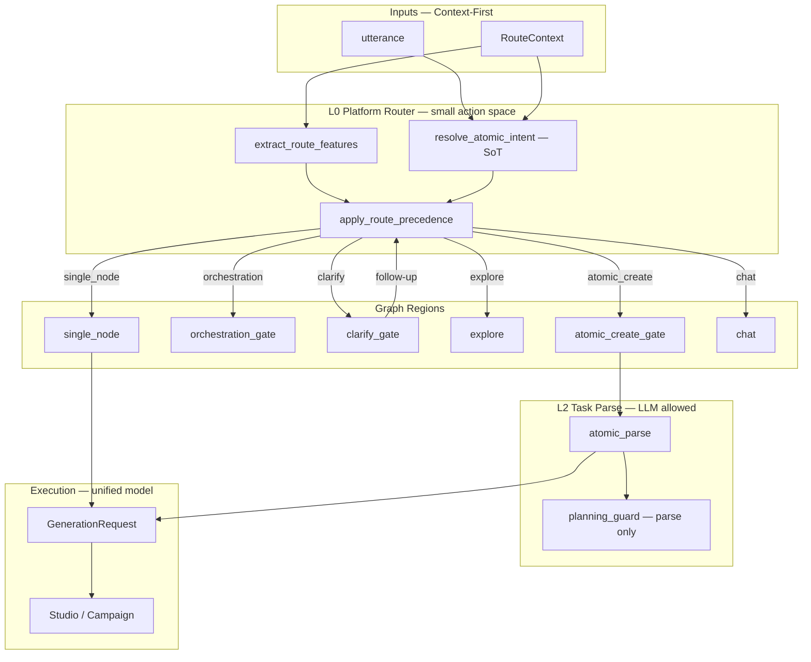

# Agent 侧栏引用生图路由与澄清续接 — 设计规格

> 状态：**Implemented P0–P2**（2026-08-09）  
> 范围：**Phase 0（P0 止血）** — 修复 `@T1 请按风格3出图` 类 utterance 的 L1 路由误判、route 澄清回复断裂、侧栏与 Dock 引用语义不对齐、执行过程 UX 误导  
> **Phase 1（P1 架构收敛）** — 见本文 §9 [Route Unification ADR]；**禁止**在 P0 之后继续堆 hint 表，新 case 应推动 P1 落地  
> 前置：[2026-08-09-atomic-intent-ir-design.md](./2026-08-09-atomic-intent-ir-design.md)、[2026-08-07-agent-sidebar-m3-explicit-refs-design.md](./2026-08-07-agent-sidebar-m3-explicit-refs-design.md)、[2026-08-07-platform-route-skill-boundary-design.md](./2026-08-07-platform-route-skill-boundary-design.md)  
> 生产 case：`@T1 请按风格3出图` → 编排澄清 → 用户回 `1` → 落入 chat（未建 image 节点、未触发生成）

---

## 0. 决策摘要

| # | 决策 | 说明 |
|---|------|------|
| **D-A** | **`@T* / @I* + 出图/生成图` 走 atomic fast path** | L1 `decide_route` 在 `marketing_intent` 之前判定；有 sidebar ref + image 信号 → `atomic_create` |
| **D-B** | **`出图` 从 blanket `MARKETING_HINTS` 移除** | 营销编排改由「详情页/全链路/分镜/campaign 短语 + skill」触发；单张「出图」不再单独触发 campaign |
| **D-C** | **统一 `clarify_context` checkpoint** | route 澄清与 atomic 澄清共用同一结构；follow-up 继承 `original_utterance + mentioned_keys + sidebar_attachments` |
| **D-D** | **route 澄清回复 `1/2/3` 走 `classify_clarify_reply`** | intake 检测 pending route clarify → 恢复上下文 → `atomic_parse` 或 campaign |
| **D-E** | **IR 扩展：`出图`、`按风格N`** | `has_generate_verb` / `is_ref_media_generation` 识别短指令；prompt 保留用户 utterance（含风格 N） |
| **D-F** | **侧栏 atomic 与 Dock 对齐：prompt + refs 分离** | node.prompt = 用户指令；T1 正文经 localRefs；禁止澄清后硬编码「蓝牙耳机主图」 |
| **D-G** | **澄清/失败时 execution trace 与文案 honest** | clarify 步骤显示「待确认意图」；确认后将创建 image + 引用 T1 |

**推荐方案（相对 B/C 备选）：** 在现有 Intent IR 上增量修补（D-A–G），不引入新 LLM 路由层。理由：根因是规则冲突与状态丢失，非 parse 能力不足；改动面可控、可 eval 回归。

> **P0 边界声明：** D-A–G 及 §3 全部 `R-*` 需求属于 **止血层**——允许新增 `_sidebar_ref_atomic_signal` 等 **feature 级 fast path**，但 **禁止** 再向 `MARKETING_HINTS` / `ATOMIC_CREATE_HINTS` 等 hint 表追加同义词条。P0 合并后须启动 §9 Route Unification（P1），否则技术债按 case 线性增长。

| 备选 | 优点 | 缺点 | 结论 |
|------|------|------|------|
| **A. IR + L1 规则修补（推荐）** | 与 PR #197 一致、可单测 | 需仔细梳理 hint 表 | ✅ 采用 |
| **B. 侧栏 utterance 跳过 L1，直连 atomic_parse** | 与 Dock 行为最接近 | campaign 边界模糊 | 部分吸收（ref+出图 fast path） |
| **C. 澄清全 LLM 分类** | 自然语言 follow-up 强 | 延迟、不可回归 | 仅作 `classify_clarify_reply` 未来 fallback |

---

## 1. 问题溯源矩阵（用户 Q1–Q5 + 诊断清单）

| ID | 来源 | 现象 / 根因 | 规格需求 ID |
|----|------|-------------|-------------|
| **Q1** | 用户问题 1 | `@T1 请按风格3出图` 未识别为 atomic image；`出图`∈`MARKETING_HINTS` + IR 无 `出图` verb | R-L1-01, R-IR-01, R-IR-02 |
| **Q2** | 用户问题 2 | 侧栏 utterance 路由 vs Dock 拓扑 refs 两套入口；`mentioned_keys` 未参与 L1（除 img2img） | R-ALIGN-01, R-ALIGN-02, R-L1-02 |
| **Q3** | 用户问题 3 | route 澄清后回 `1` 进 chat；无 `clarify_context`；`classify_clarify_reply` 未接入 | R-CL-01, R-CL-02, R-CL-03 |
| **Q4** | 用户问题 4 | 见 §1.1 扩展问题 E1–E10 | 各 R-* 映射 |
| **Q5** | 用户问题 5 | 澄清文案错位、执行步骤误导、无引用确认 | R-UX-01–R-UX-04 |
| **E1** | 诊断 | `出图` 与 atomic 生图语义冲突 | R-L1-01 |
| **E2** | 诊断 | IR 词表缺 `出图` / `按风格N` | R-IR-01, R-IR-03 |
| **E3** | 诊断 | `route_decide` 不消费 T 引用 | R-L1-02 |
| **E4** | 诊断 | route / atomic 两套 clarify 无统一 checkpoint | R-CL-01 |
| **E5** | 诊断 | 澄清选项与用户「按风格3出图」不对齐 | R-UX-02, R-CL-04 |
| **E6** | 诊断 | 执行过程显示「拟定方案」但未进 atomic/campaign | R-UX-01 |
| **E7** | 诊断 | 「风格3」未从 T1 正文解析 | R-IR-03, R-PARSE-01 |
| **E8** | 诊断 | `clarify_route` 设 `flow_mode=chat` 丢状态 | R-CL-01 |
| **E9** | 诊断 | chat 系统提示与澄清选项 1 矛盾 | R-CL-03, R-UX-03 |
| **E10** | 诊断 | Intent IR 与 L1 路由脱节 | R-L1-02, R-IR-02 |

### 1.1 验收用例（必须全部通过）

| Case ID | 输入 | 期望 |
|---------|------|------|
| **AC-01** | `@T1 请按风格3出图` + sidebar T1 attachment | `flow_mode=atomic_create` → image 节点 + localRefs 含 T1 + prompt 含「按风格3出图」 |
| **AC-02** | 同上 → 若仍 clarify → 用户 `1` | 恢复 AC-01 行为，**不得**进 chat |
| **AC-03** | `@T1 请基于文案生成视频` | video（Intent IR 已有，回归） |
| **AC-04** | `帮我做天猫详情页营销方案出图` + 无 @ref | 仍可走 campaign / clarify_route（营销短语保留） |
| **AC-05** | Dock：image 节点连 T1 + dock 输入「按风格3出图」 | 与 AC-01 Studio 调用等价（prompt + refs） |
| **AC-06** | route clarify → `2` | campaign 路径（skill 提示） |
| **AC-07** | route clarify → `3` | text vision_text 或 write，保留 original utterance |

---

## 2. 架构

### 2.1 数据流（修复后）

```text
用户: @T1 请按风格3出图
  │
  ├─ sidebar_attachments / mentioned_keys ──► RouteContext
  │
  ▼
decide_route
  ├─ [NEW] sidebar_ref_atomic_signal(ctx)?  ──► atomic_create (bypass marketing)
  ├─ resolve_atomic_intent(utterance, mentioned_keys)
  └─ marketing_intent (出图 已移除 blanket)
  │
  ▼
atomic_parse → image item + derive_studio_prompt(保留 utterance)
  │
  ▼
create_atomic_node → apply_sidebar_attachments(localRefs, mentionedKeys)
  │
  ▼
Studio: prompt + refs(T1 body)
```

### 2.2 澄清续接（修复后）

```text
decide_route → clarify_route
  │
  ├─ [NEW] 写入 clarify_context:
  │     kind=route_orchestration
  │     original_utterance, clarify_question
  │     mentioned_keys, sidebar_attachments (snapshot)
  │
  ▼
用户: 1
  │
  ▼
intake: pending_clarify(ctx) → classify_clarify_reply(original, q, "1")
  │
  ├─ choice 1 → atomic_create + 继承 original + refs
  ├─ choice 2 → campaign
  └─ choice 3 → vision_text / write
```

### 2.3 `clarify_context` 结构（统一）

```python
ClarifyContext = TypedDict:
  kind: Literal["route_orchestration", "atomic_parse", "img2img_confirm"]
  original_utterance: str
  clarify_question: str
  mentioned_keys: list[str]          # snapshot
  sidebar_attachment_ids: list[str]  # 或 ref keys，与 state 对齐
  clarify_kind: str                  # reason / legacy
```

`pending_atomic_clarify` 重命名为 **`pending_clarify`**（alias 保留兼容），接受 `kind in ("atomic_parse", "route_orchestration", ...)`。

### 2.4 P1 目标架构（预览）

P0（§2.1–§2.3）为过渡态。P1 终态架构见 **§9.3–§9.11**：Cascade Router（L0–L3）、Intent IR 为 SoT、precedence 策略表、统一 `clarify_gate`、`GenerationRequest` 侧栏/Dock 对齐。业界最佳实践映射见 §9.3。

---

## 3. 功能需求

### 3.1 L1 路由（R-L1-*）

| ID | 需求 |
|----|------|
| **R-L1-01** | 从 `MARKETING_HINTS` 移除 `"出图"`；保留「详情页」「全链路」「分镜」等编排信号 |
| **R-L1-02** | 新增 `_sidebar_ref_atomic_signal(ctx)`：`mentioned_keys` 非空 +（`resolve_output_modality` 为 image/video **或** utterance 含 `出图`/`按风格`/`生成图`）→ `atomic_create`，confidence≥0.92，reason=`sidebar_ref_atomic` |
| **R-L1-03** | `_sidebar_ref_atomic_signal` 在 `marketing_intent` / orchestration campaign 分支**之前**评估 |
| **R-L1-04** | `orch==campaign && is_atomic` 降级逻辑：若 `_sidebar_ref_atomic_signal` 为真，**不**降级为 campaign |

### 3.2 Intent IR（R-IR-*）

| ID | 需求 |
|----|------|
| **R-IR-01** | `has_generate_verb` 增加：`出图`、`出一张图`、`生成图` |
| **R-IR-02** | `has_image_output` 增加：`出图`；`按风格` + 数字可选 |
| **R-IR-03** | `is_ref_media_generation`：当 `mentioned_keys` 含 T* 且 utterance 含 `出图` 或 `按风格\d` → True（无需完整 generate 短语） |
| **R-IR-04** | `resolve_atomic_action`：上述 ref+出图 → `generate` |
| **R-IR-05** | `derive_studio_prompt`：有 mentioned_keys + 用户 utterance 非空 → **保留 utterance**（不替换为泛化句），除非 utterance 仅 `@T1` |

### 3.3 澄清续接（R-CL-*）

| ID | 需求 |
|----|------|
| **R-CL-01** | `clarify_route` 节点写入 `clarify_context`（kind=`route_orchestration`），phase=`clarify`（非 done），保留 attachments snapshot |
| **R-CL-02** | `intake`：若 `pending_clarify` 且 reply 为 `1/2/3` 或 `classify_clarify_reply`≠none → 设置 `flow_mode` 并 **恢复** snapshot 到 state |
| **R-CL-03** | choice `1`：`classify_clarify_reply` prompt **优先** `original_utterance`；仅当 original 为空时用模板 |
| **R-CL-04** | `ROUTE_CLARIFY_ORCHESTRATION` 文案更新：选项 1 明确「按引用内容单张出图（保留 @T*）」 |
| **R-CL-05** | route clarify follow-up 走 `parse_atomic_intent` 或 shortcut 到已有 `IntentParseResult`，**禁止** default chat |

### 3.4 侧栏 ↔ Dock 对齐（R-ALIGN-*）

| ID | 需求 |
|----|------|
| **R-ALIGN-01** | atomic image 创建：`node.prompt` = 用户 utterance（或 derive_studio_prompt 结果）；T* 正文仅经 `localRefs` |
| **R-ALIGN-02** | 文档 + eval：同一语义 AC-01 与 AC-05 Studio 请求字段一致（prompt、refs、mentionedKeys） |
| **R-ALIGN-03** | `atomic_create_intent`：`出图` + 非 confirm 短语 → True（与 IR 一致） |

### 3.5 解析增强（R-PARSE-*）

| ID | 需求 |
|----|------|
| **R-PARSE-01** | `rule_parse_atomic` / LLM prompt：识别 `按风格(\d+)` / `风格(\d+)`，写入 item.prompt（不尝试从 T1 正文切片，MVP 仅保留指令；P2 可选正文解析） |
| **R-PARSE-02** | eval case 写入 `eval-intent-set.yaml` + `eval-route-set.yaml` |

### 3.6 UX（R-UX-*）

| ID | 需求 |
|----|------|
| **R-UX-01** | clarify 阶段 `thinking_summary` / execution trace：`待确认：单张出图还是完整编排`（禁止「拟定方案」） |
| **R-UX-02** | 澄清消息展示：`已看到引用 T1`（若有 attachment） |
| **R-UX-03** | 澄清 follow-up 失败时：明确错误 + 建议重发完整指令，**禁止** generic chat「有什么可以帮你」 |
| **R-UX-04** | atomic 成功路径：trace 显示 `将创建 image 节点，引用 T1` |

---

## 4. 文件级变更清单

| 文件 | 变更 |
|------|------|
| `services/agent-runtime/app/graph/intent.py` | 调整 `MARKETING_HINTS` |
| `services/agent-runtime/app/graph/route_decide.py` | `_sidebar_ref_atomic_signal`、优先级 |
| `services/agent-runtime/app/graph/atomic_intent_ir.py` | 词表 + ref+出图 |
| `services/agent-runtime/app/graph/atomic_intent.py` | `atomic_create_intent` 同步 |
| `services/agent-runtime/app/graph/nodes/clarify_route.py` | 写 `clarify_context` |
| `services/agent-runtime/app/graph/nodes/intake.py` | route clarify follow-up |
| `services/agent-runtime/app/graph/atomic_clarify.py` | `pending_clarify` 泛化 |
| `services/agent-runtime/app/graph/clarify_reply.py` | 继承 original utterance |
| `services/agent-runtime/app/graph/state.py` | `clarify_context` TypedDict（可选） |
| `services/agent-runtime/app/graph/nodes/atomic_parse.py` | thinking_summary clarify 文案 |
| `services/agent-runtime/skills/atomic-create/eval-*.yaml` | AC-01/02 cases |
| `deploy/prod-atomic-intent-ir-verify.py` | 新增 style3 case |

---

## 5. 测试策略

| 层级 | 内容 |
|------|------|
| **单元** | IR verb/output、`_sidebar_ref_atomic_signal`、`classify_clarify_reply` 继承 original |
| **集成** | intake → clarify_route → intake(`1`) → atomic_create graph route |
| **回归** | 现有 video IR cases、img2img、campaign 无 skill clarify |
| **生产脚本** | `@T1 请按风格3出图` → image 节点 |

---

## 6. 非范围

- V*/A* 引用生图（仍 P1）
- 从 T1 正文自动抽取「风格3」段落（P2；MVP 仅保留 utterance 指令）
- 前端 MentionInput / 芯片 UI 改造（已有 M3）
- 新 LLM 路由层替代 `decide_route`

---

## 7. 风险与缓解

| 风险 | 缓解 |
|------|------|
| 移除 `出图` 降低 campaign 召回 | 保留「详情页+方案」「全链路」等短语；eval AC-04 |
| route clarify snapshot 与 attachments 不一致 | snapshot ref keys + attachment ids；intake 恢复时校验 |
| 「风格3」语义依赖 T1 内容 | UX 提示 + prompt 保留用户原文；P2 正文解析 |

---

## 8. 规格自检

- [x] 无 TBD / 占位符
- [x] Q1–Q5 均有 R-* 映射
- [x] E1–E10 均有 R-* 映射
- [x] 验收 AC-01–AC-07 可执行
- [x] 与 Intent IR PR #197 兼容（增量非重写）

**请评审本规格（P0）。全量实施计划（P0+P1+P2）：** [`2026-08-09-sidebar-ref-image-routing-full.md`](../plans/2026-08-09-sidebar-ref-image-routing-full.md)  
**P0 精简计划（已 supersede）：** `docs/superpowers/plans/2026-08-09-sidebar-ref-image-routing.md`  
**P1 架构收敛：** 见 §9；全量计划 Task T13–T21

---

## 9. Phase 2: Route Unification ADR

> **文档性质：** Architecture Decision Record（ADR），记录 P1 架构收敛方向  
> **状态：** Proposed（P0 合并后进入设计评审）  
> **动机：** P0 通过 fast path + hint 微调止血，但 `decide_route` 仍并行调用 `marketing_intent` / `atomic_create_intent` / `orchestration_complexity_intent` / Intent IR 四套结论；**每来一个生产 case 就加一条 hint 或 fast path 不可持续**  
> **目标：** 单一 Intent SoT + 显式 precedence 策略表 + RouteContext 全量参与；hint 表 **只读 deprecated**，新语义进 IR feature / eval 契约  
> **前置：** 本文 P0（§0–§8）、[2026-08-09-atomic-intent-ir-design.md](./2026-08-09-atomic-intent-ir-design.md)、[2026-08-07-platform-route-skill-boundary-design.md](./2026-08-07-platform-route-skill-boundary-design.md)

### 9.1 问题陈述：为何不能继续堆 hint 表

| 症状 | 机制 | P0 做法 | P1 收敛 |
|------|------|---------|---------|
| 同词多路由 | `出图` 同时命中 marketing 与 atomic | 从 MARKETING_HINTS 移除 | 废弃 label 式 hint；改 **feature** |
| IR 与 L1 结论打架 | IR→image，L1→clarify_route | fast path 绕过 | L0 **只读** IR + ctx |
| 上下文参与不一致 | img2img 看 I*，T* 不看 | `_sidebar_ref_atomic_signal` | `extract_route_features(ctx)` 统一 |
| 澄清链断裂 | route / atomic 两套 checkpoint | 统一 `clarify_context`（P0） | 单一 clarify 子图（P1） |
| 不可回归 | 改 hint 顺序即改产品行为 | eval case 补 AC-01 | **eval-route-set CI 门禁** |

**ADR 结论：** P0 是 **有时间盒的例外**；合并 PR 必须附带 Issue/Plan 链到 P1，且 **6 个月内** 不得新增 permanent hint 条目（仅允许 IR feature flag + eval）。

### 9.2 决策摘要（P1）

| # | 决策 | 说明 |
|---|------|------|
| **RU-1** | **Intent IR 为唯一语义 SoT** | `resolve_atomic_intent(utterance, route_context)` 产出 `AtomicIntent`；下游禁止再独立扫 substring |
| **RU-2** | **`decide_route` 瘦身为 precedence 执行器** | 输入 `(AtomicIntent, RouteFeatures, RouteContext)`；输出 `RouteDecision`；**删除**并行 bool 分类器 |
| **RU-3** | **Feature 化，非 Label 化** | 路由信号为结构化 feature（见 §9.3），不是 `keyword in text → flow_mode` |
| **RU-4** | **显式 Precedence 策略表** | 优先级写死在 `route_precedence.yaml`（或 Python 常量表 + 单测），顺序变更须 eval 全绿 |
| **RU-5** | **L0 只判 graph region** | `atomic_create \| orchestration \| explore \| single_node \| chat \| clarify`；节点类型/prompt 交给 L2 parse |
| **RU-6** | **RouteContext 硬信号优先于 utterance** | UI/skill/checkpoint/refs 可 **override** 低置信文本推断 |
| **RU-7** | **Clarify 为 Loop 一等节点** | 单一 `clarify_gate` 子图；所有低置信走同一 checkpoint；禁止 clarify→chat 无声断裂 |
| **RU-8** | **Harness 契约** | `eval-route-set.yaml` 为路由 CI 门禁；无 eval 的 routing PR 禁止合并 |
| **RU-9** | **侧栏 ≡ Dock 请求模型** | 共用 `GenerationRequest { prompt, refs, mentionedKeys }`；路由成功后构造同一结构 |
| **RU-10** | **废止模块（deprecated，P1 完成后删除）** | `marketing_intent()`、`atomic_create_intent()` 作为路由输入、`orchestration_complexity_intent()` 独立 veto |

### 9.3 业界最佳实践借鉴

lnkpi 意图路由的 P1 终态对齐以下业界共识（非「全 LLM」亦非「全关键词」）：

| 模式 | 来源 | 核心思想 | lnkpi 落地 |
|------|------|----------|------------|
| **Cascade Router（分层路由）** | Dialogflow CX、Semantic Kernel Planners | 粗路由 → 细解析 → 执行；越往上分支越少 | L0 `flow_mode`（≤7 分支）→ L2 `atomic_parse` → Studio |
| **Structured Intent / Slot Filling** | Rasa CALM、Dialogflow ES | 意图 = 结构化对象 + 槽位，非 bool 标签 | `AtomicIntent { action, modality, keys, slots }` |
| **Context-First Routing** | OpenAI Agents、Anthropic Tool Use | UI 动作与结构化上下文优先于裸文本 | `RouteContext` 硬信号 override utterance |
| **LLM as Parser, Not Router** | OpenAI Structured Outputs、LangGraph tutorials | LLM 输出 constrained JSON；路由动作空间小 | LLM 仅在 L2 parse；L0 不用自由文本选路 |
| **Ambiguity → Clarify（非 silent default）** | Rasa disambiguation、Alexa NLU | 低置信必澄清；checkpoint 可续接 | 单一 `clarify_gate` + `clarify_context` |
| **Eval as Contract（Harness）** | Google ML Test Score、Rasa test stories | 路由变更 = 契约变更；CI 门禁 | `eval-route-set.yaml` required check |
| **Small Action Space** | Anthropic Building Effective Agents | Router 分支 5–8 个；复杂度下沉 parse | `atomic_create \| orchestration \| explore \| …` |
| **Trajectory over Response** | Loop Engineering（IBM/Alphamatch） | 价值在轨迹（澄清→恢复→执行），非单轮回复 | clarify 是 Loop 节点，非 chat 前置 |

**反模式（当前须消除）：**

| 反模式 | 现状 | P1 禁止 |
|--------|------|---------|
| Parallel bool classifiers | 5+ 函数各扫 substring | 单一 IR SoT |
| Keyword → flow_mode | `出图` → marketing | Feature + precedence 行 |
| Route before context | T* ref 不参与 L1 | `extract_route_features(ctx)` |
| Clarify dead-end | route clarify → chat | clarify_gate → resume |
| Untestable routing | if/else 顺序即政策 | precedence 表 + eval |

---

### 9.4 目标架构总览（P1 终态）

P0（§2）为 **过渡态**：在旧 `decide_route` 上叠 fast path。P1 **终态**如下——**一条管线、一个 SoT、一张 precedence 表**：



**设计铁律（对应 RU-1 ~ RU-10）：**

1. **One Intent, Many Consumers** — 仅 `resolve_atomic_intent()` 解读 utterance 语义；`decide_route` 只读 IR + features。  
2. **Rules = Features, Not Labels** — 禁止 `keyword in text → flow_mode`；改为 `RouteFeatures` 布尔/分值字段。  
3. **Route Minimization** — L0 只选 graph region；`target_type` / `prompt` / `slots` 属 L2。  
4. **Context Overrides Text** — 有 `@T1` attachment 时，低置信文本推断不得否决 ref-backed generate。  
5. **Clarify is Loop, Not Fallback** — 澄清后必回 L0 或 L2，禁止无声落 chat。

---

### 9.5 六层工程栈映射

对照 [graph-engineering-design §1.1](./2026-07-26-graph-engineering-design.md) 六层模型，Route Unification 各层职责：

| 层 | P1 职责 | 关键产物 | 本 ADR 决策 |
|----|---------|----------|-------------|
| **Graph Engineering** | L0 路由节点、clarify_gate 子图、checkpoint channel | `route_decide` 瘦身、`clarify_gate` 统一 | RU-2, RU-7 |
| **Loop Engineering** | 澄清→恢复→执行轨迹；低置信不终止 | clarify follow-up 回 `apply_route_precedence` | RU-7 |
| **Context Engineering** | `RouteContext` 全量组装；refs/focus/checkpoint 进 features | `assemble_route_context` 扩展 | RU-6 |
| **Prompt Engineering** | L2 parse / classify 模板；**不参与 L0** | `atomic_parse_llm` system prompt | LLM 仅 L2 |
| **Harness Engineering** | eval-route-set CI、shadow diff、prod verify | `eval-route-set.yaml` 门禁 | RU-8 |
| **Observability** | trace 写入 features / precedence_rule_id | execution trace 字段 | §9.14 |

**设计顺序（自顶向下，业界推荐）：** Graph（L0 分支）→ Loop（clarify 续接）→ Context（RouteContext）→ Harness（eval）→ Prompt（L2 优化）。**禁止**仅用 Prompt 修补 L0 误判。

---

### 9.6 LangGraph 目标拓扑

P1 终态 Graph 与当前 P0 差异：**单一 clarify 子图**、**intake 不再并行 bool 扫描**。

```text
START
  │
  ▼
intake ── assemble RouteContext + pending_clarify?
  │
  ├─ pending_clarify + valid reply ──► restore ctx ──► (shortcut L2 or re-enter L0)
  │
  ▼
route_decide ── extract_features + resolve_ir + apply_precedence
  │
  ├── atomic_create ──► parse_atomic_intent (L2)
  │                         │
  │                         ├─ success ──► create_atomic_node ──► apply_sidebar_refs ──► done
  │                         └─ needs_clarify ──► clarify_gate ──► END (checkpoint)
  │
  ├── orchestration ──► skill_gate (explicit skill only) ──► …
  │
  ├── clarify ──► clarify_gate ──► END (checkpoint; phase=clarify, NOT flow_mode=chat)
  │
  ├── explore / single_node / chat ──► …
  │
  └── (removed: parallel marketing_intent branch in intake)
```

**clarify_gate（统一子图，P1 新增）：**

| 步骤 | 行为 |
|------|------|
| 写入 | `clarify_context`（kind、original、snapshot） |
| 输出 | 用户可见 clarify 文案 + honest `thinking_summary` |
| phase | `clarify`（保持会话可续接） |
| 禁止 | `flow_mode=chat` + 无 checkpoint |

---

### 9.7 分层路由管线（L0–L3 Cascade）

| 层级 | 名称 | 输入 | 输出 | 机制 | LLM |
|------|------|------|------|------|-----|
| **L0** | Platform Router | RouteContext | `flow_mode` + `reason` + `confidence` | features + precedence | ❌ |
| **L1** | Intent IR | utterance + ctx | `AtomicIntent` | 规则 + IR resolver | ❌ |
| **L2** | Task Parse | AtomicIntent + canvas | `IntentParseResult` / items | rule fast-path + LLM schema | ✅（低置信/复杂） |
| **L3** | Execute | GenerationRequest | Studio record / nodes | Nest API | ❌ |

**信号优先级（Context-First，L0 内建）：**

| 优先级 | 信号 | 示例 |
|--------|------|------|
| 1 | 用户显式 UI | 选 Skill、Dock 生成、focus 节点 |
| 2 | 结构化上下文 | `@T1` attachment、checkpoint、canvas focus |
| 3 | IR 高置信 | ref + generate + modality |
| 4 | LLM structured parse | L2 confidence ≥ threshold |
| 5 | Clarify | 多意图 / 低置信 |
| 6 | Safe default | chat + 明确下一步提示 |

---

### 9.8 核心数据模型

#### 9.8.1 `RouteContext`（Context Engineering — 已有，P1 全量消费）

```python
RouteContext = TypedDict:
    utterance: str
    mentioned_keys: list[str]
    sidebar_attachments: list[dict]
    focus_node_id: str | None
    requested_skill_id: str | None
    checkpoint: RouteCheckpoint
```

#### 9.8.2 `RouteFeatures`（P1 新增 — Feature 化，非 Label）

```python
RouteFeatures = TypedDict:
    has_text_ref: bool           # T* in keys or attachments
    has_image_ref: bool          # I* ≥ 1
    has_multi_image_ref: bool    # img2img
    explicit_skill: bool         # requested_skill_id valid
    has_atomic_checkpoint: bool
    preserve_composition: bool   # L0 preserve verbs
    orchestration_phrases: bool  # 详情页/全链路/分镜套系（不含单字「出图」）
    modality_conflict_risk: bool # IR guard
    explore_blocked: bool        # atomic/explicit gen blocks explore
```

#### 9.8.3 `AtomicIntent`（IR SoT — 扩展 slots，P2）

```python
AtomicIntent = dataclass:
    action: generate | expand | write | plan | unknown
    output_modality: image | video | text | prompt | audio
    utterance: str
    source_markers: tuple[str, ...]
    mentioned_keys: tuple[str, ...]
    slots: dict[str, str]        # P2: style="3", ref="T1"
    confidence: float              # P1: rule-derived; L2 may override parse
```

#### 9.8.4 `RouteDecision`（L0 输出）

```python
RouteDecision = TypedDict:
    flow_mode: atomic_create | orchestration | clarify | explore_canvas | single_node | chat
    precedence_rule_id: str      # 可追溯：命中 precedence 表第 N 行
    l0_action: ActionKind
    confidence: float
    reason: str
    clarify_question: str | None
    atomic_intent: AtomicIntent  # snapshot for trace
    route_features: RouteFeatures
```

#### 9.8.5 `GenerationRequest`（侧栏 ≡ Dock，P1/P2）

```python
GenerationRequest = TypedDict:
    prompt: str                    # 用户指令（含「按风格3出图」）
    refs: list[StudioRefPayload]   # T1 正文 / I1 URL via localRefs
    mentioned_keys: list[str]      # @T1 分工语义
    modality: image | video | ...
    node_id: str | None            # canvas scope
```

#### 9.8.6 `ClarifyContext`（Loop checkpoint — P0 引入，P1 统一）

见 §2.3；P1 所有 clarify 路径（route / atomic / img2img）**必须**写入同一结构。

---

### 9.9 信号优先级与 Precedence 策略表

**Precedence 表 = 唯一冲突消解协议**（借鉴 Rasa policy precedence + Dialogflow route groups）：

| 序 | rule_id | 条件 | flow_mode | reason |
|----|---------|------|-----------|--------|
| 1 | `clarify_resume` | `pending_clarify` + 有效 follow-up | 由 classify 决定 | clarify_resume |
| 2 | `checkpoint_regen` | `has_atomic_checkpoint` + regenerate | atomic_regenerate | checkpoint_regen |
| 3 | `sidebar_img2img` | `has_multi_image_ref` + transform/preserve | atomic_create | sidebar_img2img |
| 4 | `ref_backed_generate` | `intent.action==generate` + ref + modality∈{image,video} | atomic_create | ref_backed_generate |
| 5 | `focus_gen` | `focus_node_id` + single_node_gen | single_node | focus_gen |
| 6 | `explicit_skill_orch` | `explicit_skill` + orchestration_phrases | orchestration | explicit_skill_orch |
| 7 | `atomic_generate` | `intent.action==generate` + 高置信 modality | atomic_create | atomic_generate |
| 8 | `orch_ambiguous` | orchestration_phrases + 无 ref + 无 skill | clarify | orch_ambiguous |
| 9 | `explore` | explore 信号 + 未被 atomic 阻断 | explore_canvas | explore |
| 10 | `empty` | 空 utterance | chat | empty |
| 11 | `default_chat` | default | chat | default_chat |

**冲突消解规则：** 只此一张表；`decide_route.py` 内 **禁止** 新增 `if marketing_intent` 分支。新 case → 新 `RouteFeatures` 字段或调整 precedence 行 + `eval-route-set` case。

**实现位置（P1）：** `services/agent-runtime/app/graph/route_precedence.py`（新模块，单测 + YAML 可选同步）。

---

### 9.10 侧栏 / Dock 统一执行模型

**最佳实践：** 路由层与执行层解耦——L0/L2 只产出 `GenerationRequest`，Studio 不关心入口是侧栏还是 Dock。

```text
                    ┌─────────────────┐
  Agent 侧栏 ──────►│                 │
  utterance+refs    │ GenerationRequest│──────► studioApi.generateImage(...)
                    │  prompt          │        canvasApi.generateImage(...)
  Dock 生成 ──────►│  refs            │        (同一 Nest 后端)
  localPrompt+edges │  mentionedKeys   │
                    └─────────────────┘
```

| 字段 | 侧栏来源 | Dock 来源 |
|------|----------|-----------|
| `prompt` | utterance / derive_studio_prompt | `node.data.prompt`（Dock 输入） |
| `refs` | sidebar_attachments → localRefs | edges + localRefs（resolveNodeRefs） |
| `mentionedKeys` | parseRefMentions + sidebar_mentioned_keys | parseRefMentions(prompt) |

**parity 验收：** AC-01（侧栏）与 AC-05（Dock）构造的 `GenerationRequest` 字段级一致（R-ALIGN-02）。

---

### 9.11 目标模块结构（P1 文件布局）

```text
services/agent-runtime/app/graph/
├── atomic_intent_ir.py      # L1 IR SoT（扩展 slots）
├── route_context.py         # Context 组装（已有）
├── route_features.py        # [NEW] extract_route_features()
├── route_precedence.py      # [NEW] apply_route_precedence()
├── route_decide.py          # [REFACTOR] 瘦身为 orchestrator
├── clarify_context.py       # [NEW] ClarifyContext types + pending_clarify
├── nodes/
│   ├── intake.py
│   ├── clarify_gate.py      # [NEW] 统一 clarify 子图入口
│   └── atomic_parse.py      # L2 only
└── generation_request.py    # [NEW] 侧栏/Dock 统一 DTO（可选 shared pkg）

skills/atomic-create/
├── eval-route-set.yaml      # Harness 契约（CI required）
└── eval-intent-set.yaml     # L2 parse 契约
```

---

### 9.12 P0 → P1 迁移计划

| 阶段 | 内容 | 退出标准 |
|------|------|----------|
| **P0**（本文 §3） | fast path、clarify checkpoint、出图 demote、IR 词表 | AC-01–AC-07 全绿 |
| **P1a** | 引入 `extract_route_features` + `apply_route_precedence`；旧逻辑 shadow diff | shadow 一致率 ≥99% on eval-route-set |
| **P1b** | `decide_route` 切到新路径；旧 bool 分类器标记 `@deprecated` | CI eval-route-set 门禁 |
| **P1c** | 删除 deprecated 分类器；文档更新 | 无 `MARKETING_HINTS` 路由引用 |
| **P2** | `GenerationRequest` 统一；风格 N slot；T1 正文切片（可选） | Dock/侧栏 parity eval |

### 9.13 废止与保留

| 模块 | P1 后状态 |
|------|-----------|
| `atomic_intent_ir.py` | **保留并扩展** — 唯一 IR SoT |
| `marketing_intent()` | **删除**（路由用途）；orchestration 改用 `orchestration_phrases` feature |
| `atomic_create_intent()` | **删除**（路由用途）；保留为 IR 测试 helper 或内联到 feature |
| `orchestration_complexity_intent()` | **删除**；合并到 precedence 第 8 行 |
| `_sidebar_img2img_signal` / `_sidebar_ref_atomic_signal` | **合并**入 `RouteFeatures` + precedence 3–4 行 |
| `planning_guard` | **保留** — L2 parse guard，**不参与** L0 route veto |
| `classify_clarify_reply` | **保留** — clarify follow-up parser |

### 9.14 Harness 与 Observability（P1 必交付）

| 交付物 | 要求 |
|--------|------|
| `eval-route-set.yaml` | ≥30 cases：atomic / orch / clarify / explore / regression；CI required check |
| Shadow route diff | 可选：`ROUTE_SHADOW_MODE=true` 时新旧 decide_route 双跑写 log |
| Trace 字段 | `route_features`、`atomic_intent`、`precedence_rule_id`、`route_decision` 写入 execution trace |
| 生产 verify | 扩展 `prod-atomic-intent-ir-verify.py` → `prod-route-unification-verify.py` |

### 9.15 非范围（P1）

- 用 LLM 替代整张 precedence 表（LLM 仍仅 L2 parse + 可选 clarify NLU fallback）
- Skill 市场 / 用户安装 UI
- 前端路由或 Dock 改造（除 GenerationRequest 类型对齐）
- 多语言 utterance 路由

### 9.16 P1 验收标准

- [x] `decide_route` 单文件内 **零** `MARKETING_HINTS` / `ATOMIC_CREATE_HINTS` substring 路由
- [x] 任意路由变更必须附带 `eval-route-set` case 或修改既有 case 期望
- [x] AC-01–AC-07 + platform-route img2img case + video IR case 全绿
- [x] clarify follow-up（route + atomic）100% 不落入 default chat（自动化测试）
- [x] 文档：[platform-route-skill-boundary](./2026-08-07-platform-route-skill-boundary-design.md) 追加 R-S9「Route Unification 完成」
- [x] execution trace 含 `precedence_rule_id`（§9.14）

### 9.17 治理：禁止再次堆 hint 表

1. **PR 审查清单：** 若 diff 新增 `*_HINTS` 条目或 `if any(h in text for h in ...)` 路由分支 → **拒绝**，要求改 feature + precedence + eval。
2. **Issue 模板：** 路由 bug 必须标注「P0 hotfix 或 P1 precedence 行」二选一，禁止第三种「临时 hint」。
3. **Deprecation 时钟：** P0 合并日 + 90 天触发 P1b 截止；逾期则 freeze 新 feature 直至 P1 完成。

---

## 10. 文档版本

| 版本 | 日期 | 变更 |
|------|------|------|
| v1.0 | 2026-08-09 | P0 止血规格 §0–§8 |
| v1.1 | 2026-08-09 | 追加 §9 Route Unification ADR；明确 P0/P1 边界 |
| v1.2 | 2026-08-09 | §9.3–§9.11 目标架构 + 业界最佳实践；§2.4 预览 |
| v1.3 | 2026-08-09 | 链全量实施计划 full.md |
| v1.4 | 2026-08-09 | P2 GenerationRequest DTO + IR slots；状态 Implemented P0–P2 |
