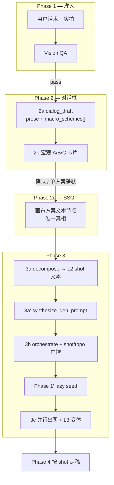

# 实物产品视觉出图 — Phase 2 方案层修订规格

> **状态**：草案待审（v1.1）  
> **日期**：2026-08-11  
> **修订对象**：[2026-08-10-ecommerce-product-visual-design.md](./2026-08-10-ecommerce-product-visual-design.md)（v1.9）  
> **触发**：产品方对齐「对话框草案 → 宏观方案选择 → 画布 SSOT → 构图拆解 → 精细编排」与现行 JSON plan 实现的 GAP

| 字段 | 值 |
|------|-----|
| 文档版本 | v1.1 |
| 适用范围 | `flow_mode: product_visual` 一期（出图） |
| 与主规格关系 | **修订 Phase 1（识图准入、seed 时机）与 Phase 2~4 前半**；并行生图调度框架不变 |

---

## 一、修订摘要

### 1.1 产品方期望（已确认）

用户以自然语言描述视觉/包装需求并上传实拍后，Agent 行为应与**手工画布工作流**一致：

1. **识图模型**理解产品内容，判断实拍是否满足后续出图前提；
2. **推理模型**产出**可读的行业方案 prose**（非 JSON、非仅生图 prompt）；
3. 初稿 **仅在对话框原文展示**，不写画布节点；
4. 模型 **摘要** 后，若存在多套宏观方案（A/B/C），在对话框以 **卡片** 供用户勾选（可 A+B），并给出 **推荐方案与理由**；仅一套时静默继续；
5. 用户确认后，将 **选定方案的完整 prose** **写入画布方案文本节点**，该节点为 **唯一真相（SSOT）**；
6. Agent 从 SSOT **拆解** 构图 shot 清单，**每类场景至少一张图**，各写入 **独立画布文本节点**；
7. **编排层**为每个 shot 声明最佳输入组合，**合成生图 prompt** 后连线 **并行出图**；
8. 关键 shot 可有 **1~3 张 gen 变体候选**；Phase 4 **按 shot（或 type×macro 汇总）定稿各 1 张**。

### 1.2 三层方案模型（必读）

本修订采用 **L1 → L2 → L3** 嵌套，取代 v1.9「仅 image_type × variant」单层模型：

```
L1  宏观方案 A / B / C     … 整包创意方向（对话框卡片选择；可多选 A+B）
      └── L2  shot 清单       … 编排单元（每类场景 ≥1 张；独立构图文本节点）
            └── L3  gen 变体  … 仅关键 shot 1~3 候选；Phase 4 定稿 1 张
```

| 层级 | ID 命名 | 用户可见 | 选择时机 |
|------|---------|----------|----------|
| L1 | `A` / `B` / `C` | 对话框卡片摘要 | Phase 2b |
| L2 | `{type_id}__{seq}`，如 `packaging_hero__1` | 画布构图文本 / 侧栏 shot 列表 | 拆解产出；可 `await_shot_confirm` 调整 |
| L3 | `{shot_id}__v{n}` | Phase 4 定稿卡片内切换 | 出图完成后 |

**与 v1.9 映射：**

- v1.9 `image_type` ≈ L2 的 **`type_id` 标签**（交付分组用，非编排唯一键）；
- v1.9 `scheme`（同类型变体）≈ L3 **gen 变体** 或 L1 **宏观方案**，取决于变体发生在哪一层（见 §1.3）。

### 1.3 变体发生在哪一层

| 场景 | 变体层 | 行为 |
|------|--------|------|
| 包装方向互斥（红金礼盒 vs 极简牛皮） | **L1** | 2b 卡片选 A 或 B；默认 **单选** |
| 用户明确「两套都要出图」 | **L1 多选 A+B** | 并行保留（§1.4）；L2 shot 带 `macro_scheme_id` |
| 同场景多种构图（模特街拍 vs 室内礼盒） | **L2** | 同 `type_id` 下 `model_holding_pack__1` / `__2` |
| 同 shot 多种出图候选 | **L3** | 关键 shot 1~3 gen；Phase 4 定稿 1 张 |

**铁律（继承 v1.9 L3/L4）：** 多选 = 多张 **独立 gen**；**禁止 prompt 融合**；每个 **(shot, 定稿)** 最终 exactly 1 张。

### 1.4 A+B 多选策略（已决）

**默认策略：B — 并行保留**（非 LLM 合并抹平差异）。

| 项 | 规则 |
|----|------|
| SSOT 形态 | 单节点内分节：`## 方案 A` / `## 方案 B`（完整 prose 各一节） |
| L2 shot | 每条带 `macro_scheme_id: "A" \| "B"` |
| 重叠 shot | A/B 均有「模特送礼」→ **2 个独立 L2 shot**（不同 `macro_scheme_id`），**不合并** |
| 上限 | `max_macro_schemes_selected = 2`；超出则 HITL 请用户删减 |
| 例外 | 用户 utterance 明确要求「融合/A+B 合成一套」→ 允许 **策略 A（合并叙事）**，须在 SSOT 标题注明 `merged` |

> **O1 已关闭：** 默认禁止将 A+B LLM 合成单段 prose（避免丢失方案边界）。

### 1.5 shot 颗粒度与上限

| 规则 | 值 |
|------|-----|
| 粒度 | **一类场景至少 1 shot**；utterance 未提的类型 **不拆**（不臆造） |
| `type_id` : `shot` | 1 : N 允许（如 `detail_page__1`, `detail_page__2`） |
| 每宏观方案最多 shot 数 | `max_shots_per_macro_scheme = 8` |
| 全局下游上限 | 继承 `max_downstream = 12`（含 Phase1 seed + L3 变体计数方式见 §4.1） |
| shot 命名 | **`{type_id}__{seq}`**（seq 从 1 起）；禁用与 L1 混淆的裸 `c1/c2` |

**最小必要 shot 原则：** 优先满足用户 utterance 点名类型；可选类型仅在 LLM 高置信推断时加入，并在 shot 确认门展示依据。

### 1.6 与主规格 v1.9 差异速查

| 维度 | v1.9 | 本修订 v1.1 |
|------|------|-------------|
| Phase 1 QA | 启发式 | Vision 识图 + 图源指标辅助 |
| Phase 1 seed 时机 | QA 后立即 | **默认 lazy**（§2.3） |
| 方案初稿 | JSON plan | 对话框 prose |
| 方案选择 | type × variant | **L1 宏观 A/B/C** + L3 变体 |
| SSOT | checkpoint JSON | 画布 prose 节点 |
| 拆解产物 | 直接出图 manifest | L2 构图文本 → 编排 → 出图 |
| 编排 | 扁平 Phase1 deps | per-shot refs |
| gen prompt | 在 scheme.prompt | **synthesize_gen_prompt**（§3.8） |
| Phase 4 分组 | 按 image_type | **按 shot_id**（可 rollup 到 type_id 展示） |

---

## 二、端到端流程

### 2.1 阶段一览

```
Phase 1   vision_qa → [await_image_qa]
Phase 2a  dialog_draft          → 对话框 prose + macro_schemes[]（一次 LLM 双输出）
Phase 2b  [await_macro_scheme_select]  → 可跳过（单方案）
Phase 2c  canvas_ssot_commit    → upsert SSOT prose
Phase 3a  decompose_from_ssot   → L2 shot 文本节点 + shot_manifest[]
Phase 3a′ synthesize_gen_prompt → 各出图节点 prompt_hint（内部，可 batch）
Phase 3b  orchestrate_shots     → refs + connect + [await_shot_confirm] + [await_topo]
Phase 1′  phase1_seed           → lazy：编排后按需生成 white_bg + turnaround（§2.3）
Phase 3c  parallel_gen          → gen_scheduler ⇄ gen_node
Phase 4   delivery_confirm      → 按 shot 定稿（rollup type 展示）
```

> **节点顺序说明：** `decompose` 在 `phase1_seed` **之前**，以便编排层先知道各 shot 需要哪些 ref，再 **按需** 生成 Phase1 资产，避免方案修订/重拍浪费 seed 积分。

### 2.2 流程图



### 2.3 Phase 1 seed 时机：lazy（默认） vs eager

| 模式 | 触发 | 行为 |
|------|------|------|
| **lazy（默认）** | 常规路径 | `decompose` + `orchestrate` 完成后，按 shot `refs` **按需** 生成 `white_bg` / `product_turnaround` |
| **eager** | `requires_standard_product_assets=true` | Vision QA pass 后立即 seed，再进 2a |

**`requires_standard_product_assets` 推断（LLM，非关键词硬路由）：**

- `true`：utterance 强依赖标准产品图（如「白底主图」「四视图」「listing 主图」且方案未确认前即需资产预览）；
- `false`：包装/概念/visual 为主，或用户可能 REVISE/RETAKE（默认）。

**CVS-03 室内：** 可跳过 `white_bg` seed；`product_turnaround` 或空间 ref 按 shot `refs` 声明。

### 2.4 对话层 vs 画布层

| artifact | 载体 | SSOT |
|----------|------|------|
| 方案初稿 prose | assistant 消息（2a） | ❌ |
| macro_schemes 元数据 | HITL 卡片 + checkpoint | ❌ |
| **选定方案 prose** | **画布文本节点（2c）** | **✅** |
| L2 shot prose | 画布文本节点（3a） | 派生（消费 SSOT） |
| L3 出图候选 | 画布 image 节点 | 执行层 |
| shot_manifest / visual_intent | checkpoint 索引 | 缓存；与画布冲突 **以画布为准** |

### 2.5 画布 UX（节点过多补偿）

| 规则 | 说明 |
|------|------|
| 折叠 | L2 shot 文本节点默认 **折叠在 SSOT 方案组** 下，画布仅展示组标题 + 数量 |
| 侧栏 | Agent 侧栏 **shot 列表卡片** 为主操作面，不强制展开全部文本节点 |
| 上限提示 | 预估节点数 > 12 时，2b 后提示用户缩减 macro 或 shot |
| 可编辑 | 用户展开后可编辑 SSOT / shot 文本；见 §5 修订路径 |

---

## 三、硬规则（AC）

### R-Dialog-Draft

Phase 2a **必须**以 assistant **自然语言消息**输出完整行业方案正文。

- **禁止** Phase 2a 仅向用户展示 JSON；
- 体裁与手工 `generateTextForRefs` + vision refs 一致；
- **一次 LLM 调用、双输出：** `{ draft_prose, macro_schemes[] }`；2b **仅抽取/校验**，禁止第二次完整重推理（避免 prose 与卡片不一致）。

### R-No-Draft-Canvas

用户 **确认 L1 宏观方案之前**，**禁止** `upsert_prompt_node` 写入初稿、候选全集或 JSON plan。

### R-Canvas-SSOT

用户确认 L1 后（含 **静默单方案**）：

1. `upsert_prompt_node(content=<SSOT prose>)` → `plan_node_id`；
2. A+B **并行保留**：SSOT 分节 `## 方案 A` / `## 方案 B`；
3. 下游 **只读** SSOT content；checkpoint 为索引；
4. 用户编辑 SSOT 后 → 触发 **§5.2 局部重跑**。

### R-Macro-Scheme-Select

| 规则 | 说明 |
|------|------|
| 对象 | L1 宏观整包方案 A/B/C |
| 多选 | 最多 2 个；默认并行保留（§1.4） |
| 推荐 | ≥1 个 `recommended` + `recommend_reason` |
| 单方案 | 跳过 2b，2a 后直接 2c |
| 修订 | ≤3 轮 → 回 2a；超限强制推荐方案 2c |

### R-Shot-Decompose

Phase 3a 从 SSOT 拆解 L2 shot：

- 每 shot：`upsert_prompt_node`（**构图描述 prose**，非最终 gen prompt）；
- 输出 `shot_manifest[]`：

```json
{
  "shot_id": "packaging_hero__1",
  "type_id": "packaging_hero",
  "macro_scheme_id": "A",
  "label": "中秋红金礼盒主视觉",
  "node_id": "…",
  "variant_count": 1,
  "refs_policy": { "requires": ["white_bg"], "optional": ["plan_node_id"] }
}
```

### R-Shot-Confirm

在 `orchestrate` 与 `await_topo` 之间（**可合并为同一门控 UI**）：

- 展示 **shot 表**：type_id、label、macro_scheme_id、refs 摘要；
- 用户可「确认拆解」或「回到对话调整」（回 3a，**不回 2a**，除非改 macro）；
- 单 shot 删减：对话「去掉 packaging_structure__1」或删 shot 节点 → 重跑 3a′/3b。

### R-Per-Shot-Orchestration

| shot 示例 | refs / depends_on |
|-----------|-------------------|
| `model_holding_pack__1` | shot 文本 + `white_bg` |
| `detail_macro__1` | shot 文本 + `product_turnaround` |
| `packaging_hero__1` | shot 文本 + `white_bg` + SSOT（optional） |

- **禁止**全部 downstream 无差别仅 `[white_bg, product_turnaround]`；
- 跨 shot 依赖：默认 **禁止** L2 依赖另一 L2 出图结果；若需「包装图作 ref」，须在 shot 确认门显式声明并用户确认。

### R-Prompt-Synthesize（Phase 3a′）

**编排层与执行层分界：** L2 shot prose **不得**直接作为 image gen prompt。

| 输入 | 输出 |
|------|------|
| shot prose + SSOT 摘要 + `visual_intent` 缓存 + `refs_policy` + `key_elements`（可选结构化缓存） | 出图节点 `prompt_hint` |

- 实现：`synthesize_gen_prompt` 节点或 `orchestrate_shots` 内 batch LLM；
- 对内可复用 legacy `build_scheme_prompt_hint` 逻辑，**对用户不可见 JSON**。

### R-Shot-Variant（L3）

| 规则 | 说明 |
|------|------|
| 范围 | **关键 shot**（LLM 标记 `variant_eligible: true` 或同 type 仅 1 shot 且用户 utterance 含「对比/多款」） |
| 数量 | 每 shot 1~3 个 gen 变体；manifest key `{shot_id}__v{n}` |
| 非关键 shot | `variant_count = 1`，静默 |
| Phase 4 | **每个 L2 shot 定稿 exactly 1 张**（从 L3 候选中选） |

### R-Vision-QA

- **必须** vision（`generateTextForRefs` / 等价）；
- 输出：`pass | fail | remediate` + 理由文案；
- 清晰度/白底为 **辅助信号**，不可替代识图语义；
- 室内场景白底放宽（CVS-03）保留。

### R-Phase4-Delivery

Phase 4 分组键：**`shot_id`**（内部）；UI 可 **rollup** 到 `type_id` 或 `type_id + macro_scheme_id` 展示。

- 默认选中 L3 `recommended` 变体；
- 切换候选 **不 regen**；
- 「微调重绘」仅当前 shot 定稿变体；
- 「确认全部定稿」→ `done`。

### R-Abort-Clean

「我重新拍」/ 中止须清除：`plan_node_id`、SSOT、全部 L2 shot 节点、Phase1 seed 节点、侧栏附件、checkpoint 方案字段（继承 v1.9 §4.1）。

---

## 四、状态与图节点（工程）

### 4.1 checkpoint 字段

| 字段 | 说明 |
|------|------|
| `macro_scheme_draft` | 2a prose 缓存（可选；权威在 messages） |
| `macro_schemes[]` | `{ id, label, summary, recommended, recommend_reason }` |
| `selected_macro_scheme_ids[]` | 如 `["A","B"]`，长度 ≤ 2 |
| `plan_node_id` | SSOT 节点 ID（2c 后必填） |
| `shot_manifest[]` | L2 拆解 + refs_policy + variant_count |
| `visual_intent` | **内部缓存**，不对用户展示；供 synthesize / 路由 |
| `requires_standard_product_assets` | bool，seed 模式 |
| `scheme_revision_count` | int |
| `phase1_asset_keys` | lazy 完成后写入 |

**`max_downstream` 计数：** Phase1 seed（0~2）+ Σ L2 shots × L3 variant_count ≤ 12。

### 4.2 LangGraph 节点

```
vision_qa_check → [await_image_qa]
  → [phase1_seed_eager]   # 仅 requires_standard_product_assets
  → dialog_draft
  → [await_macro_scheme_select]
  → canvas_ssot_commit
  → decompose_from_ssot
  → [await_shot_confirm]   # 可与 await_topo 合并 UI
  → synthesize_gen_prompt
  → orchestrate_shots → [await_topo]
  → [phase1_seed_lazy]
  → start_gen → gen_scheduler ⇄ gen_node → collect_gen
  → delivery_summary → [await_delivery_confirm] → done
```

**降级：** legacy `plan_product_visual` JSON 路径仅作 `product_visual_scheme_v2=false` 或内部 synthesize 辅助，**不对用户暴露**。

### 4.3 前端

| 模块 | 变更 |
|------|------|
| `AgentSideRail.vue` | 2a 长文；2b 宏观卡片；shot 列表 + shot/topo 合并门控 |
| `agentInterruptGate.ts` | `await_macro_scheme_select`、`await_shot_confirm`（或 `shot_topo_confirm`） |
| 画布 | SSOT 方案组 + shot 折叠；编辑后「重新拆解」CTA |
| Phase 4 | 按 shot 定稿，rollup type 展示 |

---

## 五、修订与重跑范围

| 用户动作 | 重跑范围 |
|----------|----------|
| 2b 修订宏观方案 | 2a → 2c；清除旧 SSOT、L2、出图节点 |
| 编辑 SSOT 文本 | 3a → 3a′ → 3b；保留 macro 选择 |
| 编辑单个 L2 shot 文本 | 该 shot 的 3a′ → 3b → gen（局部） |
| shot 确认门删减 shot | 更新 manifest → 3b |
| Phase 4 微调重绘 | 仅该 shot 当前定稿变体 regen |
| RETAKE | §R-Abort-Clean 全清 |

---

## 六、与手工画布对齐

| 步骤 | 手工 | Agent v1.1 |
|------|------|------------|
| 方案生成 | Dock vision + prose | 2a 同链路 |
| 方案存储 | 节点 content | 2c SSOT |
| 构图 | 用户自建文本节点 | 3a L2 shot 节点（Agent 代建，可折叠） |
| 连线出图 | 用户手动 | 3b 自动 orchestrate |
| gen prompt | 用户或节点生成 | 3a′ synthesize（对用户透明） |

---

## 七、验收要点（CVS 扩展）

| ID | 断言 |
|----|------|
| AC-P1-VISION | QA 步骤 `visionUsed: true` |
| AC-P1-LAZY-SEED | CVS-02 默认：`upsert SSOT` 早于 `white_bg` gen 完成 |
| AC-P2-DIALOG | 2a 消息含 prose ≥ 200 字，非 JSON-only |
| AC-P2-DUAL-OUTPUT | 同轮响应含 `macro_schemes[]` 且与卡片一致 |
| AC-P2-NO-DRAFT-CANVAS | 2c 前 `upsert_prompt_node` = 0 |
| AC-P2-SSOT | 2c 后 `plan_node_id` content 为 prose；A+B 时含两节标题 |
| AC-P2-MACRO | CVS-02：≥2 macro 或单套静默；选 A 后 shot ≥ 3 |
| AC-P3-SHOT-MANIFEST | `shot_manifest` 含 `packaging_hero__*`, `packaging_structure__*`, `model_holding_pack__*` |
| AC-P3-SYNTH | 出图节点 `prompt_hint` 非空且 ≠ L2 shot prose 原文 |
| AC-P3-ORCH | `model_holding_pack__*` refs 含 white_bg + shot node |
| AC-P3-SHOT-CONFIRM | 拓扑门控前展示 shot 清单（或合并 UI） |
| AC-P4-SHOT-DELIVERY | 定稿分组键为 shot_id；每 shot 最终 1 url |
| AC-LIMIT | 任意 case downstream ≤ 12 |

**eval 迁移：** `eval-cvs-set.yaml` 增加 `prose_fixture`、`shot_manifest_fixture`；保留 legacy `plan_fixture` 仅测 synthesize 内部对照。

**TDD 用例全集（研发自动化）：** [2026-08-11-product-visual-phase2-scheme-ssot-test-cases.md](./2026-08-11-product-visual-phase2-scheme-ssot-test-cases.md)

**用户验收测试 UAT（产品/QA 手工）：** [2026-08-11-product-visual-phase2-scheme-ssot-uat.md](./2026-08-11-product-visual-phase2-scheme-ssot-uat.md)

---

## 八、迁移与兼容

| 项 | 说明 |
|----|------|
| Feature flag | `product_visual_scheme_v2`（默认 true 新会话） |
| Legacy | v2=false 走 v1.9 JSON plan 路径至 deprecation |
| 内部保留 | `visual_intent`、`type_id` 模板库、`buildImageRefConsistencyBlock`、`gen_scheduler` |
| 主规格 | 本修订评审通过后合并入主文档 **v2.0** |

---

## 九、开放问题（v1.1 已决 / 剩余）

| # | 问题 | 状态 |
|---|------|------|
| O1 | A+B 合并 vs 并行 | **已决：默认并行保留（§1.4）** |
| O2 | decompose 实现 | **已决：LLM → shot_manifest + L2 prose（§R-Shot-Decompose）** |
| O3 | macro vs type_id | **已决：macro=L1；type_id=L2 标签（§1.2）** |
| O4 | 跨 shot 依赖（包装作 ref） | 默认禁止；特例需 shot 确认门显式批准 |
| O5 | 专用 packaging prompt mode | 实现计划待定；2a 可先复用 generic + vision system prompt |

---

## 十、规格自检（v1.1）

- [x] 三层 L1/L2/L3 定义无歧义  
- [x] A+B、shot 上限、命名规范已写死  
- [x] lazy seed + synthesize + shot 确认门已入流  
- [x] Phase 4 与 L3 定稿规则一致  
- [x] 修订/中止/局部重跑已覆盖  
- [x] 与 v1.9 并行 gen / 不融合铁律无矛盾  
