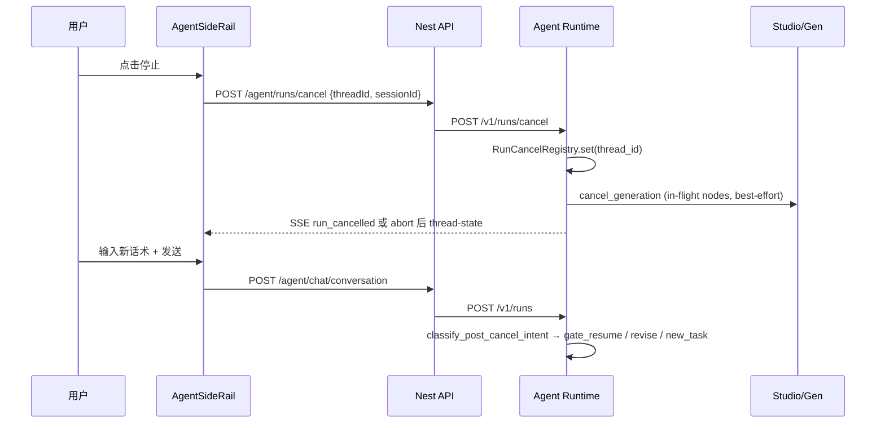

# Agent 运行中中断与改意图 — 设计规格

> **状态**：Accepted（PV 首期）  
> **初稿**：2026-08-12  
> **Accepted**：2026-09-06  
> **触发**：UX-PV 交付后用户反馈 — 任务进行中无法随时中断、点生成钮改发新需求、系统识别意图再执行  
> **读者**：产品、前端、Agent Runtime、Nest API  
> **前置**：  
> - [2026-08-11-agent-conversation-ux-product-visual-design.md](./2026-08-11-agent-conversation-ux-product-visual-design.md)  
> - [2026-08-06-agent-sidebar-copy-design.md](./2026-08-06-agent-sidebar-copy-design.md)  
> - LangGraph `interrupt_before` + checkpoint（W5 / P0-05）  
> - [2026-08-08-agent-canvas-control-surface-design.md](./2026-08-08-agent-canvas-control-surface-design.md)

| 字段 | 值 |
|------|-----|
| 文档版本 | v2.0 |
| 首期范围 | **`product_visual` only**：真正停止 + 启发式改意图协议 |
| 后续 | **Expand-B**：同一 cancel 协议扩 atomic → campaign → explore |
| 非范围 | Dock 单节点取消（已有 `cancel_generation`）；多 thread 并行；Cloud Agent；LLM 意图分类；自动猜「改主意」 |

**产品决策（2026-09-06 brainstorming）**

| # | 决策 |
|---|------|
| D1 | 交付深度 = 停止 + 改意图协议（含 callout / 新任务 chip），非仅 abort SSE |
| D2 | 首期只做 `product_visual`；完成后再扩全 flow |
| D3 | 改意图分类用**启发式 +「发起新任务」chip**（不用 LLM 分类器；取消后不一律 fresh intake） |
| D4 | 实现采用 **Run Cancel Token**（方案 1），不用懒取消或弃 thread |

---

## 一、问题陈述

### 1.1 用户期望旅程

```
任务进行中（出图/写方案/任意阶段）
  → 用户点侧栏右下角「停止」
  → 当前 run 安全停止
  → 用户输入新话术
  → 系统理解：门控续跑 / 改意图 / 全新任务
  → 执行对应路径，上下文衔接清晰
```

### 1.2 现状与缺口

| 环节 | 现状 | 仍缺 |
|------|------|------|
| 前端取消 | abort SSE + toast（Phase 0） | 后端 run / 出图未停 |
| 流式中发新话 | 取消后可输入 | 无统一「改意图」协议 |
| 门控中改意图 | `should_resume_interrupt` / fresh restart 部分可用 | 规则不透明；与 cancel 未串联 |
| 出图阶段 | `gen_scheduler` 无 cancel flag | 无法协作停派发 + 在途 cancel |
| 意图路由 | 仅 intake / gate 路径 | 取消后无 `classify_post_cancel_intent` |

**根因：** 系统是 **checkpoint 续跑 + 固定 HITL 门控**，不是 **可任意打断的对话式 REPL**。

---

## 二、目标与非目标

### 2.1 目标（Must，PV 首期）

1. **PV 任意可见阶段**，用户可显式中断当前 Agent turn（侧栏停止钮；Esc 可选）。
2. 中断后 **≤3s** 内 composer 可输入；发送新话时明确识别：门控回复 / 改意图 / 新任务。
3. **出图阶段**中断：停止调度新节点 + 取消进行中的 generation record（best-effort）。
4. 改意图后状态清理可预测（§四字段表）+ 侧栏一句摘要。
5. UAT 表（§七）可验收。

### 2.2 非目标（Won't，本期）

- 同一 thread 两路 run **并行**
- 自动猜测用户是否「改主意」（须显式中断或门控规则命中）
- 画布 Dock 与侧栏 Agent **统一取消**
- Campaign / atomic / explore 全链路（Expand-B）
- LLM 意图分类器
- 上游 provider 保证秒级杀进程

---

## 三、架构（Run Cancel Token）

### 3.1 序列



### 3.2 组件职责

| 层 | 变更 |
|----|------|
| **Web** | `cancelActiveStream()` → `cancelAgentRun()`：先 cancel API，再 abort；cancelled callout +「发起新任务」chip |
| **Nest** | 代理 `POST /v1/runs/cancel`；thread-state 透传 `runCancelled` / `phase=cancelled` |
| **Runtime** | `RunCancelRegistry`；`gen_scheduler` / 长节点协作取消；cancel 后 checkpoint 收口；`classify_post_cancel_intent` |
| **State** | `phase` 增 `cancelled`；`run_cancelled`；`cancel_reason` |

### 3.3 出图阶段取消（PV）

`gen_scheduler` 在波次边界 in-flight=0，适合协作式取消：

1. 每 wave 派发前读 `cancel_flag` → 不再 `Send` 新 `gen_node`
2. 对已派发节点：Nest `cancel_generation(node_id)`（与 explore 共用）
3. checkpoint：`phase=cancelled`，presentation callout「已停止出图，已完成 a/b」
4. 进度卡剩余项标 `cancelled`

长节点（非 gen）入口同样读 flag → 跳转 cancelled 收口，不进入下一门控。

---

## 四、状态机与改意图字段表

### 4.1 运行态

```
streaming_active
  ├─ gate_waiting   (interrupt_before)
  ├─ planning       (dialog_draft / decompose / …)
  └─ generating     (start_gen → gen_scheduler ⇄ gen_node → collect_gen)
         ↓ 用户停止
phase = cancelled, run_cancelled = true
         ↓ 用户再发话
classify_post_cancel_intent → gate_resume | revise | new_task
```

取消收口写：

- `phase: "cancelled"`
- `run_cancelled: true`、`cancel_reason: "user"`
- `presentation: callout_info`（人话）
- gen 通道：未派发标 cancelled；在途 best-effort cancel
- **不**清画布节点 / 本会话附件 SSOT

### 4.2 取消后意图分类（启发式，优先级自上而下）

| 优先级 | 条件 | 结果 |
|--------|------|------|
| 1 | 消息 = `__new_task__` 或点「发起新任务」chip | **new_task** |
| 2 | 仍有 `next` 门控 **且** `should_resume_interrupt` = true | **gate_resume** |
| 3 | 命中改意图词且非新任务词 | **revise** |
| 4 | ≥12 字 + `@T/@I/...`，或明确新任务词 | **new_task** |
| 5 | 其余 ≥12 字自由需求（取消后首条） | **new_task**（偏安全） |
| 6 | 短句且无门控 | 含改意图词 → **revise**；否则 **new_task** + callout 提示可用 chip |

**改意图词（首期）：** `换成|改成|改为|不要|去掉|调整|修改|改一下|换成白底|只要…`  
**新任务词：** `另一套|重新做|新任务|换个产品|帮我做一套|从头`

取消后**不在** generating 中途直接吃改意图（先停再发）。与 `thread_busy` 对齐：停止解锁后再分类。

`runs.py` 入口顺序：若 `run_cancelled` 或 `phase=cancelled` → `classify_post_cancel_intent` → 分支；成功开跑后清 `run_cancelled`。

### 4.3 字段保留 / 清空

**new_task** → 复用并扩展 `FRESH_TURN_STATE_CLEAR`，额外清 `run_cancelled`、`cancel_reason`、gen_* 全套、`journey_trace`、`presentation`。保留 `messages`（追加）、`session_id` / `thread_id`；侧栏附件随本轮 `turn_update` 覆盖。

**revise**（按取消时所在阶段分档）：

| 取消时大致阶段 | 保留 | 清空 / 重置 | 回跳 |
|----------------|------|-------------|------|
| image_qa 前后 | 更新后的 `effective_utterance`、附件、`visual_intent` 骨架 | QA 决策、retake 旗 | `intake` 或 `await_image_qa` |
| macro / scheme 附近 | utterance、附件、已过 QA 资产键；`macro_schemes` 草稿可选留 | `selected_macro_*`、shot、delivery、gen_* | `await_macro_scheme_select` 或 `dialog_draft` |
| shot / topo 附近 | utterance、macro 已选、附件 | 可重分解 `shot_manifest`、gen_*、delivery | `decompose_from_ssot` / `await_shot_confirm` |
| 出图中 / 出图后 | utterance、macro+shot SSOT、已完成节点 | gen 进度通道、部分 `delivery_selections` | 重跑未完成 shot；话术像整单重做 → 升 **new_task** |

原则：**改意图不丢已确认的上游门控结果；下游未确认产物可作废。**

### 4.4 侧栏 UX

| 状态 | 生成钮 | Composer | 提示 |
|------|--------|----------|------|
| streaming（含 generating） | ⏹ 停止 | disabled | 现有 banner |
| cancelled | ↑ 发送 | enabled | callout +「发起新任务」chip |
| await_* 门控 | ↑ / 确认 chips | enabled | 现有 HITL；未 new_task 时可继续确认 |

---

## 五、API / SSE / 前端契约

### 5.1 `POST /api/agent/runs/cancel`（Nest）

```json
// Request
{ "threadId": "...", "sessionId": "...", "reason": "user" }

// Response
{
  "ok": true,
  "phase": "cancelled",
  "cancelledNodeIds": ["node_..."],
  "completedTasks": 2,
  "totalTasks": 5
}
```

Nest → Runtime：`POST /v1/runs/cancel`（`thread_id` / `session_id` / `reason`）。

- 幂等：重复 cancel → `ok: true`
- 无活跃 run：仍 `ok: true`
- 非 PV 首期：可 `ok: true, skipped: true, reason: "flow_not_supported"`（Expand-B 再接）

### 5.2 Runtime cancel 步骤

1. `RunCancelRegistry.set(thread_id, reason)`
2. astream 协作退出（scheduler 波次前 / 长节点入口读 flag）
3. 在途 PV 节点 `cancel_generation`
4. checkpoint 写 §4.1 收口
5. 若 SSE 仍连：发 `run_cancelled` 后结束；若前端已 abort：靠 thread-state

### 5.3 SSE / thread-state

```json
{ "type": "run_cancelled", "data": { "phase": "cancelled", "completedTasks": 2, "totalTasks": 5 } }
```

```json
{
  "phase": "cancelled",
  "runCancelled": true,
  "interrupted": false,
  "presentation": {
    "kind": "callout_info",
    "body": { "text": "已停止出图（完成 2/5）。直接说修改意见，或点「发起新任务」。" }
  }
}
```

### 5.4 前端

| 现状 | 升级 |
|------|------|
| 仅 abort SSE | `cancelAgentRun()`：先 POST cancel，再 abort；API 失败仍 abort + toast |
| 无 cancelled UX | 消费 SSE / thread-state：callout +「发起新任务」chip |
| — | 取消后下一轮 **新** idempotency key |

### 5.5 错误与降级

| 情况 | 行为 |
|------|------|
| cancel API 超时 / 5xx | 仍 abort；toast「后台可能仍在收尾」 |
| 上游 gen 无法取消 | 节点标 cancelled/可能仍完成；UI 提示部分任务可能仍在后台结束 |
| cancel 与 gate resume 竞态 | 用户先点确认 chip 且未停 → 现有 resume；先停再确认 → §4.2 |

---

## 六、分期

| 阶段 | 范围 | 状态 |
|------|------|------|
| **Phase 0** | 前端 SSE abort + toast | ✅ 已交付 |
| **Phase PV-1** | Cancel API + Registry + `gen_scheduler` 协作 + PV generating 收口 + thread-state/SSE | 首交付 |
| **Phase PV-2** | `classify_post_cancel_intent` + revise/new_task 字段表 + callout + 新任务 chip | 紧随 PV-1（同属「停止+改意图」） |
| **Expand-B** | 协议扩 atomic → campaign → explore | PV 验收后再开 |

PV-1 / PV-2 可同一实现 PR 串行，验收按 §七分项勾选。

**Implementation Plan：** 本 spec 用户审阅通过后，由 `writing-plans` 产出 `docs/superpowers/plans/2026-09-06-agent-mid-run-interrupt-pv.md`（或更新日期）。

---

## 七、验收标准（UAT）

| UAT-ID | 场景 | Pass |
|--------|------|------|
| UAT-INT-PV-01 | PV 出图中点「停止」 | ≤5s 无新 `gen_node` 派发；进度卡停止增长；`phase=cancelled` |
| UAT-INT-PV-02 | 停止后发改意图（如「换成白底风格」） | **revise**：保留已确认上游；侧栏一句说明 |
| UAT-INT-PV-03 | 停止后点「发起新任务」或 `__new_task__` | **new_task**：PV SSOT/shot/delivery 清空；intake；画布可保留 |
| UAT-INT-PV-04 | 停止后 ≥20 字新需求（含 `@I`） | **new_task**；旧 SSOT 不阻塞 |
| UAT-INT-PV-05 | 门控下先停止，再点「确认出图」 | 仍在该 gate 且命中 resume → **gate_resume** |
| UAT-INT-PV-06 | 停止后重连 thread-state | `runCancelled` + callout；composer 可用 |
| UAT-INT-PV-07 | 重复停止 / cancel 幂等 | 两次 `ok: true`，无异常 |

---

## 八、风险与缓解

| 风险 | 缓解 |
|------|------|
| cancel 后 checkpoint 半态 | 统一 `phase=cancelled` + §4.3 表；单测 |
| 上游 gen 杀不掉 | best-effort + UI 提示 |
| 启发式误判 revise↔new_task | 显式 chip；UAT-02/03/04；日志 `post_cancel_intent` |
| idempotency-key 冲突 | 取消后强制新 key |
| 误触停止 | toast + callout；P2 再考虑「撤销停止」 |
| 非 PV 误调 cancel | `skipped: flow_not_supported`，前端不报红 |

---

## 九、变更记录

| 日期 | 版本 | 说明 |
|------|------|------|
| 2026-08-12 | v1.0 | 初稿：问题、方案 B、API、UAT、分期 |
| 2026-09-06 | v2.0 | Accepted：收窄为 PV 首期；锁定启发式改意图 + Run Cancel Token；补状态机/字段表/UAT-PV；Expand-B 后置 |
