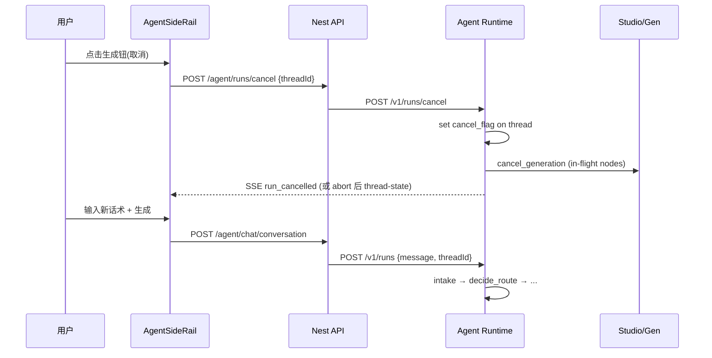

# Agent 运行中中断与改意图 — 设计规格

> **状态**：草案待审  
> **日期**：2026-08-12  
> **触发**：UX-PV 交付后用户反馈 — 任务进行中无法随时中断、点生成钮改发新需求、系统识别意图再执行  
> **读者**：产品、前端、Agent Runtime、Nest API  
> **前置**：  
> - [2026-08-11-agent-conversation-ux-product-visual-design.md](./2026-08-11-agent-conversation-ux-product-visual-design.md)  
> - [2026-08-06-agent-sidebar-copy-design.md](./2026-08-06-agent-sidebar-copy-design.md)  
> - LangGraph `interrupt_before` + checkpoint（W5 / P0-05）

| 字段 | 值 |
|------|-----|
| 文档版本 | v1.0 |
| 适用范围 | 侧栏 Agent 全 flow（product_visual / campaign / atomic / explore）；**P0 实现聚焦 product_visual v2 + atomic** |
| 非范围 | 画布 Dock 单节点生成取消（已有 `cancel_generation` explore 路径）；多 thread 并行；Cloud Agent |

---

## 一、问题陈述

### 1.1 用户期望旅程

```
任务进行中（出图/写方案/任意阶段）
  → 用户点侧栏右下角「生成」钮（或等价中断）
  → 当前 run 安全停止
  → 用户输入新话术
  → 系统理解新意图（继续 / 修改 / 全新任务）
  → 执行对应 flow，上下文衔接清晰
```

### 1.2 现状与缺口

| 环节 | 现状（2026-08-12 前） | v2.1 补丁 | 仍缺 |
|------|----------------------|-----------|------|
| 前端取消 | 生成钮文案「点击取消」但 `send()` 直接 return | ✅ abort SSE + toast | 后端 run / 出图未停 |
| 流式中发新话 | composer disabled | 取消后可输入 | 无统一「改意图」协议 |
| 门控中改意图 | `should_resume_interrupt` 短句 resume；长句 `@ref` → fresh restart | 部分可用 | 规则不透明、无确认 |
| 出图阶段 | 无 `interrupt_before` | — | 无法 cancel in-flight gen |
| 意图路由 | 仅 `intake` 节点 | fresh restart 清 checkpoint | 运行中无 REPL 式改道 |

**根因：** 系统是 **checkpoint 续跑 + 固定 HITL 门控**，不是 **可任意打断的对话式 REPL**。

---

## 二、设计目标与非目标

### 2.1 目标（Must）

1. **任意可见阶段**，用户可显式 **中断当前 Agent turn**（侧栏生成钮 / Esc / 可选「停止」chip）。
2. 中断后 **≤3s** 内 composer 可输入；发送新话时 **明确识别**：门控回复 / 改意图 / 新任务。
3. **出图阶段**中断时：停止调度新节点 + 取消进行中的 generation record（best-effort）。
4. 改意图后 **状态清理可预测**（哪些保留、哪些清空）+ 侧栏 **一句摘要**说明。
5. product_visual v2 与 atomic_create **UAT 可验收**（§六）。

### 2.2 非目标（Won't，本期）

- 同一 thread 两路 run **并行**执行  
- 自动猜测用户是否「改主意」（须显式中断或门控规则命中）  
- 画布 Dock 底部生成栏与侧栏 Agent **统一取消**（可二期对齐 UX）  
- Campaign 全链路（可复用协议，implementation P2）

---

## 三、方案对比与推荐

### 方案 A — 前端 abort + 后端 noop（现状增强）

仅断 SSE；后端 LangGraph 继续跑到下一 interrupt 或 END。

| 优点 | 缺点 |
|------|------|
| 改动最小 | 出图继续、积分消耗、改意图不可靠 |
| 已部分落地 | 不符合用户「中断任务」语义 |

**结论：** 仅作 **Phase 0 过渡**（v2.1 已做），不是终态。

### 方案 B — Run Cancel Token + Checkpoint 分支（推荐）

引入 **Run 级 cancel flag**；前端 abort 调 `POST /api/agent/runs/cancel`；Runtime 在节点边界 / gen scheduler 轮询 cancel，跳转到 **`intake` 或 `done(aborted)`**；新消息走正常 intake。

| 优点 | 缺点 |
|------|------|
| 语义清晰、可测 | 需 Runtime + Nest 协作 |
| 与 LangGraph checkpoint 兼容 | gen 中途 cancel 需 nest cancel API |
| 可渐进 rollout | |

### 方案 C — 每轮新 thread

中断 = 新 `threadId`；旧 thread 遗弃。

| 优点 | 缺点 |
|------|------|
| 无 checkpoint 污染 | 丢失画布 SSOT / 定稿上下文 |
| | 与「同画布续聊」产品方向冲突 |

**推荐：方案 B**，分三期交付（§七）。

---

## 四、架构（方案 B）

### 4.1 组件与职责



| 层 | 新增/变更 |
|----|-----------|
| **Web** | `cancelActiveStream()` 升级为 `cancelAgentRun()`；取消后 composer 解锁；可选 `改意图` callout |
| **Nest** | 代理 `POST /v1/runs/cancel`；传递 `sessionId` / `threadId` |
| **Runtime** | `RunCancelRegistry`；`gen_scheduler` / 长节点协作式取消；cancel 后 checkpoint 写入 `phase: cancelled` |
| **State** | `run_cancelled: bool`、`cancel_reason: user \| timeout` |

### 4.2 中断后新消息的意图分类

在现有 `should_resume_interrupt` **之前**增加：

```
if run_was_cancelled or explicit_new_task_marker:
    → Command(goto="intake", update=FRESH_TURN_STATE_CLEAR + message)

elif next_nodes and should_resume_interrupt(message):
    → 现有 gate resume

elif next_nodes and long_message_with_refs:
    → 现有 fresh restart

else:
    → 正常 turn_update（续跑）
```

**显式新任务标记（任一）：**

- 用户在中断后首条消息 ≥12 字且 **不** 命中门控关键词  
- 消息以 `@T`/`@I` 引用开头  
- 用户点「发起新任务」chip（message=`__new_task__`）

**改意图 vs 全新任务（product_visual）：**

| 用户话术倾向 | 策略 | 保留 state |
|--------------|------|------------|
| 「换成白底风格」「不要礼盒了」 | 改意图续 thread | `effective_utterance`、附件、`visual_intent` 部分 |
| 「帮我做另一套耳机主图」 | 新任务 | 清空 SSOT/shot/delivery；保留 session 画布 |
| 门控短回复「确认出图」 | gate resume | 不清 |

### 4.3 出图阶段取消

1. `gen_scheduler` 每 wave 前读 `cancel_flag` → 停止 Send 新 `gen_node`  
2. 对已 dispatch 的 node：调 Nest `cancel_generation(node_id)`（与 explore 共用）  
3. 写 checkpoint：`phase=cancelled`，`presentation` = callout「已停止出图，已完成 a/b」  
4. `task_progress_card` 标记剩余项 `cancelled`

### 4.4 侧栏 UX 规范

| 状态 | 生成钮 | Composer | 提示 |
|------|--------|----------|------|
| streaming | ⏹ 停止 | disabled | — |
| 已取消 / 门控 | ↑ 发送 | enabled | callout：「已停止。直接说新需求，或点上方按钮继续当前步骤。」 |
| 出图中 | ⏹ 停止 | disabled | banner 已有「请勿切 tab」 |

**与 UX-PV 关系：** `generating` 阶段主按钮从占位「取消生成」改为 **真实 cancel**（本规格 Phase 1）。

---

## 五、API 草案

### 5.1 `POST /v1/runs/cancel`

```json
// Request
{ "thread_id": "...", "session_id": "...", "reason": "user" }

// Response
{ "ok": true, "cancelled_nodes": ["gen_node:white_bg", "..."], "phase": "cancelled" }
```

幂等：重复 cancel 返回 `ok: true`。

### 5.2 SSE 事件（可选）

```json
{ "type": "run_cancelled", "data": { "phase": "cancelled", "completed_tasks": 2, "total_tasks": 5 } }
```

### 5.3 thread-state 扩展

```json
{
  "phase": "cancelled",
  "run_cancelled": true,
  "presentation": { "kind": "callout_info", "body": { "text": "..." } }
}
```

---

## 六、验收标准（UAT）

| UAT-ID | 场景 | Pass |
|--------|------|------|
| UAT-INT-01 | product_visual 出图中途点停止 | ≤5s 内无新节点 dispatch；进度卡停止增长 |
| UAT-INT-02 | 停止后发全新话术（≥20 字） | 走 intake；旧 SSOT 不阻塞；侧栏无 machine payload |
| UAT-INT-03 | 拓扑门控停止后点「确认出图」 | 仍 resume topo gate（未发新任务） |
| UAT-INT-04 | atomic 单节点生成中停止 | `cancel_generation` 调用；节点非 generating |
| UAT-INT-05 | 停止后立即重连 thread-state | phase=cancelled；composer 可用 |

---

## 七、分期交付

| 阶段 | 范围 | 依赖 |
|------|------|------|
| **Phase 0** | 前端 SSE abort + toast | ✅ v2.1 已交付 |
| **Phase 1** | Cancel API + gen_scheduler 协作 + product_visual | Nest proxy + Runtime registry |
| **Phase 2** | 改意图分类 + presentation callout + atomic | Phase 1 |
| **Phase 3** | campaign / 门控中「新任务」确认 chip | Phase 2 |

**Implementation Plan：** Phase 1 通过后由 `writing-plans` 产出 `docs/superpowers/plans/2026-08-12-agent-mid-run-interrupt.md`。

---

## 八、风险与缓解

| 风险 | 缓解 |
|------|------|
| cancel 后 checkpoint 半态 | 统一写 `phase=cancelled` + 明确 CLEAR 字段表 |
| 上游 gen 无法取消 | best-effort + UI 标记「可能仍在生成」 |
| 与 idempotency-key 冲突 | cancel 后下一轮新 idempotency key |
| 误触停止 | 停止后 3s 内 toast + 可选 undo chip（P2） |

---

## 九、变更记录

| 日期 | 版本 | 说明 |
|------|------|------|
| 2026-08-12 | v1.0 | 初稿：问题、方案 B、API、UAT、分期 |
