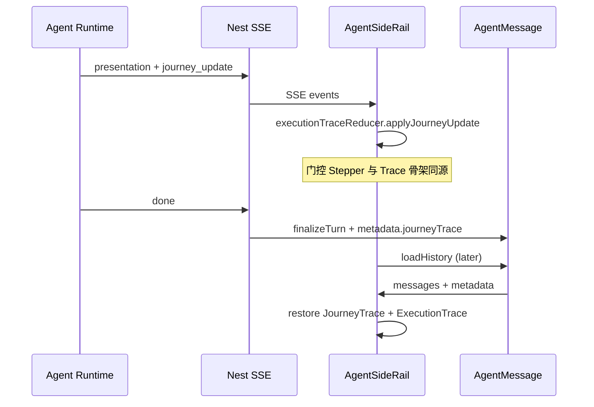

# Product Visual 九步旅程 · 执行记录一体化设计

> **状态**：已批准（2026-08-13）· 实现计划见 [plans/2026-08-13-product-visual-journey-trace.md](../plans/2026-08-13-product-visual-journey-trace.md)  
> **日期**：2026-08-13  
> **触发**：UAT / 生产 E2E 复盘 — 用户无法在**历史对话**中回放九步进度、宏观方案选择、Agent 执行过程  
> **读者**：产品、前端、Nest、Agent Runtime  
> **非范围**：Campaign / atomic 全量迁移（本文仅 **product_visual v2** 为 P0；其余 flow 可后续复用骨架）

| 字段 | 值 |
|------|-----|
| 文档版本 | v1.0 |
| 适用范围 | `flow_mode: product_visual` + `product_visual_scheme_v2=true` |
| 前置规格 | [2026-08-11-agent-conversation-ux-product-visual-design.md](./2026-08-11-agent-conversation-ux-product-visual-design.md)（九步 Stepper + Presentation） |
|  | [2026-08-06-agent-execution-trace-design.md](./2026-08-06-agent-execution-trace-design.md)（Execution Trace P0–P2） |
|  | [2026-08-11-product-visual-phase2-scheme-ssot-design.md](./2026-08-11-product-visual-phase2-scheme-ssot-design.md)（L1 宏观方案） |
|  | [2026-08-06-agent-sidebar-copy-design.md](./2026-08-06-agent-sidebar-copy-design.md)（气泡文案规范） |

---

## 0. 决策摘要

| 项 | 结论 |
| --- | --- |
| **用户心智** | 九步 Stepper = **工作流 todo**；用户应感知「当前第几步、Agent 在做什么、已完成步划线」 |
| **与 Execution Trace 关系** | **合并展示、分层数据**：九步为 **旅程骨架**（`kind: workflow_step`）；现有 canvas / text_stage / task 等为 **子步骤** |
| **Live 会话** | 每轮 assistant 消息下 **`AgentExecutionTrace`** 默认折叠；展开后 **顶部固定九步旅程**，其下为操作明细 |
| **门控区 Stepper** | **保留**于 `AgentPresentationHost`（当前门控操作面）；与 Trace 内旅程 **同源数据**，禁止两套状态分叉 |
| **持久化** | P0 必须：**每 thread 一条旅程快照**写入 `AgentMessage.metadata`（assistant 终局消息或专用 system 消息）；历史加载可完整回放 |
| **宏观方案** | 确认后写入旅程子步骤 detail（人话：「已选 A 湖鲜原境风、B 礼盒臻享风」）；可选只读卡片 snapshot |
| **thread-state 扩展** | 补充 `selectedMacroSchemeIds`；`done` 阶段仍返回完整 `presentation.stepper` + 旅程 snapshot |
| **规格层级** | 本文 **迭代** execution-trace-design §12「DB 持久化 P2+」→ 对 product_visual **提前至 P0** |

---

## 1. 问题陈述

### 1.1 现状（2026-08-13 代码审计）

| 能力 | Live 流式 | 历史回放 |
|------|-----------|----------|
| 九步 Stepper（高亮 / 划线 / 置灰） | ✅ 门控区 `AgentStepper` | ❌ `presentation` 不入库 |
| Agent 执行记录折叠块 | ✅ `AgentExecutionTrace` 挂消息下 | ❌ `loadHistory` 不恢复 |
| 宏观方案可选卡片 | ✅ `await_macro_scheme_select` 门控 | ❌ 完成后不可见 |
| 宏观方案已选记录 | ✅ checkpoint `selected_macro_scheme_ids` | ❌ DB / API / UI 均无 |
| 用户 machine 决策 | ✅ resume 用 | ❌ `__macro_*__` 过滤不入库 |
| `thread-timeline` | ✅ 后端有 | ❌ 前端未消费 |

### 1.2 用户期望（已确认）

1. 九步是 **product_visual 工作流 todo**，不是 internal routing 名称。  
2. 执行过程中 **动态更新**当前步与已完成步（完成后 **划线**）。  
3. 上述进度属于 **Agent 执行记录**，可在「执行过程」折叠块中查看。  
4. **历史对话**打开后，仍能看到完整九步轨迹及关键决策（含宏观方案可选 / 已选）。

### 1.3 成功标准

1. Live：用户展开「执行过程」可见九步骨架 + 子步骤；当前步 `running`，已完成 `done` + 划线样式。  
2. 宏观选择：确认后在 trace 第 3 步下出现人话 detail；历史 thread 可回放。  
3. 刷新 / 切换 thread 再进入：九步旅程与终局摘要均可恢复，无需重跑 graph。  
4. 不破坏 sidebar_copy：主气泡仍只显示最终阶段文案；内部 phase / machine payload 不出现在气泡。  
5. 生产 smoke：`prod-crab-listing-e2e-audit.py` 断言 `journeyTrace.completed` 含 9 步 ID 或等价 snapshot。

---

## 2. 方案比选

### 方案 A — 仅前端合并 UI（不推荐）

- Live 时将 SSE `presentation.stepper` 写入 Pinia `executionTrace`；历史仍丢失。  
- **优点**：改动小。  
- **缺点**：不解决历史回放；刷新即失；与用户需求不符。

### 方案 B — 旅程快照持久化 + Trace UI 一体化（**推荐**）

- 定义 `JourneyTraceSnapshot` JSON；Runtime 在 phase 变迁时 emit `journey_update`；Nest `finalizeTurn` 写入 `AgentMessage.metadata`。  
- 前端 reducer 维护骨架 + 子步骤；`loadHistory` 恢复。  
- **优点**：满足 Live + 历史；单源；可渐进扩展 Campaign。  
- **缺点**：需 DB 字段 + 前后端协议小扩展。

### 方案 C — Replay 页独占（不推荐为 P0）

- 历史只在 `/replay/:sessionId` 用 `thread-timeline` + checkpoint 重建。  
- **优点**：不改 AgentMessage schema。  
- **缺点**：侧栏历史体验仍空；用户主路径是 SideRail。

**结论：采用方案 B。**

---

## 3. 信息架构

### 3.1 侧栏单轮消息结构（Live & History 一致）

```text
┌─ Assistant 气泡 ─────────────────────────────┐
│ 最终人话文案（text_replace 末条）              · 2m48s │
└──────────────────────────────────────────────┘
▸ 执行过程（9 步 · 2m48s）          ← 默认 collapsed
  ▾ 展开后：
  ┌─ 旅程骨架（Workflow Journey）──────────────┐
  │ ✓ 1. 检查产品图 · 8s                        │
  │     └ 识图通过：大闸蟹礼盒                   │
  │ ✓ 2. 理解需求 · 出方案 · 32s                │
  │ ✓ 3. 选宏观风格 · 5s                        │
  │     └ 已选：A 湖鲜原境风、B 礼盒臻享风       │
  │ ✓ 4. 方案落盘 · 12s                         │
  │ …                                           │
  │ ✓ 9. 交付完成 · 1s                          │
  └─────────────────────────────────────────────┘
  ┌─ 操作明细（现有 ExecutionStep）─────────────┐
  │ ✓ 理解需求 · 1.2s                           │
  │ ✓ 添加文本节点「方案 SSOT」· 0.8s            │
  │ ✓ 节点出图中 · 48s                          │
  └─────────────────────────────────────────────┘

┌─ 门控区（仅 interrupted / 当前 turn）─────────┐
│ [AgentStepper — 与 Trace 骨架同源]             │
│ [宏观卡片 / shot 表 / 定稿卡 …]                │
└──────────────────────────────────────────────┘
```

### 3.2 两层步骤的职责

| 层 | ID 空间 | 来源 | 用途 |
|----|---------|------|------|
| **旅程骨架** | `image_qa` … `done`（固定 9 个） | `presentation.stepper` + `journey_update` | 工作流 todo、历史回放主时间线 |
| **操作明细** | 动态 `text_stage` / `canvas` / `task` … | 现有 SSE 事件 | Agent 具体做了什么 |

**规则：**

- 骨架步 **enter** `running` 当 `stepper.current` 变为该 ID。  
- 骨架步 **complete** `done` 当 ID 进入 `stepper.completed`。  
- 操作明细 **挂载**在对应骨架步之下（`parentStepId`），而非与骨架平铺混淆。

### 3.3 九步标签（SSOT）

与 [agent-conversation-ux-product-visual-design §1](./2026-08-11-agent-conversation-ux-product-visual-design.md) 及 `PRESENTATION_STEPS` 保持一致：

| # | ID | 标签 |
|---|-----|------|
| 1 | `image_qa` | 检查产品图 |
| 2 | `scheme_draft` | 理解需求 · 出方案 |
| 3 | `macro_select` | 选宏观风格 |
| 4 | `ssot_persist` | 方案落盘 |
| 5 | `shot_plan` | 定构图清单 |
| 6 | `topo_preview` | 预览出图计划 |
| 7 | `generating` | 出图中 |
| 8 | `delivery` | 选定稿 |
| 9 | `done` | 交付完成 |

---

## 4. 数据模型

### 4.1 `JourneyTraceSnapshot`（持久化 / SSE）

```typescript
/** 单 thread 内 product_visual 旅程的权威快照 */
interface JourneyTraceSnapshot {
  version: 1
  flowMode: 'product_visual'
  /** 九步固定顺序，每步一条 */
  steps: JourneyStepRecord[]
  current: JourneyStepId
  startedAt: string // ISO
  updatedAt: string // ISO
  finishedAt?: string // ISO — phase === done 时写入
  totalMs?: number
}

type JourneyStepId =
  | 'image_qa' | 'scheme_draft' | 'macro_select' | 'ssot_persist'
  | 'shot_plan' | 'topo_preview' | 'generating' | 'delivery' | 'done'

interface JourneyStepRecord {
  id: JourneyStepId
  label: string // 冗余存储，防前端常量漂移
  status: 'pending' | 'running' | 'done' | 'failed' | 'skipped'
  enteredAt?: string
  completedAt?: string
  ms?: number
  /** 人话摘要，供历史回放；禁止 machine payload */
  summary?: string
  /** 结构化只读 replay 数据（可选） */
  snapshot?: JourneyStepSnapshot
}

/** 各步可选 snapshot — 仅含用户可见字段 */
type JourneyStepSnapshot =
  | { kind: 'image_qa'; understanding?: string; checks?: Array<{ label: string; ok: boolean }> }
  | { kind: 'scheme_draft'; proseExcerpt?: string } // ≤200 字
  | { kind: 'macro_select'; schemes: Array<{ id: string; label: string; summary?: string; recommended?: boolean }>; selectedIds: string[] }
  | { kind: 'ssot_persist'; planNodeId?: string; title?: string }
  | { kind: 'shot_plan'; shotCount: number; typeLabels?: string[] }
  | { kind: 'topo_preview'; sceneCount: number; etaMin?: number }
  | { kind: 'generating'; completed: number; total: number }
  | { kind: 'delivery'; finalizedCount: number }
  | { kind: 'done'; deliveryCount: number }
```

### 4.2 `AgentMessage.metadata` 扩展

Prisma **不新增列**；使用现有 `AgentMessage` 表，Nest 增加 JSON 字符串列 **`metadata`**（迁移一次）：

```prisma
model AgentMessage {
  // ... existing fields
  metadata String? // JSON: AgentMessageMetadata
}
```

```typescript
interface AgentMessageMetadata {
  journeyTrace?: JourneyTraceSnapshot
  executionTrace?: ExecutionTraceState // 操作明细，结构与 Pinia 一致
}
```

**写入策略：**

| 时机 | 行为 |
|------|------|
| 每轮 SSE `done` | 合并更新该 thread 最新 assistant 消息的 `metadata.journeyTrace` |
| phase → `done` | 同时写入 `metadata.executionTrace` 全量快照 |
| 仅 user 消息、无 assistant 文本 | 仍可在最后一条 assistant 或 **thread 级 anchor 消息** 写入（Nest 保证至少一条 carrier） |

**读取策略：**

- `loadHistory`：取 thread 内 **最后一条** 含 `metadata.journeyTrace` 的 assistant 消息，挂载到 **该 thread 最后一轮** assistant UI（或独立「旅程摘要」锚点，见 §5.3）。  
- 未完成 thread：`refreshThreadCheckpoint` + `journeyTrace` 合并，以 **updatedAt 较新者** 为准。

### 4.3 Runtime checkpoint 补充

`get_thread_state` 响应增加：

```typescript
selectedMacroSchemeIds?: string[]
journeyTrace?: JourneyTraceSnapshot // 与 checkpoint 同步，供重连
```

checkpoint `state` 新增可选键 `journey_trace`（与 presentation 同步更新，避免双源）。

---

## 5. 协议与数据流

### 5.1 新 SSE 事件：`journey_update`

Runtime 在 `presentation` envelope 构建 **同时** emit（Nest 透传）：

```json
{
  "type": "journey_update",
  "data": {
    "snapshot": { /* JourneyTraceSnapshot */ }
  }
}
```

**Emit 时机：**

- 每次 `build_presentation_envelope` 且 stepper 变化；  
- `macro_scheme_select` 确认后（含 `selectedIds` + schemes 快照）；  
- `collect_gen` 进度 tick（仅更新 `generating` 步 summary，节流 ≥2s）；  
- `done` 终局。

### 5.2 宏观方案确认 — 人话 summary 生成

Runtime `apply_macro_scheme_decision` 成功后：

```python
# 伪代码
labels = [scheme_label(id) for id in selected_ids]
summary = f"已选：{'、'.join(labels)}"
snapshot = {
    "kind": "macro_select",
    "schemes": normalize_macro_schemes(macro_schemes),  # 全量可选
    "selectedIds": selected_ids,
}
journey_step_complete("macro_select", summary=summary, snapshot=snapshot)
```

**禁止**在 summary 中出现 `__macro_scheme_decision__` JSON。

### 5.3 历史 UI 锚点

**问题**：一条 thread 多轮 user 消息，但 product_visual 旅程通常 **跨多轮单线推进**。

**规则：**

- **P0**：整个 thread **共享一条** `JourneyTraceSnapshot`（最后一次 `journey_update` 覆盖）；侧栏在 **消息列表底部**（或最后一轮 assistant 下）渲染 **「本对话旅程」** 折叠块。  
- 门控区 Stepper 仍仅 **当前 interrupted** 时显示在输入区上方。  
- **P1 可选**：按 turn 切片 `journeyTrace` 版本历史（YAGNI，不在 P0）。

### 5.4 数据流图



---

## 6. 前端组件变更

### 6.1 `executionTraceReducer.ts`

- 新增 `ExecutionStepKind: 'workflow_step'`。  
- 新增 `applyJourneyUpdate(trace, snapshot)`：  
  - 同步/创建 9 个骨架 `ExecutionStep`；  
  - 将现有子步骤 `parentStepId` 绑定到当前 `running` 骨架步。  
- `finalizeExecutionTrace` 时固化 `totalMs`。

### 6.2 `AgentExecutionTrace.vue`

- 展开时分 **两个 section**：  
  1. **工作流进度**（九步，样式复用 `AgentStepper` 状态色 + 子 summary）；  
  2. **操作明细**（现有列表，可折叠）。  
- Streaming 中：标题 `执行过程（进行中… · 第 N/9 步）`。

### 6.3 `AgentSideRail.vue`

- SSE handler 增加 `journey_update`。  
- `loadHistory` 后从 metadata 恢复；若无 metadata，`refreshThreadCheckpoint` 回退。  
- **移除**门控 Stepper 与 Trace 骨架的状态分叉（共用 `journeyTraceRef`）。

### 6.4 `agent.ts` store

- `loadHistory` 映射 `metadata.executionTrace` → `msg.executionTrace`。  
- Thread 级 `journeyTrace` ref，供底部旅程摘要与门控 Stepper 读取。

---

## 7. 后端变更

### 7.1 Nest `agent.service.ts`

- `finalizeTurn`：接收本轮累积的 `journeyTrace` / `executionTrace`，序列化入 `metadata`。  
- SSE 代理：累积 `journey_update` 事件。

### 7.2 Nest `agentMessageSanitize.ts`

- **不变**：user machine payload 仍不入库。  
- 新增：assistant **可选**写入 `metadata` 内的 `macro_select` snapshot（非 content 字段）。

### 7.3 Runtime `presentation.py` / `runs.py`

- 抽取 `build_journey_trace_snapshot(state, phase) -> dict`。  
- `get_thread_state` 返回 `selectedMacroSchemeIds`、`journeyTrace`。  
- 单方案跳过 `macro_select` 时：该步 `status: skipped`，summary「仅一套方案，已自动选定」。

---

## 8. 错误与边界

| 场景 | 行为 |
|------|------|
| 识图失败 / 用户终止 | 当前骨架步 `failed`；summary 用人话错误（复用 `errors.py` presentation） |
| 宏观修订回 2a | `macro_select` 回退 `pending`；保留历史 snapshot 版本于 metadata 内 **不** P0 要求 |
| thread 未完成即关闭 | checkpoint + 最后 metadata 可恢复到中断步 |
| 非 product_visual flow | 不 emit `journey_update`；Execution Trace 保持现有行为 |
| metadata 过大 | snapshot prose ≤200 字；schemes 最多 3 套；gzip 不 P0 |

---

## 9. 验收标准（AC）

| ID | Given | Then |
|----|-------|------|
| AC-JT-01 | Live macro 门控 | Trace 展开见第 3 步 `running`；门控 Stepper 与 Trace 当前步一致 |
| AC-JT-02 | 用户确认 A+B | 第 3 步 `done` + summary 含 A、B 中文 label；无 JSON payload |
| AC-JT-03 | 全流程 done | 九步均为 `done`；第 9 步 summary 含交付数量 |
| AC-JT-04 | 刷新页面 | `loadHistory` 后 Trace 九步仍可展开回放 |
| AC-JT-05 | 切换历史 thread | 同上，且 macro snapshot 可只读展示 schemes + selected |
| AC-JT-06 | 单宏观方案 | 第 3 步 `skipped` 或 `done`（自动选定），不 interrupt 门控 |
| AC-JT-07 | sidebar_copy | assistant 主气泡无 `await_` / `__macro_` 字样 |
| AC-JT-08 | E2E audit | v5 audit JSON 含 `journeyTrace.steps.length === 9` |

---

## 10. 测试计划

| 层 | 内容 |
|----|------|
| Unit | `applyJourneyUpdate` reducer；`build_journey_trace_snapshot` Python |
| Component | `AgentExecutionTrace` 九步渲染；history restore |
| Integration | Nest metadata 读写；thread-state 新字段 |
| E2E | 扩展 `deploy/prod-crab-listing-e2e-audit.py` 断言 journeyTrace |

---

## 11. 分期

| 期 | 交付 |
|----|------|
| **P0（本文）** | journey_update SSE；Trace UI 合并九步；metadata 持久化；macro 已选回放；thread-state 扩展 |
| **P1** | generating 步实时进度 summary；delivery 步 snapshot 缩略图 |
| **P2** | Campaign / atomic 复用骨架；Replay 页与 SideRail 共用组件；thread-timeline 补全耗时 |

---

## 12. 与既有规格的关系

| 既有文档 | 本文处理 |
|----------|----------|
| agent-conversation-ux §1 Stepper | **保留**门控区 Stepper；数据改由 `JourneyTraceSnapshot` 驱动 |
| execution-trace-design §12 DB P2+ | product_visual **提前**持久化；其他 flow 仍 P2 |
| scheme-ssot-design §2.4 | SSOT 仍在画布；本文增加 **对话层索引**（summary + planNodeId） |
| sidebar-copy | 不变；轨迹与气泡分离 |

---

## 13. 已确认项（2026-08-13）

- [x] P0 旅程锚点：**thread 级单快照**（§5.3）
- [x] 历史 macro 回放：**summary + 只读卡片**
- [x] `AgentMessage.metadata` 迁移与本功能同批上线

---

## 14. 附录：方案对比记录（Brainstorming）

| 方案 | 历史回放 | 改动面 | 结论 |
|------|----------|--------|------|
| A 仅前端合并 | ❌ | 小 | 否决 |
| B 快照持久化 + Trace 一体化 | ✅ | 中 | **采纳** |
| C 仅 Replay 页 | ⚠️ 非主路径 | 中 | P2 补充 |

---

*实现计划： [2026-08-13-product-visual-journey-trace.md](../plans/2026-08-13-product-visual-journey-trace.md)*
