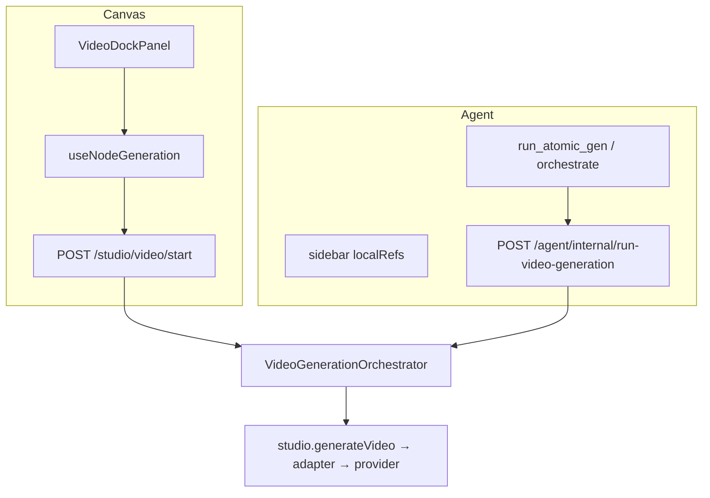

# 图生视频上游能力审计与产品化规格（I2V Capability Audit）

> 状态：**现状审计已定 · Plan 已写（待实施）**  
> 日期：2026-08-15  
> 代号：**I2V-AUDIT**  
> 范围：基于 Agnes Video V2.0 与 Seedance 2.0/2.5 公开 API，审计本项目图生视频链路在 **单图 / 多图 / 多模态 / 关键帧 / 连续分镜** 等能力上的实现完整度；定义后续产品化方向  
> 前置：  
> - `2026-08-08-seedance-agnes-video-adapter-design.md`（C3-video adapter）  
> - `2026-08-14-unified-image-to-video-pipeline-design.md`（U-I2V 编排统一，PR #246/#247）  
> 上游参考：  
> - [Agnes Video V2.0 官方文档](https://agnes-ai.com/en/docs/agnes-video-v20)  
> - [Seedance 2.0 API（HiAPI 汇总）](https://www.hiapi.ai/docs/models/video/seedance-2-0/)  
> - [Seedance 2.5 image-to-video（AtlasCloud）](https://www.atlascloud.ai/models/bytedance/seedance-2.5/image-to-video)

---

## 0. 决策摘要

| 项 | 结论 |
|---|---|
| 文档性质 | **现状审计 + 缺口清单 + 后续产品化方向**；非本轮直接实施 plan |
| 审计结论 | **引擎层（adapter/scenario/refWire）对 Seedance 多模态 + Agnes 单图/keyframes 已基本打通**；缺口集中在 **UI 能力边界、Provider 语义不等价、上游高级参数未产品化** |
| 单图 I2V | ✅ **完整**（三入口 + 生产验证 PASS） |
| 多图 / 关键帧 / 首尾帧 | ⚠️ **adapter 有、UX 弱、Agnes/Seedance 语义不等价** |
| 多模态（V*/A* ref） | ⚠️ **Seedance 完整；Agnes 不支持；UI 无引导** |
| 连续分镜 S8 | ⚠️ **半自动**（Seedance `return_last_frame` + 手动「延续上一镜」） |
| 参数暴露 | ⚠️ **核心参数有；crop/4K/adaptive/seed/negative 缺失或 dropped** |
| 明确不做（本轮产品化） | 新 provider 接入；Seedance 2.5 全量；Material/shot 旁路统一；Playwright E2E |
| 后续规格 | 见 §9；实施 plan 另起 `2026-08-15-i2v-capability-productization.md` |

---

## 1. 审计背景与范围

### 1.1 审计动机

U-I2V（PR #246/#247）已统一三入口生成编排（Orchestrator + start/wait + canonical refs）。在此基线上，需回答：

1. 上游 Agnes / Seedance **公开 API 支持哪些 I2V 模式与参数**？
2. 本项目 adapter 层 **实际映射了哪些**？
3. UI / API **暴露了哪些**，用户如何灵活调用？
4. **缺口在哪里**，优先级如何？

### 1.2 审计范围

| 在范围内 | 在范围外 |
|---|---|
| 画布 Dock 独立 video 节点 | VideoStudioPage 遗留页深度重构 |
| Agent atomic / campaign sidebar | Campaign 编排 DSL 扩展 |
| `POST /studio/video/start` + Orchestrator | Material/shot 旁路迁入 Orchestrator（C2 Epic） |
| `agnes-video-v2.0` + `seedance-2.0-*`（APIMart） | Seedance 2.5 新 API 全量对接 |
| scenario S1–S8 + refWire 路由 | 新 video provider |

### 1.3 审计方法

- **上游**：2026-08-15 联网查阅 Agnes 官方文档、Seedance 2.0/2.5 公开 API 说明
- **代码**：`packages/agent/src/studio/`、`packages/agent/src/tools/video-provider.ts`、`packages/shared/src/videoModelProfiles.ts`、`apps/web` Dock 组件
- **生产**：2026-08-14/15 回归脚本结果（path1/2 canvas 7/7；path3 agent 12/12）

---

## 2. 上游能力基线（现状调研）

> 本节为 **外部事实基线**，作为 §5–§7 对照标准。

### 2.1 Agnes Video V2.0（`agnes-video-v2.0`）

**端点：** `POST https://apihub.agnes-ai.com/v1/videos` → 轮询 `GET /agnesapi?video_id=`

| 能力 | API 形态 | 关键约束 |
|---|---|---|
| 文生视频 | `prompt` only | 异步；`num_frames` 须 **8n+1**，≤441 |
| **单图 I2V** | 顶层 `image: url` | 图片须公网 HTTPS |
| **多图 / 关键帧动画** | `extra_body.image: url[]` + `extra_body.mode: "keyframes"` | 官方称 smooth transition between keyframes |
| 首尾帧（严格） | ❌ 无 native first/last API | 多图 keyframes **近似**过渡，非 guaranteed last frame |
| 视频参考 | ❌ | — |
| 音频参考 | ❌ | — |
| 返回末帧 | ❌ | 无 `return_last_frame` |
| 原生音频 | ❌ | — |
| 时长 | `seconds = num_frames / frame_rate` | frame_rate 1–60；推荐 24 |
| 画幅 | width/height → **归一化**到 480p/720p/1080p | 支持 16:9/9:16/1:1/4:3/3:4 |
| seed / negative_prompt | ✅ 可选 | 可复现 / 排除内容 |
| num_inference_steps | ✅ 可选 | 未在本项目暴露 |

### 2.2 Seedance 2.0（经 APIMart `doubao-seedance-2.0-*`）

**端点：** `POST /v1/videos/generations` → task 轮询

| 能力 | API 形态 | 关键约束 |
|---|---|---|
| 文生视频 | `prompt` | duration 4–15s（本项目 clamp） |
| **单图 I2V** | `image_urls[0]` 或 `first_frame_url` | prompt 可配合 `@Image1` |
| **多图参考** | `reference_image_urls[]` / `image_urls[]` | 与首/末帧组合计数 ≤9（部分网关） |
| **首尾帧（严格）** | `first_frame_url` + `last_frame_url` 或 `image_with_roles[{first_frame,last_frame}]` | **保证末帧匹配** last image |
| **关键帧动画** | 多图 reference 模式 | 语义为 reference-driven，**≠ Agnes keyframes** |
| **视频参考** | `reference_video_urls[]` + `@VideoN` | S6 运镜/风格参考 |
| **音频参考** | `reference_audio_urls[]` + `@AudioN` | 须配合 I* 或 V* |
| **返回末帧** | `return_last_frame: true` | 响应含 `last_frame_url`，可链式接下一段 |
| **原生音频** | `generate_audio: true/false` | Seedance 专有 |
| 画幅 | `aspect_ratio` / `size` | 16:9/9:16/1:1/4:3/3:4/21:9/**adaptive** |
| 分辨率 | `resolution` | mini 最高 720p；**standard 支持 4K** |
| seed | ✅ | 未在本项目 UI 暴露 |
| 模式互斥 | 官方文档强调 | **首帧 / 首尾帧 / 多模态 reference 同一请求常互斥**；adapter 须路由而非堆叠 |

### 2.3 Seedance 2.5（演进参考，未接入）

| 能力 | 说明 | 本项目 |
|---|---|---|
| `mode` 枚举 | `auto` / `t2v` / `i2v_first` / `i2v_both` / `reference` | ❌ 未接入 |
| 多模态上限 | 最多 30 图 + 10 视频 + 10 音频 | ❌ |
| 单 pass 15s+ | 行业宣传能力 | ❌ |
| `return_last_frame` | ✅ | 2.0 已有；2.5 延续 |

> **审计备注：** 2.5 仅作路线图参考；本轮产品化以 **已接入的 agnes-v2.0 + seedance-2.0-*** 为准。

### 2.4 上游能力对照总表

| 维度 | Agnes V2.0 | Seedance 2.0 |
|---|---|---|
| 单图 I2V | ✅ native | ✅ native |
| 多图参考 | ✅ keyframes | ✅ image_urls |
| 严格首尾帧 | ❌（keyframes 近似） | ✅ image_with_roles |
| 关键帧 morph | ✅ keyframes | ⚠️ reference 语义不同 |
| 视频 ref | ❌ | ✅ |
| 音频 ref | ❌ | ✅ |
| return_last_frame | ❌ | ✅ |
| generate_audio | ❌ | ✅ |
| 4K | ❌（归一化 1080p） | ✅ standard variant |
| adaptive 画幅 | ❌（normalize） | ✅ |

---

## 3. 本项目链路架构现状

### 3.1 分层（U-I2V 已落地）

```text
L0  Entry：Canvas Dock / Agent sidebar / HTTP API / (legacy VideoStudio)
L1  RefBinding：localRefs / edges / sidebar attachments
L2  Canonical：resolveNodeRefs → resolveCanonicalVideoRequest
L3  Orchestrator：VideoGenerationOrchestrator.start / wait（660s）
L4  Adapter：buildVideoReferenceBundle → inferVideoScenario → buildVideoProviderOptions
L5  Provider：AgnesVideoProvider / ApimartVideoProvider
```

### 3.2 关键模块与文件

| 模块 | 路径 | 职责 |
|---|---|---|
| refs SSOT | `packages/shared/src/nodeRefs.ts` | edge + localRefs → `@I1/@V1/@A1`；edge 可读 upstream localRefs |
| canonical | `packages/shared/src/videoGeneration/resolveCanonicalVideoRequest.ts` | 节点 → `CanonicalVideoGenerationRequest` |
| bundle + scenario | `packages/agent/src/studio/video-refs.ts` | `buildVideoReferenceBundle`、`inferVideoScenario` |
| adapter | `packages/agent/src/studio/generation-adapter.ts` | refWire 路由、参数 clamp、prompt @ 注入 |
| profile | `packages/shared/src/videoModelProfiles.ts` | per-model ref 上限、duration、resolution tier |
| provider | `packages/agent/src/tools/video-provider.ts` | Agnes / Apimart HTTP 出站 |
| orchestrator | `apps/server/src/studio/video-generation.orchestrator.ts` | start/wait 生命周期 |
| UI Dock | `apps/web/src/components/canvas/dock-studio/panels/VideoDockPanel.vue` | videoMode、上传、首尾帧、延续上一镜 |
| UI 参数 | `apps/web/src/components/canvas/VideoSettingsSelector.vue` | duration/aspect/resolution/crop/audio |
| 生成入口 | `apps/web/src/composables/useNodeGeneration.ts` | 画布 → `studioApi.startVideoGeneration` |

### 3.3 编排统一状态（2026-08-15）

| 项 | 状态 | 证据 |
|---|---|---|
| 三入口 Orchestrator | ✅ PR #246 | Agent + Canvas `/studio/video/start` |
| referenceImageUrl 停写（video） | ✅ PR #247 | `verify-u-i2v-phase3` |
| Campaign localRefs | ✅ PR #247 | `apply_sidebar_refs.py` |
| 生产 path1/2 | ✅ 7/7 | `prod-canvas-i2v-video-verify.py` |
| 生产 path3 | ✅ 12/12 | `prod-agent-i2v-video-verify.py` |
| Material/shot 旁路 | ⚠️ 未统一 | `canvasApi.generateVideo` |
| VideoStudioPage | ⚠️ legacy | `POST /studio/video/generate` 一站式 |

---

## 4. 场景矩阵 S1–S8 现状

### 4.1 推断逻辑（代码 SSOT）

```typescript
// packages/agent/src/studio/video-refs.ts — inferVideoScenario()
S7: audios only
S6: videos present
S7: audios + (images|videos)
S5: videoMode=first_last_frame && images.length===2
S4: images.length >= 2
S2: images.length===1 || videoMode=image_to_video
S1: default t2v
```

**审计发现：**

| 场景 | 设计文档含义 | 代码是否推断 | 审计结论 |
|---|---|---|---|
| S1 文生视频 | t2v | ✅ | **完整** |
| S2 单图 I2V | 单图 animate | ✅ | **完整**；三路径生产已验 |
| S3 多图一致性参考 | 多图 reference 非 keyframe | ❌ ≥2 图归 **S4** | **缺口**：metadata 无法区分 S3/S4 |
| S4 多图 / 关键帧 | ≥2 图 | ✅ | **adapter 完整**；UX 未解释差异 |
| S5 首尾帧 | 严格 first+last | ✅（2 图 + first_last_frame） | **Seedance 完整**；Agnes **降级 keyframes** |
| S6 视频参考 | video_urls | ✅ | **Seedance only** |
| S7 音频参考 | audio_urls | ✅ | **Seedance only**；纯音频无 I/V → 400 |
| S8 连续分镜 | return_last_frame 链 | ❌ **不自动推断** | **半实现**：见 §6.5 |

### 4.2 refWire 路由现状

| refWire | Provider | 触发条件 |
|---|---|---|
| `agnes_single_image` | Agnes | 1 图 |
| `agnes_keyframes` | Agnes | ≥2 图 |
| `apimart_multimodal` | Seedance | 默认多模态 |
| `apimart_first_last` | Seedance | first_last_frame + 2 图 |
| `legacy_prompt_tags` | 旧模型 | `[ref-image:url]` 拼 prompt |
| `none` | — | 无 ref |

### 4.3 Provider 语义不等价（关键产品风险）

| 用户 UI 操作 | Agnes 实际行为 | Seedance 实际行为 |
|---|---|---|
| 选「首尾帧」+ 2 图 | `extra_body.mode: keyframes`（**过渡动画**） | `image_with_roles` first/last（**严格首尾**） |
| 选「图生视频」+ 2 图 | keyframes | 多图 `image_urls` reference |
| 选「图生视频」+ 1 图 | `image` | `image_urls[0]` + 可选 return_last_frame |

> **现状结论：** 同一 Dock 控件在不同模型下 **语义不同**，UI **未展示能力徽章或警告**。

---

## 5. 参数映射现状（逐项审计）

### 5.1 用户参数 → Canonical → 上游

| 参数 | UI 暴露 | Canonical | Agnes 出站 | Seedance 出站 | 审计 |
|---|---|---|---|---|---|
| `prompt` | ✅ Dock | ✅ | ✅ | ✅ + `@ImageN` 注入 | **完整** |
| `videoModel` | ✅ | ✅ | ✅ model | ✅ model | **完整** |
| `videoMode` | ✅ 三态 | ✅ | 影响 refWire | 影响 refWire | **完整**；语义不等价见 §4.3 |
| `duration` | ✅ 4/5/10/15 | ✅ clamp 4–15 | → num_frames/fps | → duration | ⚠️ Agnes min 5s，选 4s 被抬升 |
| `aspectRatio` | ✅ 16:9/9:16/1:1 | ✅ | → width/height | → size | ⚠️ profile 支持 4:3/3:4/21:9/adaptive，**UI 不可选** |
| `resolution` | ✅ 480/720/1080 | ✅ | → 像素 tier | → resolution | ⚠️ Seedance standard **4K UI 不可选** |
| `crop` | ✅ 三档 | ✅ | ❌ dropped | ❌ catalog metadataOnly | **假控件**：不传 upstream |
| `generateAudio` | ✅ | ✅ | ❌ dropped | ✅ native | ⚠️ Agnes 下开关**无效** |
| `refs[]` I/V/A | ✅ edge/localRefs | ✅ | I only native | I/V/A native | ⚠️ V/A 仅 Seedance |
| `referenceImageUrl` | 只读 legacy | 兜底 | image fallback | image_urls[0] fallback | PR #247 停写 |
| `seed` | ❌ | ❌ | provider 支持 | provider 支持 | **未产品化** |
| `negative_prompt` | ❌ | ❌ | provider 支持 | — | **未产品化** |
| `return_last_frame` | 隐式 S2/S8 | adapter 设 | ❌ | ✅ S2/S3/S8 分支 | 用户不可显式控 |

### 5.2 Profile 上限（clamp 现状）

| 模型 | maxImageRefs | maxVideoRefs | maxAudioRefs | minDuration | maxResolution |
|---|---:|---:|---:|---:|---|
| Seedance 2.0 mini | 9 | 3 | 3 | 4s | 720p |
| Seedance 2.0 standard | 9 | 3 | 3 | 4s | **4K** |
| Agnes video | 8 | 0 | 0 | 5s | 1080p |

### 5.3 UI 常量（`packages/shared/src/index.ts`）

- `VIDEO_ASPECT_RATIO_OPTIONS`：**仅 3 种**（16:9/9:16/1:1）
- `VIDEO_RESOLUTION_OPTIONS`：**仅 3 档**（480p/720p/1080p）
- `VIDEO_DURATION_OPTIONS`：4/5/10/15
- `DEFAULT_VIDEO_SETTINGS.generateAudio: true` — 对 Agnes 无效

---

## 6. 能力维度完整度评估（现状）

### 6.1 单图 I2V — **完整度 95%**

| 检查项 | 状态 |
|---|---|
| 画布 upload → localRefs | ✅ |
| 画布 edge → 上游 image | ✅ |
| Agent sidebar → localRefs | ✅ |
| Orchestrator start + recordId + startedAt | ✅ |
| Agnes `image` / Seedance `image_urls` wire | ✅ |
| 生产验证 | ✅ path1/2/3 |

**残留缺口：** legacy `referenceImageUrl` 读路径仍在；VideoStudio 未接入。

### 6.2 多图 I2V — **完整度 70%**

| 检查项 | 状态 |
|---|---|
| 多 localRefs / 多 edge → refs[] | ✅ |
| inferVideoScenario → S4/S5 | ✅ |
| Agnes keyframes wire | ✅ |
| Seedance multi image_urls | ✅ |
| Dock「首尾帧」按钮（≥2 图） | ✅ |
| UI 区分「多图参考 vs 关键帧 vs 首尾帧」 | ❌ |
| S3 独立场景 | ❌ |
| 模型能力提示 | ❌ |
| ref 上限 UI 提示 | ❌ |

### 6.3 多模态（图+视频+音频 ref）— **完整度 60%**

| 检查项 | 状态 |
|---|---|
| @V1 上游 video 节点 → S6 | ✅ |
| @A1 上游 audio 节点 → S7 | ✅ |
| Seedance video_urls / audio_urls | ✅ |
| prompt @VideoN / @AudioN 注入 | ✅ |
| Agnes 丢弃 V/A（droppedFields） | ✅ adapter 行为 |
| Dock 专门引导连 video/audio 节点 | ❌ |
| 选 Agnes 时 V/A ref 警告 | ❌ |
| 纯音频 S7 无 I/V 的错误 UX | ⚠️ 400，提示不足 |

### 6.4 关键帧动画 — **完整度 65%**

| 检查项 | 状态 |
|---|---|
| Agnes `extra_body.mode: keyframes` | ✅ ≥2 图自动 |
| Seedance 严格首尾帧 S5 | ✅ first_last_frame + 2 图 |
| Seedance 多图 reference 作 S4 | ✅ |
| 两 provider **语义等价** | ❌ **不等价** |
| UI 按模型切换文案/模式 | ❌ |

**推荐用法（现状，非规格）：**

| 目标 | 应选模型 | 用户操作 |
|---|---|---|
| 关键帧 morph | **Agnes** | ≥2 图，**勿**选 first_last_frame |
| 严格首尾过渡 | **Seedance** | 2 图 + videoMode=first_last_frame |
| 多图风格参考 | **Seedance** | ≥2 图 + image_to_video |

### 6.5 连续分镜 S8 — **完整度 40%**

| 检查项 | 状态 |
|---|---|
| Seedance S2/S3/S8 → return_last_frame | ✅ adapter |
| Provider 返回 lastFrameUrl | ✅ ApimartVideoProvider |
| 写回节点 lastFrameUrl 字段 | ⚠️ 不完整 / 非自动 |
| UI「延续上一镜」| ✅ 读 upstream.lastFrameUrl → localRefs |
| 一键「接下一段」工作流 | ❌ |
| Agnes 链接 | ❌ 不支持 |

### 6.6 通用参数暴露 — **完整度 55%**

见 §5.1 审计表。核心时长/比例/分辨率可用；crop/4K/adaptive/seed/negative 缺失或 dropped。

---

## 7. 用户调用路径现状

### 7.1 主路径（已统一 Orchestrator）



### 7.2 入口对照表

| 入口 | API | refs 来源 | 阻塞模式 | 审计 |
|---|---|---|---|---|
| Canvas 独立 video | `/studio/video/start` | resolveNodeRefs | 异步 poll | ✅ 推荐 |
| Agent atomic | internal start/wait | canonical | SSE + 660s wait | ✅ 推荐 |
| Canvas video↔shot | material generateVideo | refs + legacy url | material poll | ⚠️ 旁路 |
| VideoStudioPage | `/studio/video/generate` | 通常无 | 同步 legacy | ⚠️ 未统一 |
| Scene Composer batch | batch API | toGenerationRefs | 继承 shot | ⚠️ 旁路 |

### 7.3 用户灵活调用指南（现状能力）

| 用户目标 | 操作步骤 | 模型 |
|---|---|---|
| 单图 15s 产品视频 | 上传 1 图 → prompt → 时长 15 → 生成 | 任意 |
| 上游图引用的 I2V | 连线 image → video → prompt → 生成 | 任意 |
| Agent 一键 I2V | 侧栏 @I1 上传 → atomic 建节点 → 确认 | 任意 |
| 两图严格首尾 | 2 个 image ref → 切「首尾帧」 | **Seedance** |
| 两图 morph 过渡 | 2 个 image ref → 保持「图生视频」 | **Agnes** |
| 运镜参考 | 连 upstream **video** 节点 | **Seedance** |
| 节奏/配乐参考 | 连 upstream **audio** 节点 | **Seedance** |
| 连续镜头 | 上一镜 Seedance 生成 → 点「延续上一镜」 | **Seedance** |

### 7.4 无法灵活调用的能力（现状）

- seed / negative_prompt 复现与排除
- Seedance standard **4K** / **adaptive** 画幅
- crop 实际生效
- Agnes 下 generateAudio
- 自动 S8 分镜链（无手动「延续上一镜」）
- API 文档化的高级 refs 组合（无 OpenAPI 示例）

---

## 8. 缺口清单（Gap Register）

| ID | 类别 | 描述 | 严重度 | 依赖 |
|---|---|---|---|---|
| G-01 | UX | 同 UI「首尾帧」在 Agnes/Seedance 语义不等价，无提示 | P0 | — |
| G-02 | UX | generateAudio 对 Agnes 无效但 UI 仍显示 | P1 | G-01 能力矩阵 |
| G-03 | UX | crop 有控件但不传 upstream | P1 | catalog native 标记 |
| G-04 | 参数 | aspectRatio 缺 4:3/3:4/21:9/adaptive | P1 | profile 已有 |
| G-05 | 参数 | Seedance standard 4K UI 不可选 | P1 | variant 识别 |
| G-06 | 参数 | seed / negative_prompt 未暴露 | P2 | 高级面板 |
| G-07 | 场景 | S3 未独立推断，与 S4 合并 | P2 | metadata 用途 |
| G-08 | 场景 | S8 不自动推断；末帧写回不完整 | P2 | Seedance only |
| G-09 | 引导 | V*/A* 多模态 ref 无 Dock 引导 | P1 | — |
| G-10 | 旁路 | Material/shot 未走 Orchestrator | P2 | C2 Epic |
| G-11 | 旁路 | VideoStudioPage legacy API | P2 | — |
| G-12 | 文档 | API 缺 refs+videoMode 组合说明 | P2 | — |
| G-13 | 时长 | UI 4s 对 Agnes 实际 min 5s，无提示 | P2 | profile minDuration |

---

## 9. 后续产品化方向（目标态，非本轮实施）

> 由 §8 缺口导出；详细 task 另写 implementation plan。

### 9.1 P0 — 能力可见性

- Dock / ModelSelector 展示 **I2V 能力徽章**（首尾帧 / keyframes / V*A* / audio / 4K / 连续镜）
- 选 Agnes 时隐藏或禁用 generateAudio、首尾帧（或改文案为「关键帧过渡」）
- 选 Seedance 时 first_last_frame 标注「严格首尾帧」

### 9.2 P1 — 参数与引导

- 扩展 aspectRatio / resolution 选项至 profile 允许集
- RefStrip 标注 @I1/@I2 角色；与 videoMode 联动校验
- V*/A* 连接时显示 chips 提示

### 9.3 P2 — 工作流与 API

- Seedance 完成后写 `lastFrameUrl`；「接下一段」一键操作
- 高级选项：seed、negative_prompt
- `/studio/video/start` OpenAPI 示例：refs × videoMode 矩阵
- Material / VideoStudio 迁入 Orchestrator（独立 Epic）

### 9.4 方案对比（Brainstorming 结论）

| 方案 | 描述 | 优点 | 缺点 | 结论 |
|---|---|---|---|---|
| **A（推荐）** | 能力徽章 + 按模型禁用/改文案 | 改动小；立刻降低误用 | 不增加新能力 | ✅ P0 |
| B | 统一语义层强制转 keyframes | 模型无关 | 丢 Seedance 严格首尾帧 | ❌ |
| C | 每模型独立 Dock 面板 | 最清晰 | 维护成本高 | 延后 |

---

## 10. 现状分析覆盖审核清单（Coverage Audit）

> 本节逐项对照 **2026-08-14/15 对话分析**，确认均已写入规格。

| # | 分析项 | 规格章节 | 覆盖 |
|---:|---|---|:---:|
| 1 | Agnes 上游 API 能力表 | §2.1 | ✅ |
| 2 | Seedance 2.0 上游 API 能力表 | §2.2 | ✅ |
| 3 | Seedance 2.5 演进参考 | §2.3 | ✅ |
| 4 | 上游能力对照总表 | §2.4 | ✅ |
| 5 | Seedance 模式互斥说明 | §2.2、§4.3 | ✅ |
| 6 | 项目 L0–L5 分层架构 | §3.1 | ✅ |
| 7 | 关键文件路径职责表 | §3.2 | ✅ |
| 8 | U-I2V PR #246/#247 编排状态 | §3.3 | ✅ |
| 9 | inferVideoScenario S1–S8 逻辑 | §4.1 | ✅ |
| 10 | S3 未单独推断 | §4.1、G-07 | ✅ |
| 11 | S8 半自动 / 不推断 | §4.1、§6.5、G-08 | ✅ |
| 12 | refWire 路由表 | §4.2 | ✅ |
| 13 | Agnes vs Seedance 语义不等价 | §4.3 | ✅ |
| 14 | buildVideoReferenceBundle 职责 | §3.2 | ✅ |
| 15 | buildVideoProviderOptions 映射 | §5.1、§4.2 | ✅ |
| 16 | Agnes provider 单图/keyframes 代码路径 | §2.1、§4.2 | ✅ |
| 17 | Apimart provider 多模态/首尾帧/return_last_frame | §2.2、§5.1 | ✅ |
| 18 | first_last_frame Agnes 降级 keyframes | §4.3、§6.4 | ✅ |
| 19 | return_last_frame / S8 链 | §6.5 | ✅ |
| 20 | 单图 I2V 完整度 95% | §6.1 | ✅ |
| 21 | 多图 I2V 完整度 70% | §6.2 | ✅ |
| 22 | 多模态 V*/A* 完整度 60% | §6.3 | ✅ |
| 23 | 关键帧动画完整度 65% | §6.4 | ✅ |
| 24 | 连续分镜完整度 40% | §6.5 | ✅ |
| 25 | 参数暴露完整度 55% | §6.6、§5.1 | ✅ |
| 26 | crop UI 但不传 upstream | §5.1、G-03 | ✅ |
| 27 | seed/negative 未暴露 | §5.1、G-06 | ✅ |
| 28 | generateAudio Seedance only | §5.1、G-02 | ✅ |
| 29 | aspectRatio UI 仅 3 种 vs profile 更多 | §5.1、§5.3、G-04 | ✅ |
| 30 | 4K standard UI 不可选 | §5.1、§5.2、G-05 | ✅ |
| 31 | 用户调用路径 mermaid | §7.1 | ✅ |
| 32 | 入口对照表（Canvas/Agent/Material/Legacy） | §7.2 | ✅ |
| 33 | 按目标推荐用法表 | §7.3 | ✅ |
| 34 | 无法灵活调用的能力列表 | §7.4 | ✅ |
| 35 | 生产验证 path1/2 7/7 | §3.3、§6.1 | ✅ |
| 36 | 生产验证 path3 12/12 | §3.3、§6.1 | ✅ |
| 37 | Material/shot 旁路 | §3.3、§7.2、G-10 | ✅ |
| 38 | VideoStudioPage legacy | §3.3、§7.2、G-11 | ✅ |
| 39 | referenceImageUrl legacy 读路径 | §5.1、§6.1 | ✅ |
| 40 | Profile maxImage/Video/Audio refs 上限 | §5.2 | ✅ |
| 41 | Agnes duration min 5s vs UI 4s | §5.1、G-13 | ✅ |
| 42 | P0/P1/P2 产品化优先级建议 | §9.1–§9.3 | ✅ |
| 43 | 方案 A/B/C 对比 | §9.4 | ✅ |
| 44 | Gap Register 可追踪 ID | §8 | ✅ |

**覆盖结论：** 对话分析 **44/44 项均已写入本规格**，无遗漏。

---

## 11. 与现有规格关系

| 文档 | 关系 |
|---|---|
| `2026-08-08-seedance-agnes-video-adapter-design.md` | C3 adapter 实施规格；本审计在其上评估 **产品化完整度** |
| `2026-08-14-unified-image-to-video-pipeline-design.md` | U-I2V 编排；本审计假设 Orchestrator **已上线** |
| 待写 `2026-08-15-i2v-capability-productization.md` | 由 §9 缺口导出的 **implementation plan** |

---

## 12. 开放问题

1. **S3 是否 worth 独立 scenario？** 若 metadata 无消费者，可继续合并 S4。
2. **Agnes 首尾帧 UI：** 改文案「关键帧过渡」还是隐藏 mode？
3. **4K / adaptive：** 仅 Seedance standard BYOK 开放，还是平台默认也开放？
4. **S8 自动链：** 是否产品化为「分镜序列」独立 Epic，而非 Dock 小按钮？

---

**Spec 路径：** `docs/superpowers/specs/2026-08-15-i2v-upstream-capability-audit-design.md`  
**Implementation Plan：** `docs/superpowers/plans/2026-08-15-i2v-capability-productization.md`
