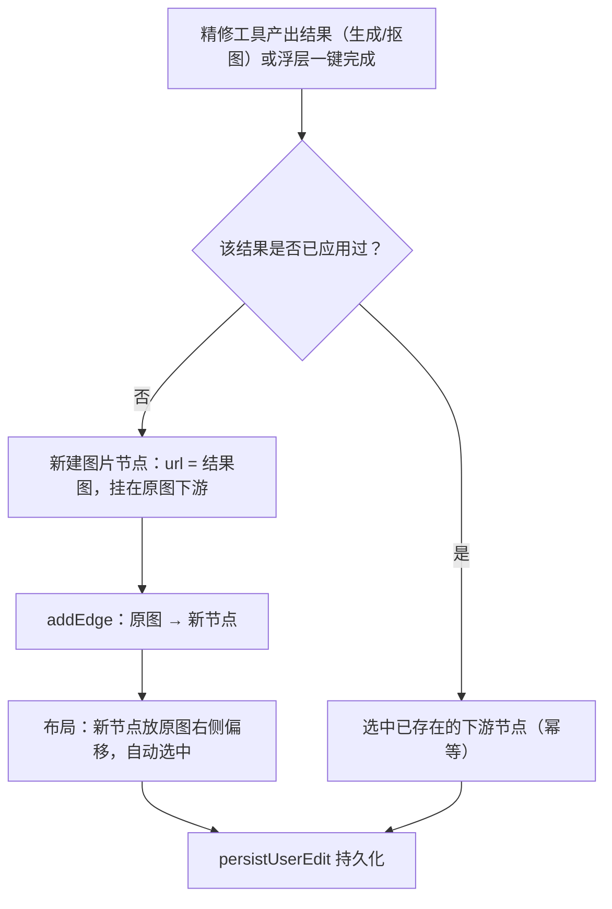
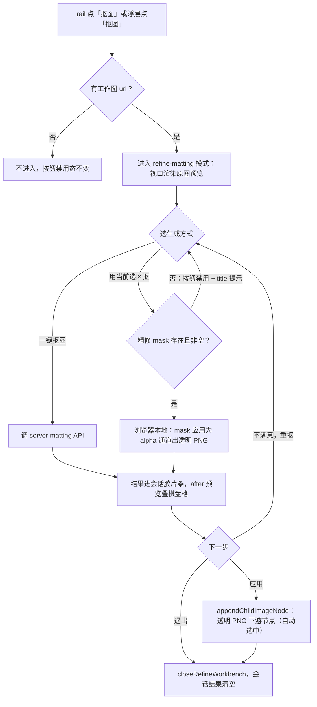
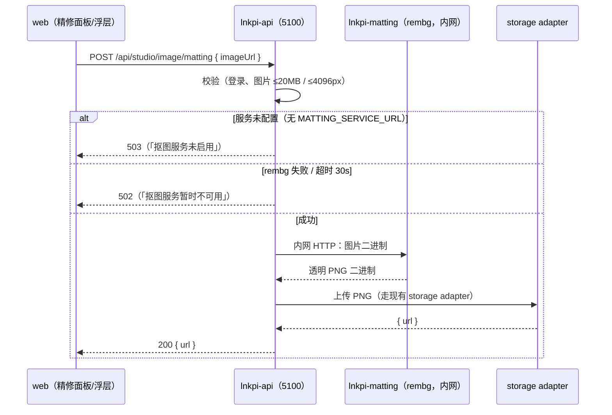

# 精修抠图特性 + 精修应用语义统一 Design

**Date:** 2026-09-22
**Status:** Draft
**代号:** **REFINE-MATTING-UNIFIED-APPLY**
**Related:**
- `2026-09-22-refine-m2-capability-pack-design.md` — 浮层快捷工具组占位（本文点亮 matting）
- `2026-09-22-workbench-shell-and-outpaint-pilot-design.md` — WorkbenchShell / 工具注册表 / 扩图打样
- `2026-08-31-cx-image-edit-sam-point-select-design.md` — 点选（SAM3 + MediaPipe）
- `2026-08-19-cx-image-edit-toolchain-design.md` — 选区工具链

---

## 0. 配图索引

| 图号 | 类型 | 主题 | 说明了什么 / 怎么用 |
|---|---|---|---|
| 图 1 | 结构图 | 统一应用语义 | 应用 = 连接下游节点的完整决策流，含幂等分支；实现 `handleRefineApply` 与浮层一键时按此图核对 |
| 图 2 | 结构图 | 抠图模式状态机 | 精修抠图模式的进入/生成/应用/退出流转与守卫；实现 MattingPanel 时对照 |
| 图 3 | 结构图 | 抠图服务调用时序 | web → server → rembg → storage 的请求链与错误契约；实现 server 端点时对照 |

---

## 1. Goal

两个目标，一次交付：

1. **抠图（matting）新特性**：精修工作台新增「抠图」工具（点亮 rail 占位与浮层占位），CVM 自托管本地推理，免费、无积分，产出透明 PNG。
2. **精修应用语义统一**：所有精修工具（涂抹生成、点选生成、扩图、抠图）与浮层一键操作的「应用」语义统一为**连接下游新节点**，原图永远不被覆盖；随之**版本条全线退役**（精修链路内）。

### 1.1 统一语义（用户拍板，locked）

> **精修是过程，不是终点。画布上本身就有原图。**
> 所有工具的「应用」= 连接下游节点生成新图片；不进精修的一键生成同样连接下游节点。精修过程内提供前后对照，不满意撤回重做。

推导结论（本文档其余部分均由此展开）：

- 原图节点在任何操作下都**不被修改**（url、position、data 不动），因此**不存在"改坏了要回退"的场景**；
- 版本条的存在依据（保护原图 + 多版本回退）消失 → **精修链路版本管理整体退役**；
- 画布上原图 → 下游结果节点的连线本身就是天然的"历史"。

### 1.2 版本管理取舍规则（写入规范，供后续工具沿用）

| 应用语义 | 版本管理 | 理由 |
|---|---|---|
| 覆盖原图（**已废除**，不再有工具使用） | 需要 | 原图被改，版本条是唯一回退手段 |
| 连接下游新节点（**唯一语义**） | 不需要 | 原图不动；新节点自身就是持久化结果；确定性变换重跑无信息量 |

---

## 2. 统一应用语义

### 2.1 应用流程（见 图 1）

*图 1 · 统一应用语义 —— 说明了「应用」的唯一路径与幂等分支。无论入口是精修面板的「应用」还是浮层一键，落点都是同一个函数（§2.2），保证行为一致。*

### 2.2 实现要点

- **新建 `appendChildImageNode` 助手**（CanvasPage 内或抽到独立模块），签名：
  `appendChildImageNode(source: Node, result: { url, prompt, recordId?, nodeSize?, appliedKey? }): Node`
  - 内部走 `addNode` + `addEdge`（与 `runGridSlice` 相同的注入模式，`CanvasPage.vue:2930-2940`）；
  - 节点 data：`url`、`prompt`、`imageModel`、`generationRecordId`（有则挂）、`status: 'completed'`；走 `seedImageVersions` 产单版本种子（保持节点数据结构不变，下游节点自身单版本）；
  - 位置：源节点右侧偏移（间距沿用切分子节点的既有间距常量）；扩图结果按 `outpaintTo` 等比定 `nodeSize`；
  - 返回新节点，调用方 `selectNodeIds([newId])`。
- **幂等**：`result.appliedKey`（生成类 = recordId；抠图 = 结果 url 的 hash）——再次应用同一结果时不新建节点，改为定位并选中已有下游节点。防止连点铺一排重复节点。
- **`handleRefineApply` 重写**（`CanvasPage.vue:2990`）：删除 `appendEditVersion` / `patchNodeData(原节点)` / `applyOutpaintCenterAnchor(原节点)` 路径，改为调 `appendChildImageNode`。`shouldApplyRefineToNode` 守卫删除（原图不再被改，守卫失去意义）。
- **`handleRefineRevert` 删除**（`CanvasPage.vue:3053`），对应 emit 链（VersionStrip `revert` → RefineSidePanel `onRevert`）一并移除。
- **扩图居中锚定迁移**：`applyOutpaintCenterAnchor` 的 contain-fit 尺寸逻辑迁移进 `appendChildImageNode` 的 `nodeSize` 计算（新节点按 `outpaintTo` 等比定尺寸），原图 position 不再变动。

### 2.3 版本条退役范围

| 项 | 处置 |
|---|---|
| `VersionStrip.vue` 组件 | 从 `RefineSidePanel` 移除引用；组件文件保留（画布其他处若有引用不动，实测仅精修引用） |
| `RefineSidePanel` props `versions` / `currentVersionId`、emit `revert` | 删除 |
| `RefineWorkbench` 对应透传 | 删除 |
| `CanvasPage` `refineVersions` / `refineCurrentVersionId` 计算与 `@revert` 绑定 | 删除 |
| shared `appendEditVersion` / `revertImageVersion` / `ImageVersionEntry` 类型 | **保留**（数据结构不破坏，历史节点已有版本数据不迁移、无损；仅精修链路不再调用） |
| 存量节点上的多版本数据 | 不迁移不清理，节点显示当前 url 即可 |

### 2.4 会话内结果历史（生成类工具的"挑图"替代）

版本条退役后，生成类工具（涂抹/点选/扩图）每次结果不同且扣积分，需要保留**会话级**挑选能力：

- store 新增 `refineSessionResults: RefineSessionResult[]`（`{ id, url, recordId?, prompt, createdAt }`）；
- 每次生成成功后 push（含当前结果标记）；右栏在对照 band 下方渲染**横向胶片条**（缩略图，点击切换当前 `afterUrl`；最多保留 8 张，超出挤掉最旧）；
- 「应用」作用于当前选中的会话结果；
- 退出精修即清空（应用过的结果已落在画布上，未应用的丢弃——重新生成即可）；
- 抠图模式同样使用该胶片条（虽然确定性高，但重抠几次对比边缘仍有价值，且结构统一零额外成本）。

### 2.5 对照能力（保留，语义收窄）

- 精修过程内的**前后对照**保留：before = 进入精修时的原图，after = 当前选中会话结果（现有 `RefineCompareBand` / `compareViewModel` 不动）；
- `RefineWorkViewport` 的 `hasAfter` 判定从「节点 versions 长度」改为「会话结果非空」；
- 语义上对照只回答一个问题：「这次改动效果如何，满不满意」；不满意 → 重做（会话内再生成）；满意 → 应用成下游节点。

---

## 3. 抠图特性

### 3.1 技术路径（locked）

| Topic | Choice |
|---|---|
| 引擎 | **CVM 自托管 rembg**（Docker，ONNX CPU 推理，模型 `isnet-general-use`） |
| 成本 | 免费，**不扣积分**，不建 GenerationRecord |
| 一期交互 | 一键自动 + **用当前选区抠**（复用精修现有 mask，浏览器本地合成） |
| 点选细化独立画布 | 不做（选区抠已覆盖"指定主体"场景） |
| 模型选择 UI | 一期只有「通用」一项，不暴露模型选择器 |
| 结果 | 透明 PNG，进会话胶片条，「应用」= 下游节点 |

### 3.2 抠图模式状态机（见 图 2）

*图 2 · 抠图模式状态机 —— 说明了抠图模式的全部流转：两种生成方式（服务端 / 本地选区）汇入同一个结果出口，「应用」走 §2 统一语义，退出即结束（无版本、无历史负担）。*

### 3.3 服务端：CVM 自托管 rembg + 代理端点（见 图 3）

*图 3 · 抠图服务调用时序 —— 说明了抠图请求的完整链路与错误契约（与点选 503/502 同款）。要点：*

- **新服务 `lnkpi-matting`**（`deploy/docker-compose.prod.yml`）：
  - 镜像：`python:3.11-slim` 基底 + `rembg[cpu]` + FastAPI/uvicorn 单文件服务（`deploy/docker/matting/Dockerfile` + `main.py`）；
  - 端点 `POST /matting`：multipart 收图，返回 PNG；`GET /health`；
  - 模型文件随镜像打包或首次启动下载到 named volume `matting-models`（约 170MB）；
  - `mem_limit: 1g`，仅内网（不映射公网端口），`expose: 8000`；
  - API 容器通过服务名 `http://lnkpi-matting:8000` 访问（env `MATTING_SERVICE_URL`）。
- **server 端点** `POST /studio/image/matting`（`studio.controller.ts` + `studio.service.ts`，仿 `segmentImage`）：
  - 登录态必须；拉图复用现有 media-probe 尺寸/大小校验（超限 400）；
  - `MATTING_SERVICE_URL` 未配置 → `503`；rembg 非 200 / 超时（30s）/ 返回非 PNG → `502`；
  - 成功：上传 storage adapter 得 URL，返回 `{ data: { url } }`；
  - **免费**：不查积分、不扣积分、不建 GenerationRecord。
- **本地开发**：`docker run` 单容器起 rembg（或 `MATTING_SERVICE_URL` 留空 → 端点 503，前端提示「抠图服务未启用」，一键抠图禁用；**选区抠不依赖服务**，本地开发无需容器即可验收）。

### 3.4 前端：rail 独立模式（`refine-matting`）

- **注册表**（`workbenchToolRegistry.ts`）新增：
  `refine-matting = { panel: MattingPanel, dock: MattingDock, dockPlacement: 'panel' }`；
  抠图无画布手柄交互，dock 用面板内落位（与 `refine-select` 同款）。
- **MattingPanel**（新组件）：
  - 预览区：当前结果（无结果时显示原图），透明区域叠**棋盘格**底（CSS `conic-gradient` 实现，约 8px 格）；
  - 「一键抠图」按钮（busy 态转圈；`MATTING_UNAVAILABLE` 503 时禁用 + title「抠图服务未启用」）；
  - 「用当前选区抠」按钮（mask 为空时禁用 + title「先在涂抹/点选中创建选区」）；
  - 「应用到画布」按钮（`canApply` = 会话结果非空）；
  - 会话胶片条（§2.4，与其他工具共用组件）。
- **选区抠的本地合成**（新纯函数模块 `mattingComposite.ts`）：
  输入原图 ImageData + 现有 mask RGBA（`maskRemote.ts` 的 `loadMaskRgbaFromUrl` / 本地 mask canvas）→ 输出 alpha 合成后的 PNG blob；羽化 1px 边缘可后议，一期硬边即可；
  复用 `maskExport.exportMaskPng` 的导出路径与 `persistMediaUrl` 上传。
- **rail 能力区**（`refineToolRailModel.ts`）：`matting` 从 `REFINE_CAPABILITY_ITEMS` 禁用占位移除。

### 3.5 前端：浮层一键

- `selectionToolModel.ts`：`matting` 工具 `disabled: false`，删除 `disabledReason`（裁剪/旋转占位不动）；
- `SelectionActionBar.vue`：`tool.id === 'matting'` → `emit('matting')`；
- `CanvasPage` 接 `@matting`：调 `studioApi.mattingImage({ url })` → 成功后 `appendChildImageNode`（同 图 1，appliedKey = url hash）→ toast「抠图完成，已生成下游节点」；503/502 → 对应错误 toast；
- busy 期间按钮转圈、防重复点击；**不进精修**，行为与精修内「应用」完全一致（图 1 单一出口）。

---

## 4. 存量工具语义迁移清单

| 工具 | 现状 | 迁移后 |
|---|---|---|
| 涂抹生成（select 模式） | 应用 = 覆盖原图 + appendEditVersion | 应用 = 下游节点（图 1） |
| 点选生成 | 同上 | 同上 |
| 扩图（outpaint） | 同上 + applyOutpaintCenterAnchor 改原图 position | 下游节点按 `outpaintTo` 等比定 nodeSize；原图 position 不动 |
| 宫格切分 | 已是下游子节点 | 不动（`runGridSlice` 是 §2.2 的参照实现） |
| 浮层一键（本规格新增抠图） | — | 下游节点（图 1） |

迁移红线：

- 精修面板内 `editor.getRefineMask()`、prompt、edit intent、积分扣减、GenerationRecord 链路**全部不动**——只改「结果落地」一段；
- 扩图会话内 rect/base 状态机不动；
- `imageVersionStateFromData` / `seedImageVersions` 保留（新下游节点种子用）。

---

## 5. 错误处理

| 场景 | 行为 |
|---|---|
| matting 服务未启用（503） | 一键抠图按钮禁用 + title 提示；已发起的请求 toast「抠图服务未启用」 |
| rembg 失败/超时（502） | toast「抠图服务暂时不可用，请稍后重试」 |
| 图片超限（400） | toast「图片过大（限 20MB / 4096px）」 |
| 选区抠 mask 为空 | 按钮禁用态，不发起任何操作 |
| 应用时源节点已被删除 | `appendChildImageNode` 前置判空，toast「原图节点已不存在」 |
| 生成类工具失败 | 现状不变（现有错误 toast），会话胶片条不追加 |

---

## 6. 测试策略

- **纯函数层**：`mattingComposite.ts`（alpha 合成正确性、空 mask、全 mask）、幂等 appliedKey 计算；
- **server 契约**：matting 端点 503（未配置）/ 502（上游失败、超时）/ 200（mock rembg + mock storage）+ 参数校验 400；
- **组件层**：MattingPanel（按钮禁用态、busy、503 禁用）、RefineSidePanel（胶片条渲染/切换/挤旧、无 VersionStrip、matting 面板渲染）、SelectionActionBar（matting 可点、emit、busy）；
- **回归（红→绿）**：`handleRefineApply` 语义变更——旧测试（覆盖原图断言）删除或改写为下游节点断言；`applyOutpaintCenterAnchor` 迁移断言跟移；
- **浏览器验收**：本地起 rembg 容器 → 抠图全链路（一键 + 选区）→ 应用后画布连线正确、原图无改动；扩图/涂抹应用走下游节点；重复应用幂等。

---

## 7. 非目标（Non-goals）

- 抠图模型选择 UI（通用模型单一项）、人像/商品专用模型切换；
- 抠图边缘羽化/描边参数化（一期硬边）；
- 批量抠图（多选节点一键全抠）；
- GPU 推理、服务端自动扩缩容；
- 点选细化独立画布（SAM 点选独立入口）；
- 存量节点历史版本数据清理；
- 画布级 undo/redo 全局体系。

---

## 8. 验收清单

- [ ] rail「抠图」可进入独立模式；浮层「抠图」一键可用；rail 能力区占位移除
- [ ] 一键抠图出透明 PNG（棋盘格预览正确）；选区抠不依赖 rembg 服务可用
- [ ] 「应用」/ 浮层一键 → 原图下游新节点 + 连边 + 自动选中；重复应用幂等（选中已有节点）
- [ ] 扩图/涂抹/点选应用语义 = 下游节点；原图 url/position/data 在任何精修操作后不变
- [ ] 精修内无版本条；会话胶片条可用（切换/挤旧/退出清空）；前后对照正常
- [ ] matting 端点 503/502/200 契约正确；不扣积分
- [ ] compose 中 lnkpi-matting 健康、内存 ≤1GB、模型卷持久化；CVM 部署后生产可用
- [ ] web 全量测试绿；`pnpm verify-spec-figures` 通过
