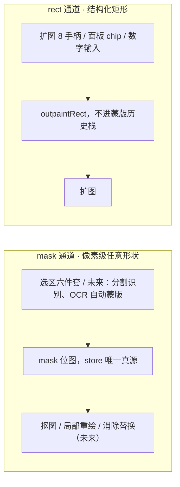
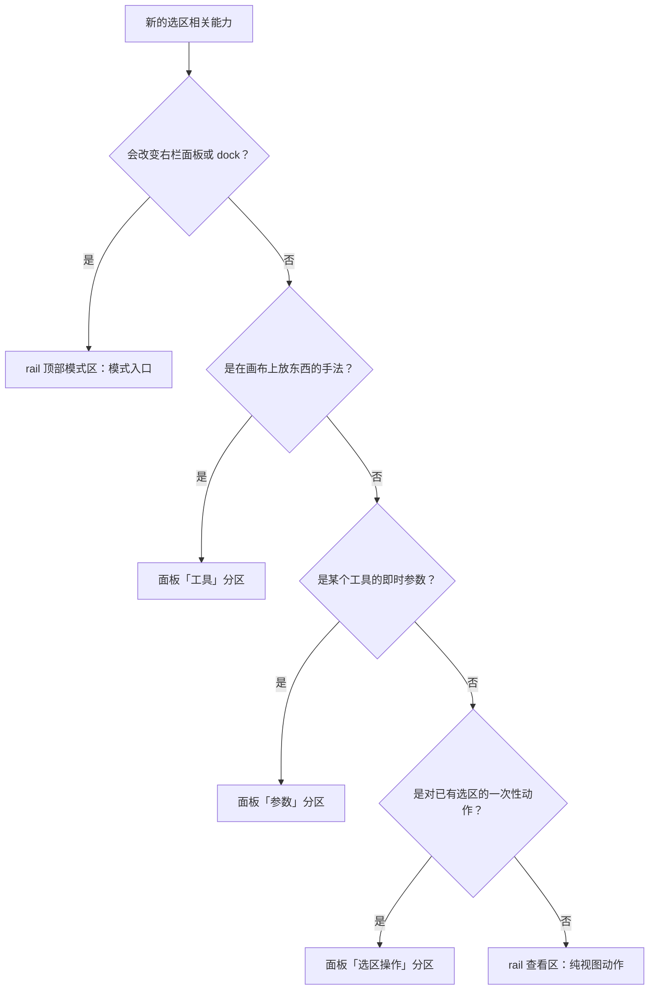
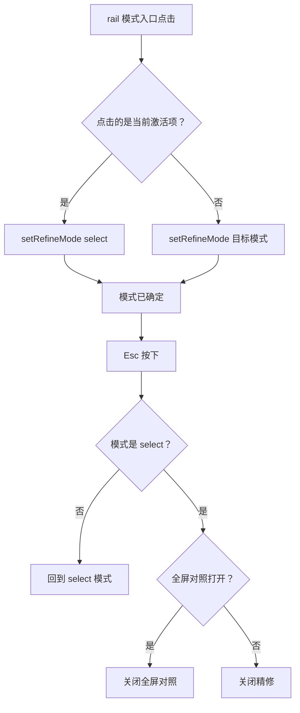
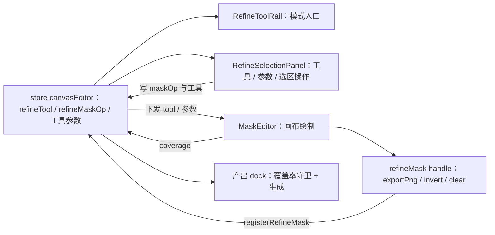
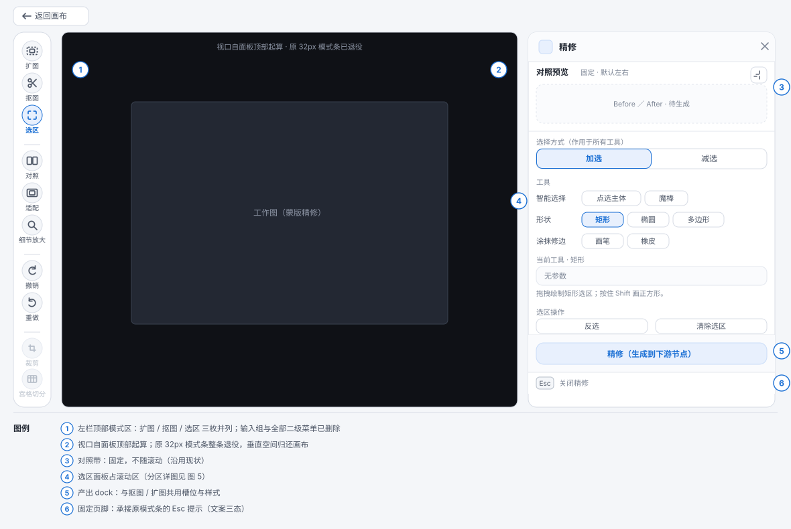

# 精修「选区」统一设计规格：入口三合一 + 工具参数进面板 + 模式条退役 + 补齐椭圆

- 日期：2026-09-23
- 状态：设计已与用户逐条确认（4 项拍板 + 3 项派生待否决；2026-09-23 补 §4.0 区域层双通道模型与独立/内置判据），待实现
- 前置：#402（精修抠图特性 + 精修应用语义统一）已合并到 main `df45200`
- 关联决策会话：2026-09-23（brainstorming，用户逐条拍板）
- 分支约定：实现走 feature 分支 + PR + CI 全绿 + squash merge

---

## 0. 配图索引（结构与视觉两类，均随本文档演进）

本文档的图分两类：**结构图**一律以 Mermaid 内嵌；**视觉稿**以 `assets/` 下的 SVG 附件承载（相对路径引用）。

| 编号 | 形式 | 内容 | 位置 | 用途 |
|---|---|---|---|---|
| 图 1 | 内嵌 Mermaid | 区域层双通道模型（mask 通道 / rect 通道） | §4.0 | 接新工具先判它属于哪条通道，再套图 2 判据树定落点；回答「选区为何独立成模式、扩图为何没有选区工具」 |
| 图 2 | 内嵌 Mermaid | 选区相关新能力的落点判据树 | §4.1 | 后续同类需求自检「该放 rail 还是面板」，不再逐次讨论 |
| 图 3 | 内嵌 Mermaid | 三模式切换语义 + Esc 三级退出 | §4.2 | 实现 `setRefineMode` 调用点与 `onClose` 分级时的唯一依据 |
| 图 4 | 内嵌 Mermaid | 选区数据流（store ↔ rail / 面板 / MaskEditor） | §5.2 | 判断某个改动该落在哪一层；防止再次出现「参数两处真源」 |
| 图 5 | SVG 附件 `assets/refine-selection-unified-5-layout.svg` | 改造后精修工作区布局（rail / 视口 / 右栏三段 + 模式条退役位置） | §6.1 | 布局验收基准：逐条核对区域存在性与垂直空间归属 |
| 图 6 | SVG 附件 `assets/refine-selection-unified-6-panel.svg` | 右栏「选区」面板分区详图（①选择方式 ②工具 ③参数 ④选区操作 ⑤页脚） | §6.2 | 面板验收基准：逐条核对分区、7 枚工具、参数三形态 |

---

## 1. 目标

1. **入口收敛**：左栏 rail 的「选区」概念从三个并列入口（智能选择 / 框选 / 涂抹）收敛为**一个模式入口**，与「扩图」「抠图」同族并列、形态一致（见 图 5）。
2. **落点收敛**：选区的工具、参数、命令全部集中到右栏「选区」面板；画布顶部的模式条**整条退役**（见 图 6）。
3. **能力补齐**：新增**椭圆**；把「加选 / 减选」从工具隐式属性提升为**作用于全部工具的显式开关**。

## 2. 范围

### 2.1 本期做

- rail：删除 3 个输入组及其全部二级菜单；新增「选区」模式入口；扩图图标字形 `⤢` 改为 SVG（三枚模式入口同族）。
- 右栏：`RefineSelectPanel` 重写为完整的「选区」面板（选择方式 / 工具 / 参数 / 选区操作 / 固定页脚）。
- 模式条：`RefineModeBar.vue` 及其单测删除；工具名与参数进面板，Esc 提示进面板固定页脚。
- store：`RefineMaskTool` 新增 `'ellipse'`；`setRefineTool` 不再把「加选」硬编码给矩形等工具。
- MaskEditor：新增椭圆拖拽绘制；矩形 / 椭圆 / 多边形 / 魔棒 尊重 `maskOp`（现状矩形恒为加选，见 §7.2）。
- Esc 分级链补入抠图模式（现状只有扩图在链上）。
- 删除「清除瑕疵」快速预设（连 `STAIN_PRESET_PROMPT` 链路与 `applyStainPreset` 事件）。
- 测试与配图。

### 2.2 明确不做

| 不做项 | 理由 |
|---|---|
| 反向抠图 | 既定不进一期（matting 规格裁决） |
| 选区羽化（feather） | 需要引入羽化半径与合成侧改动，独立评估 |
| 选区自身变换（缩放 / 旋转 / 移动选区） | 现有选区是位图 alpha，无路径对象可变换，是独立课题 |
| 交叉选择（intersect） | `RefineMaskOp` 两态已覆盖高频需求；三态留后续 |
| 智能选择的分割模型升级 | 点选仍走现有远端 SAM → 本地 mediapipe 回退链路，不动 |
| 画布节点层的框选多选 | 那是 VueFlow 的多选，与选区/蒙版无关，不动 |
| 子工具协议进 `workbenchToolRegistry` | workbench-shell 规格 §4.2 的未尽项，仍是后续包 |

## 3. 与既有规格的关系（显式修订 / 推翻）

| 既有裁决 | 出处 | 本规格处置 |
|---|---|---|
| P0-3「左栏 = 输入组 3 项 + 查看组 2 项」 | layout-rework §4 | **修订**：输入组 3 项 → 1 项「选区」模式入口；查看组 2 项不变 |
| P1-1「3 个输入工具各带二级菜单，容纳 6 个既有能力」 | layout-rework §5 | **推翻**：删除全部输入组二级菜单；工具改由右栏面板承担；能力由 6 项扩为 7 项（补椭圆） |
| P1-2「两个选区命令进子菜单」 | layout-rework §5 | **修订**：命令进右栏面板「选区操作」分区 |
| P1-4「模式条参数矩阵」 | layout-rework §5 | **推翻**：参数进右栏面板「参数」分区；`RefineModeBar.vue` 删除 |
| P1-5「对照模式条文案」 | layout-rework §5 | **推翻**：模式条退役；Esc 提示迁至面板固定页脚，并由两态改为**三态** |
| P1-6「Esc 分级：对照 → 工作图 → 退出精修」 | layout-rework §5 | **扩展**：分级链补入抠图模式（`refineMode !== 'select'` 优先回选区） |
| 「layout-rework P0-9：`select` 模式的工具参数（笔刷 / 容差）仍留模式条，不动」 | workbench-shell §3 | **推翻**：select 参数一并进面板 |
| §4.2「二级子工具…选区六件套…共享精修的参数面板与 dock」「只有画布行为和模式条参数不同」 | workbench-shell §4 | **修订**：子工具集 6 → 7（+椭圆）；「模式条参数」表述作废，参数改由面板「参数」分区渲染。子工具数据源仍由 rail 模型文件承担，进注册表仍是后续包 |
| 抠图「用当前选区抠」消费选区蒙版 | matting-unified-apply §3 | **不变**：抠图消费的仍是最终 mask 位图；本规格只改选区 UI 与 op 的显式化，不改消费方式 |

## 4. 规范与判据

### 4.0 区域层总览：mask 通道与 rect 通道（回答「选区为什么独立成模式」）

精修工作台的总模型是「区域 × 动作」：一切产出型动作 = 一块区域 + 一个生成动作。但**区域有两种交换格式**，按动作语义二分，而不是按工具二分（见 图 1）：



*图 1 · 区域层双通道模型：mask 通道（像素级任意形状，被抠图 / 局部重绘 / 消除替换等多个消费者共享）与 rect 通道（结构化矩形，扩图专用）是两条平行通道；同一通道内来源可插拔、动作解耦，跨通道一期不互转。用途是接新工具时先判断它属于哪条通道，再套 §4.1 判据树定落点。*

三条统筹原则：

1. **同一通道内，来源可插拔、动作解耦**：区域来源只负责产出该格式并写进 store，不知道消费者是谁。未来的自动蒙版（分割识别 / OCR）只是「替用户画」的另一个来源，产出后仍可用加 / 减选手绘修正，不需要为新来源改任何动作侧代码。
2. **跨通道一期不互转**：不提供「把手柄矩形转成蒙版再精修」这类隐式桥；确有需求时作为显式功能另立包（已登记 §12）。
3. **独立成模式 vs 内置进工具的判据**：区域来源被**多个动作共享 → 独立工作台**（mask 通道 → 「选区」模式，画一次多方复用）；来源**唯一专用 → 内置于该动作**（rect 通道 → 扩图模式自带手柄，没有也不需要选区工具）。这条判据同时回答「为什么扩图没有选区工具」与「选区为什么值得单独一个入口」。

对实现的三条约束（防「区域状态被塞错通道」这类坑，与 §7.2 登记的「参数两处真源」同族）：

- 扩图的 rect **不得**读写选区蒙版、**不得**进蒙版历史栈（pilot §6.2 既有裁决，此处重申）；
- 「选区」面板**不得**出现任何扩图 rect 的读写；
- 未来接局部重绘 / 消除替换时，其区域**只能**来自 mask 通道（消费现有 mask），不得另起区域状态。

### 4.1 「选区相关的东西该放哪」判据（本规格产出，后续同类需求直接套）

依次问四个问题（见 图 2），第一个答「是」的就是它的落点：



*图 2 · 落点判据树：四条判据逐级下钻，把「模式入口 / 工具 / 参数 / 命令 / 视图动作」五类东西一次性定死位置。用途是后续接新工具时自检该放哪，避免再次出现「参数在模式条、命令在 rail、工具在 rail、面板空着」这种四处分裂。*

判据补注：

- 第 1 问的「改变面板或 dock」= 切换它会换一套参数面板与产出动作。这是 workbench-shell 注册表判据（一级工具）的复用，不新造。
- 「一次性动作」指反选、清除选区这类不新增手法、没有参数、点一下就生效的操作。

### 4.2 模式入口统一语义

三枚模式入口（扩图 / 抠图 / 选区）统一为一条式子：`setRefineMode(激活 ? 'select' : 目标模式)`（见 图 3）。

- **选区**：目标模式就是 `select`，所以点击恒为 `setRefineMode('select')`，**幂等**（点已激活的选区按钮无变化）。
- **扩图**：原 `toggleRefineMode()` 换成上式，行为等价；`toggleRefineMode` 若无其他消费者则删除。
- **抠图**：现状已是 `setRefineMode(mattingActive ? 'select' : 'matting')`，不改。
- `busy` 时三枚全部 `disabled`（沿用现状）。

### 4.3 工具与「选择方式」的联动判据

`refineMaskOp` 是唯一真源，规则如下（这是本规格的核心语义修订，实现时不要凭直觉）：

| 动作 | 对 `refineMaskOp` 的影响 |
|---|---|
| 选「画笔」 | 置为 `'add'` |
| 选「橡皮」 | 置为 `'subtract'` |
| 选 点选主体 / 魔棒 / 矩形 / 椭圆 / 多边形 | **不改动**，按当前值执行 |
| 用户手动拨「加选 / 减选」开关 | 立即写入，作用于下一个选区动作，也作用于此后切换到的任何工具 |

要点：**取消工具与 op 的隐式耦合**。现状由 `setRefineTool` 硬编码（`eraser → subtract`、`brush / rect → add`，见 §7.2），导致矩形永远无法减选；本期把开关交给用户，画笔与橡皮只作为「加 / 减的快捷形态」保留。

### 4.4 椭圆交互

- 与矩形同款**拖拽**绘制：按下记起点 → 移动实时预览 → 抬起提交。
- 预览与提交走 canvas 原生 `beginPath → ellipse → fill`，复用矩形已有的 snapshot 回滚范式；**不**走多边形那种逐像素 even-odd 填充。
- 按住 Shift 时锁**正圆**（`rx = ry = max(rx, ry)`）。
- 绘制样式尊重 `maskOp`：`add` ⇒ `source-over` + 选区色；`subtract` ⇒ `destination-out`。

### 4.5 Esc 分级（修订后）



*图 3 · 模式切换与退出的状态机：上半段是「点模式入口」的统一式子；下半段是 Esc 的三级退出，第一级「非 select 模式先回 select」把抠图也纳进来（现状缺失）。用途是实现时判断该改哪个分支，以及页脚文案三态与三级的一一对应。*

页脚文案由纯函数给出，与三级一一对应：

| 状态 | 页脚文案 |
|---|---|
| `refineMode !== 'select'` | 回到选区 |
| 全屏对照打开 | 回到工作图 |
| 其余 | 关闭精修 |

`busy` 时 `useWorkbenchPanel` 已在源头拦截 Esc，不进入本分级。

## 5. 架构与契约

### 5.1 模型层：新增 `refineSelectionModel.ts`，`refineToolRailModel.ts` 瘦身

新文件 `apps/web/src/components/canvas/refine/refineSelectionModel.ts` 承载选区侧全部声明式数据：

```ts
import type { RefineMaskOp, RefineMaskTool, RefineMode } from '@/stores/canvasEditor'

/** 参数区渲染哪种控件：'brush' 粗细+颜色 / 'wand' 容差 / 'none' 只显示提示行 */
export type RefineToolParamKind = 'brush' | 'wand' | 'none'

export interface RefineToolSpec {
  tool: RefineMaskTool
  label: string
  icon: string[]        // SVG path d 数组，与 rail 现状同款渲染
  param: RefineToolParamKind
  hint: string          // 参数区常驻的一行用法说明
}

export interface RefineSelectionGroup {
  id: 'smart' | 'shape' | 'paint'
  label: string
  tools: RefineMaskTool[]
}

export const REFINE_SELECTION_GROUPS: RefineSelectionGroup[]
export const REFINE_TOOL_SPECS: Record<RefineMaskTool, RefineToolSpec>
export const REFINE_SELECTION_COMMANDS: { id: 'invert' | 'clear'; label: string; hint: string }[]
export const REFINE_MASK_OP_OPTIONS: { op: RefineMaskOp; label: string; hint: string }[]
export function refineSelectionEscHint(input: { refineMode: RefineMode; compareLightboxOpen: boolean }): string
export function refineSelectionOpAfterToolPick(tool: RefineMaskTool, current: RefineMaskOp): RefineMaskOp
```

与旧模型的差异：`hint` 从「只有多边形有提示」升级为**每个工具恒有一行**，`param` 从四态收敛为三态（`polygon-hint` 由 `hint` 承担，`rect / point` 的 `none` 保留）。

`refineToolRailModel.ts` 删除项：`REFINE_INPUT_GROUPS`、`RefineInputGroupId`、`RefineInputGroup`、`RefineToolVariant`、`RefineToolCommand`、`GROUP_OF_TOOL`、`LABEL_OF_TOOL`、`PARAM_OF_TOOL`、`groupForTool`、`toolLabel`、`inputToolActive`、`toolParamKind`、`refineWorkspaceLabel`。
保留项：`REFINE_VIEW_TOOLS`、`REFINE_COMPARE_OPTIONS`、`REFINE_FIT_OPTIONS`、`REFINE_ZOOM_ACTIONS`、`REFINE_CAPABILITY_GROUPS / ITEMS`、`compareModeLabel`。

`components/canvas/toolIcons.ts` 新增两个模式入口图标（单串 `v-html`，与既有 `TOOL_ICON_MATTING` 同款）：
- `TOOL_ICON_SELECT`：四角框线（marquee corner brackets），表述「框出一片区域」；
- `TOOL_ICON_OUTPAINT`：虚线外框 + 实线内框，表述「画布向外扩展」。

### 5.2 数据流



*图 4 · 选区数据流：store 是唯一真源，rail 与面板都只读写 store（面板不再经 emit 转发），MaskEditor 通过 viewport 注册的 handle 反向提供导出/反选/清除，覆盖率回到 store 驱动 dock 的 CTA 守卫。用途是判断一处改动该落在哪一层——「参数两处真源」这类历史缺陷就是在这张图上把边画重了。*

选区侧的完整数据流见 图 4。面板**不发 emit**：它操作的全是 store 内的工具与参数状态，走 emits 会带来 8 个以上事件的纯转发噪音，且 `RefineSidePanel` 没有额外编排逻辑。这与 `RefineToolRail`（同样直接读写 store）保持同一范式。

### 5.3 组件契约

`RefineSelectionPanel.vue`（由 `RefineSelectPanel.vue` 重命名并重写）

- props：`busy?: boolean`；emits：无
- 直接消费：`refineTool / refineMaskOp / refineBrushSize / refineBrushColor / refineWandTolerance`、`getRefineMask()`
- 分区与 `data-testid`：

| 分区 | testid |
|---|---|
| 选择方式 | `refine-selection-op-add` / `refine-selection-op-subtract` |
| 工具（7 枚） | `refine-selection-tool-<tool>`（`point` / `wand` / `rect` / `ellipse` / `polygon` / `brush` / `eraser`） |
| 参数 | `refine-selection-param-brush` / `refine-selection-param-wand` / `refine-selection-param-none`、`refine-selection-param-hint` |
| 选区操作 | `refine-selection-command-invert` / `refine-selection-command-clear` |
| 固定页脚 | `refine-panel-esc-hint` |

`RefineToolRail.vue`

- 删：`REFINE_INPUT_GROUPS` 循环、二级菜单模板、`GLYPH`、`VARIANT_ICONS`、`pickTool`、`runCommand`、`toggleInputGroup`、`isInputOpen`
- 增：`rail-mode-select` 按钮
- `OpenMenu` 类型收敛为 `{ kind: 'view'; id: 'compare' | 'fit' } | null`
- 对照二级菜单里的提示文案需修订：原文「选中后画布顶部出模式条，Esc 回到工作图」里的「模式条」已不存在，改为指向全屏对照自身头部。

`RefineWorkViewport.vue`：删除 `RefineModeBar` 的 import 与标签。
`RefineSidePanel.vue`：删除 `applyStainPreset` 接线与 `STAIN_PRESET_PROMPT` import；新增固定页脚一行（对全部模式生效）。
`workbench/workbenchToolRegistry.ts`：`refine-select` 的 `panel` 指向新组件。
`utils/refineSession.ts`：删除 `STAIN_PRESET_PROMPT`。
删除文件：`RefineModeBar.vue`、`RefineModeBar.test.ts`。

### 5.4 store 变更

- `RefineMaskTool` 联合类型新增 `'ellipse'`。
- `setRefineTool(tool)` 改为：

```ts
function setRefineTool(tool: RefineMaskTool) {
  refineTool.value = tool
  refineMaskOp.value = refineSelectionOpAfterToolPick(tool, refineMaskOp.value)
}
```

（现状是三分支特判并给 `rect` 硬编码 `add`，见 §7.2。）

- 无新增状态字段。

### 5.5 MaskEditor 变更

- `MaskTool` 联合类型新增 `'ellipse'`（注意该文件有一份与 store 同值但独立声明的 `MaskTool`，两处需同步）。
- `onPointerDown`：`rect` 分支扩为 `rect | ellipse`，两者都走「压栈 → 存 snapshot → 记起点」范式。
- `onPointerMove`：`rect | ellipse` 分支；椭圆按 `ellipseFromDrag(start, pt, shiftKey)` 取 `{ cx, cy, rx, ry }` 后 `ctx.ellipse(...)` 填充，仍先 `putImageData(snapshot)` 回滚。
- 新增形状样式函数：按 `props.maskOp` 选 `source-over` + 选区色，或 `destination-out` + 不透明黑；矩形分支**同时**改成走它（这是「矩形能减选」的实现点）。

## 6. 主场景规格

### 6.1 工作区布局



*图 5 · 改造后精修工作区布局：左栏顶部三枚模式入口并列、视口自面板顶部起算（模式条那 32px 已归还）、右栏四段（对照带 / 选区面板 / 产出 dock / 固定页脚），编号 ①–⑥ 与图例一一对应。用途是布局验收基准——逐条核对每个区域存在性，以及「模式条不再占高」这一条。*

### 6.2 右栏「选区」面板分区


*图 6 · 右栏「选区」面板分区：① 选择方式（加选 / 减选）② 工具（三组 7 枚，椭圆为新增）③ 参数（固定位置，随工具切换内容，含 3 种形态）④ 选区操作（反选 / 清除）⑤ 固定页脚（Esc 三态文案）。用途是面板验收基准——分区顺序、工具数量与分组、参数三形态逐条可对。*

### 6.3 逐项可验收清单

1. 进入精修后，rail 顶部**三枚模式入口并列**（扩图 / 抠图 / 选区），且**不存在**任何输入组、任何输入二级菜单（见 图 5 ①）。
2. 点「扩图」→ 进扩图模式；再点「扩图」→ 回选区模式。点「抠图」同理。点已激活的「选区」按钮**无任何变化**。
3. 右栏面板自上而下为：选择方式 → 工具 → 参数 → 选区操作；再下为产出 dock，面板最底为固定页脚（见 图 5、图 6）。
4. 画布顶部**不存在模式条**；视口自面板顶部起算（见 图 5 ②）。
5. 点任一工具按钮：该按钮高亮、参数区标题变「当前工具 · X」、控件按 `param` 切换、提示行更新（见 图 6 ③）。
6. 点「减选」：开关高亮；此后矩形 / 椭圆 / 多边形 / 魔棒 / 点选都按减选执行。
7. 点「橡皮」：开关自动跳到「减选」；点「画笔」：开关自动跳到「加选」。
8. 椭圆：拖拽绘制、移动中实时预览、抬起提交；按住 Shift 画正圆；减选态下能从已有选区里挖出一个椭圆洞。
9. 「反选」「清除选区」在面板内即时生效；覆盖率提示与 dock 的 CTA 禁用态随之更新。
10. `Esc`：扩图或抠图模式下 → 回到选区模式；全屏对照下 → 关闭对照；否则 → 关闭精修；页脚文案与三者同步。
11. 面板内**不存在**「清除瑕疵」；`STAIN_PRESET_PROMPT` 全仓无引用。

## 7. 数据与状态变更

### 7.1 变更清单

- 新增状态字段：无。
- 类型变更：`RefineMaskTool` / `MaskTool` 联合类型 +`'ellipse'`。
- 行为变更：`setRefineTool` 的 op 联动（§5.4）；MaskEditor 形状绘制的 op 尊重（§5.5）。
- 删除：`STAIN_PRESET_PROMPT`、`RefineModeBar` 对 store 的全部读取。
- 不变：`refineMaskOp / refineBrushSize / refineBrushColor / refineWandTolerance / refineCoverage / refineMode` 的字段与默认值。

### 7.2 现状问题登记（本规格要修的根因）

- `apps/web/src/stores/canvasEditor.ts:174-178`：`setRefineTool` 里 `eraser → subtract`、`brush / rect → add`，其余不动。→ 矩形被硬编码为加选，用户无法减选。
- `apps/web/src/components/canvas/refine/MaskEditor.vue:355-363`：矩形分支强制 `globalCompositeOperation = 'source-over'` + `props.color`，**完全忽略 `props.maskOp`**。→ 即使 store 给了 `subtract`，矩形也不会减选。
- `apps/web/src/components/canvas/refine/MaskEditor.vue:302`：魔棒分支已经读了 `props.maskOp`。→ 说明「op 只对魔棒生效、对形状不生效」是历史遗留的不一致，本规格抹平。

## 8. 纯函数与算法（含单测要求）

| 函数 | 落点文件 | 单测要求 |
|---|---|---|
| `ellipseFromDrag({ start, end, shiftKey })` | 新建 `refine/maskEllipse.ts` | 起点=终点 ⇒ `rx = ry = 0`；反向拖拽 ⇒ 归一化为正值；`shiftKey` ⇒ `rx = ry = max(rx, ry)`；中心为两点中点 |
| `refineSelectionOpAfterToolPick(tool, current)` | `refineSelectionModel.ts` | `brush ⇒ 'add'`；`eraser ⇒ 'subtract'`；其余 4 项**原值返回**（传 `'subtract'` 也要保持 `'subtract'`） |
| `refineToolParamKind(tool)` | 同上 | 7 项全表：`brush / eraser ⇒ 'brush'`，`wand ⇒ 'wand'`，其余 4 项 ⇒ `'none'` |
| `refineSelectionEscHint({ refineMode, compareLightboxOpen })` | 同上 | 三分支 + **优先级**：`outpaint` 且对照打开 ⇒ 「回到选区」（模式优先于对照） |
| 形状样式分支 | 抽到 `refine/maskShape.ts` 便于测 | `add ⇒ source-over + 选区色`；`subtract ⇒ destination-out + 不透明黑` |

**回归测试必须先红**（项目既定实践）：把修复前的实现临时还原（`git show origin/main:<file> > <file>`）跑一遍，确认新写的断言在旧实现上失败，再恢复。本规格至少要对以下三条做此验证：

1. `setRefineTool('rect')` 在 `maskOp === 'subtract'` 下**保持** `subtract`；
2. 形状绘制在 `subtract` 下使用 `destination-out`；
3. Esc 在抠图模式下先回 `select` 而不是关闭精修。

## 9. 文件级改动清单

**新增**

- `apps/web/src/components/canvas/refine/refineSelectionModel.ts`
- `apps/web/src/components/canvas/refine/refineSelectionModel.test.ts`
- `apps/web/src/components/canvas/refine/RefineSelectionPanel.vue`
- `apps/web/src/components/canvas/refine/RefineSelectionPanel.test.ts`
- `apps/web/src/components/canvas/refine/maskEllipse.ts`
- `apps/web/src/components/canvas/refine/maskEllipse.test.ts`
- `apps/web/src/components/canvas/refine/maskShape.ts`（形状样式分支，便于纯函数测试）

**修改**

- `components/canvas/refine/RefineToolRail.vue`、`RefineToolRail.test.ts`
- `components/canvas/refine/refineToolRailModel.ts`、`refineToolRailModel.test.ts`
- `components/canvas/refine/RefineWorkViewport.vue`、`RefineWorkViewport.test.ts`
- `components/canvas/refine/RefineSidePanel.vue`、`RefineSidePanel.test.ts`
- `components/canvas/refine/MaskEditor.vue`
- `components/canvas/refine/RefineWorkbench.vue`、`RefineWorkbench.test.ts`
- `components/canvas/toolIcons.ts`
- `components/canvas/workbench/workbenchToolRegistry.ts`、`workbenchToolRegistry.test.ts`
- `stores/canvasEditor.ts`、`canvasEditor.refine.test.ts`
- `utils/refineSession.ts`

**删除**

- `components/canvas/refine/RefineModeBar.vue`
- `components/canvas/refine/RefineModeBar.test.ts`
- `components/canvas/refine/RefineSelectPanel.vue`（重命名为 `RefineSelectionPanel.vue`）

## 10. 测试策略与验收标准

### 10.1 单测

- **纯函数**：§8 全表。
- **组件级**：
  - `RefineToolRail`：无任何 `rail-input-*`；无任何二级菜单容器；存在 `rail-mode-select` 且激活；三模式互斥；能力区与查看区不变。
  - `RefineSelectionPanel`：7 枚工具全渲染且分组正确；点工具写 store 且参数区切换；点加减选写 store；画笔 / 橡皮反转开关；反选 / 清除调 handle；页脚文案三态。
  - `RefineWorkViewport`：**不存在** `refine-modebar`；`refine-panel-esc-hint` 存在。
  - `RefineSidePanel`：无 `refine-select-preset-stain`；无 `STAIN_PRESET_PROMPT` 引用。

### 10.2 回归（必须先红）

§8 列出的三条。

### 10.3 jsdom 的盲区与真实浏览器验证

jsdom 里 `clientWidth` 恒为 0、无真实布局，「元素存在」断言全绿不等于浏览器里可见。因此以下两项**必须**用真实浏览器验证：

1. **椭圆绘制**（面板 → 画布 → 选区结果）：vite dev + 临时 harness 页挂真实组件，用浏览器工具量取并核对选区覆盖率变化，测完删 harness。
2. **面板布局**（7 枚工具是否换行溢出、参数区高度、页脚是否被挤出）：量 `getBoundingClientRect`。

### 10.4 目视验收

§6.3 的 11 条人工逐条过。

## 11. 风险

| 风险 | 影响 | 缓解 |
|---|---|---|
| 删掉二级菜单后，切工具路径变长（原先 rail 悬停即可切） | 高频切换手感变差 | 面板常驻可见，7 枚工具分三组一行可达；若实测嫌远，后续加数字快捷键（已登记 §12），不动本次结构 |
| `maskOp` 语义变化波及抠图「用当前选区抠」 | 可能影响抠图结果 | 抠图消费的是最终 mask 位图（`getCanvas()`），op 只影响**绘制过程**；matting 相关测试保持全绿作为守门 |
| 椭圆边缘经 `isMaskPixelSelected`（alpha > 127）二值化后可能有毛边 | 观感 | 目视验收专门过一条；若不可接受，改为按覆盖率判定的后续包 |
| `RefineSelectPanel` 重命名牵动注册表与测试 | 一次性改动面 | 注册表是面板的唯一真源，改一处即可；测试同步更名 |
| 扩图图标 SVG 化后不如 `⤢` 直观 | 辨识度 | 线框稿已给出形态；验收时可单点回退为字形，不牵连其他改动 |
| 模式条删除后，缩放百分比等信息的展示位一并消失（现状本就不显示） | 无 | 该信息现状即缺失（layout-rework 已知未修项），不在本规格范围 |

## 12. 后续包 / 路线图

- 选区羽化（feather）与选区变换（缩放 / 旋转 / 移动选区）——需要把选区从纯位图升级为「位图 + 路径」双表示，独立课题。
- 交叉选择（intersect）——`RefineMaskOp` 扩为三态。
- 子工具协议进 `workbenchToolRegistry`（workbench-shell §4.2 的未尽项）。
- 选区工具的数字快捷键（在删掉二级菜单之后才有意义）。
- 反向抠图（既定不进一期）。
- 跨通道显式转换（如「手柄矩形转蒙版再精修」）——需求出现时另立包，一期不做（§4.0 原则 2）。
- 对照带 Before / After 分辨率不一致的观感问题（layout-rework 已知未修项，与本规格无关）。

## 13. 配图规范自检

单篇校验（2026-09-23，定稿与补 §4.0 后复跑）：

```
$ pnpm verify-spec-figures --file docs/superpowers/specs/2026-09-23-refine-selection-unified-design.md

✓ docs/superpowers/specs/2026-09-23-refine-selection-unified-design.md

校验完成：1 篇在范围内，0 篇历史文档跳过（< 2026-09-22），0 个错误，0 个警告
退出码 0
```

全量校验（同批次其他规格 / 计划文档一并过）：

```
$ pnpm verify-spec-figures

✓ docs/superpowers/specs/2026-09-22-refine-m2-capability-pack-design.md
✓ docs/superpowers/specs/2026-09-22-refine-matting-unified-apply-design.md
✓ docs/superpowers/specs/2026-09-22-workbench-shell-and-outpaint-pilot-design.md
✓ docs/superpowers/specs/2026-09-23-refine-selection-unified-design.md
✓ docs/superpowers/plans/2026-09-22-refine-m2-capability-pack.md
✓ docs/superpowers/plans/2026-09-22-refine-matting-unified-apply.md
✓ docs/superpowers/plans/2026-09-22-workbench-shell-and-outpaint-pilot.md

校验完成：7 篇在范围内，228 篇历史文档跳过（< 2026-09-22），0 个错误，0 个警告
退出码 0
```

过程中被校验器拦下并已修正的问题（记录在案，供后续同类视觉稿复用）：

1. **R1 越界误报的根因**：校验器只解析 `<rect>` 且**不折算 `<g transform>`**，因此画在 `translate(cx cy)` 组内、用相对负坐标（`x="-7.5"`）表达的图标矩形会被判越界。修法是**图标一律用绝对坐标**，不要依赖 transform 组内负坐标。
2. **R4 未引用**：图 2 / 图 4 起初只出现在 §0 索引与图注里，正文没有 `图 N` 字样，被报警告。修法是在判据段与数据流段各补一处正文引用。
3. 自查另发现一处**内容错误**（与配图规则无关）：工具数一度写成 8 枚，实为 **7 枚**（`point / wand / rect / ellipse / polygon / brush / eraser`），已在正文、图 6 与线框稿中统一订正。
4. 第二轮修订（2026-09-23，补 §4.0 区域层总览）：图号整体顺延一位（原图 1–5 → 图 2–6），两张 SVG 附件同步改名（`-4-layout` → `-5-layout`、`-5-panel` → `-6-panel`），§0 索引与全部正文引用同步更新，全量校验通过。
